# 開発フロー

```mermaid
flowchart TB
    subgraph phase0 [0. 事前準備]
        Z1{"GitHub MCP?"} -->|未設定| Z2["設定を促す"]
        Z1 -->|設定済| A1
        Z2 --> A1
    end

    subgraph phase1 [1. 要件定義]
        A1["requirements"] --> A2["競合調査"] --> A3["PRD.md 作成"]
    end

    subgraph phase2 [2. 設計]
        B0{"GitHub MCP?"} -->|未設定| B0a["設定必須"]
        B0 -->|設定済| B1
        B0a --> B1
        B1["design"] --> B2["PRD.md 確認"] --> B3["DESIGN.md 作成"]
        B2 --> B4["SCREEN.md 作成"]
        B3 --> B7["データストレージ決定"]
        B4 --> B7
        B7 --> B5["GitHub Issues 作成"]
        B5 --> B6{"API必要?"}
    end

    subgraph phase3 [3. API設計]
        C1["api"] --> C2["DESIGN.md 確認"] --> C3["openapi.yaml 作成"]
    end

    subgraph phase4 [4. 環境構築]
        S1["setup"] --> S2{"src/ 存在?"}
        S2 -->|No| S3["環境構築実行"]
        S2 -->|Yes| S4["スキップ"]
        S3 --> S5["動作確認"]
    end

    subgraph phase5 [5. プロトタイプ]
        P1["prototype"] --> P2["UIコンポーネント実装"]
        P2 --> P3["Storybook 作成"]
        P3 --> P4["メイン画面実装"]
        P4 --> P5["DESIGN_CONCEPT.md 作成"]
        P5 --> P6["デザイン確認・承認"]
    end

    subgraph phase6 [6. テスト設計]
        T1["test-design"] --> T2["テストケース設計"]
        T2 --> T3["TEST_CASES.md 作成"]
        T3 --> T4["ユーザー確認"]
    end

    subgraph phase7 [7. 本実装]
        D1["implement"] --> D2["GitHub Issue 取得"]
        D2 --> D3["コード実装"] --> D5["E2Eテスト実装"]
        D5 --> D4["Issue 更新・クローズ"]
    end

    subgraph phase8 [8. デプロイ]
        F1["deploy"] --> F2["ビルド確認"] --> F4["デプロイ実行"]
    end

    A3 --> B0
    B6 -->|Yes| C1
    B6 -->|No| S1
    C3 --> S1
    S5 --> P1
    S4 --> P1
    P6 --> T1
    T4 --> D1
    D4 -->|全Issue完了| F1
```

## 事前準備（MCP設定）

開発を始める前に、以下の MCP を設定してください：

| MCP        | 用途       | 必要なタイミング     |
| ---------- | ---------- | -------------------- |
| GitHub MCP | Issue 管理 | 設計フェーズ（必須） |

設定ガイド：[GitHub MCP 設定](./SETUP_GITHUB_MCP.md)

※ デプロイ用 MCP（Vercel MCP 等）はフレームワークにより異なります。CLAUDE.md の参照ドキュメントを確認してください。

## フェーズ詳細

### 1. 要件定義

- **コマンド**: `/project:requirements`
- **処理内容**: INPUT.md 確認 → 競合調査 → PRD 作成
- **成果物**: reports/COMPETITIVE_ANALYSIS.md, docs/PRD.md
- **MCP確認**: GitHub MCP 未設定の場合、設定を推奨（ブロックしない）

### 2. 設計

- **コマンド**: `/project:design`
- **処理内容**:
  - PRD.md 確認 → 全体設計・画面設計
  - データストレージ方針決定
  - タスク起票（GitHub Issues）
- **成果物**: docs/DESIGN.md, docs/SCREEN.md, docs/COMPONENT.md, docs/DATA_MODEL.md（DB使用時）, GitHub Issues
- **MCP確認**: GitHub MCP 未設定の場合、設定を要求（Issue 作成に必須）

### 3. API設計（オプション）

- **コマンド**: `/project:api`
- **処理内容**: DESIGN.md 確認 → API定義
- **成果物**: docs/openapi.yaml
- **スキップ条件**: 外部API/バックエンド不要の場合

### 4. 環境構築

- **コマンド**: `/project:setup`
- **処理内容**:
  - src/ 無ければ環境構築（一時ディレクトリ経由）
  - 追加パッケージのインストール
  - 設定ファイル作成
  - 動作確認
- **成果物**: src/, 設定ファイル一式
- **スキップ条件**: src/ が既に存在する場合

### 5. プロトタイプ

- **コマンド**: `/project:prototype`
- **処理内容**:
  - 共通UIコンポーネント実装
  - Storybook で各コンポーネント確認
  - メイン画面のみ実装（ダミーデータ）
  - DESIGN_CONCEPT.md 作成（カラー、タイポグラフィ、必要な画像一覧）
  - ユーザーにデザイン確認・承認を依頼
- **成果物**: src/components/, Storybook, メイン画面, docs/DESIGN_CONCEPT.md
- **完了条件**: デザインコンセプトがユーザーに承認されること

### 6. テスト設計

- **コマンド**: `/project:test-design`
- **処理内容**:
  - PRD.md と SCREEN.md を確認
  - E2Eテストケースを設計
  - 優先度（P0/P1/P2）を設定
  - ユーザーにテストケースを確認
- **成果物**: docs/TEST_CASES.md
- **前提条件**: `/project:prototype` が完了していること（UIが確定していること）

### 7. 本実装

- **コマンド**: `/project:implement <Issue番号>`
- **引数**:
  - 単一: `/project:implement 30`
  - 複数: `/project:implement 30,31,32` または `/project:implement 30 31 32`
- **処理内容**:
  - テスト設計完了を確認
  - 指定された Issue の実装
  - コード実装（承認済みコンポーネントを活用）
  - E2Eテスト実装（TEST_CASES.md に基づく）
  - Storybook 追加（新規UIの場合）
  - lint / format 実行
  - 単体テスト・E2Eテスト実行
  - コミット・プッシュ・PR作成
- **成果物**: src/, e2e/, PR
- **前提条件**: `/project:prototype` と `/project:test-design` が完了していること
- **並行開発**: 複数Issue指定時は git worktree を使用して並列実装

### 8. デプロイ

- **コマンド**: `/project:deploy`
- **処理内容**:
  - ビルド確認
  - デプロイ実行（フレームワーク別の手順に従う）
  - 動作確認
- **成果物**: 本番環境

## その他のコマンド

| コマンド                | 説明                          |
| ----------------------- | ----------------------------- |
| `/project:review`       | コードレビューと修正          |
| `/project:status`       | 現在の状況を確認              |

## 環境構築の注意

要件定義・設計後に実装を開始する場合、既存ファイル（docs/PRD.md 等）があるためプロジェクト作成コマンドは直接実行できません。

環境構築時は一時ディレクトリを経由します（詳細は CLAUDE.md の「環境構築手順」を参照）。
