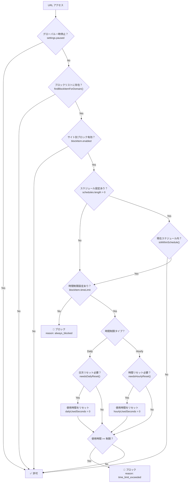
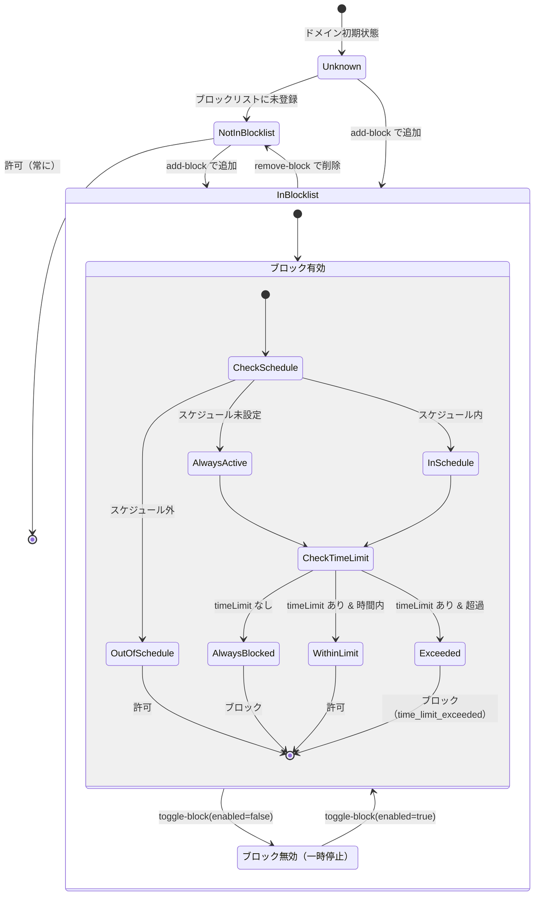
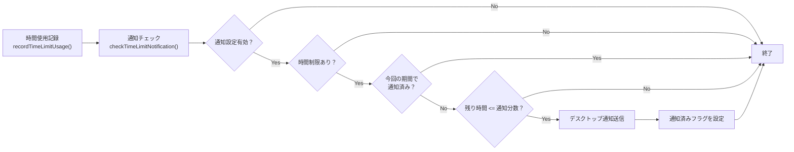

# ブロック状態管理 - ステートマシーン図

このドキュメントはブロック機能の状態遷移を定義しています。

## 概要

VisionFocusのブロック機能は、複数の条件を組み合わせてドメインのブロック状態を判定します。

## ブロック判定フロー

## 状態遷移図

## ブロック理由（BlockReason）

| 理由 | 説明 | 条件 |
|------|------|------|
| `always_blocked` | 常時ブロック | timeLimit が未設定 |
| `time_limit_exceeded` | 時間制限超過 | 使用時間 >= 制限時間 |
| `null` | ブロックされていない | 上記以外 |

## 状態を決定する要素

| 要素 | 保存場所 | 型 | 説明 |
|------|----------|-----|------|
| グローバル一時停止 | `settings.paused` | `boolean` | 拡張機能全体の一時停止 |
| ブロックリスト | `settings.blockList` | `BlockItem[]` | ブロック対象ドメインリスト |
| サイト別有効/無効 | `blockItem.enabled` | `boolean` | 個別サイトのブロック ON/OFF |
| サイト別時間制限 | `blockItem.timeLimit` | `TimeLimit \| null` | 「1日30分まで」などの設定 |
| スケジュール | `settings.schedules` | `Schedule[]` | ブロック有効時間帯 |
| 時間制限使用量 | `analytics.timeLimitUsage` | `Record<string, TimeLimitUsage>` | 実際の消費時間 |

## リセットタイミング

### 日次リセット（Daily）
- 条件: `lastDailyReset !== 今日の日付`
- 処理: `dailyUsedSeconds = 0`, `lastDailyReset = 今日`
- トリガー: `recordTimeLimitUsage()` または `resetExpiredUsage()`

### 時間リセット（Hourly）
- 条件: `lastHourlyReset !== 現在の時間キー`
- 処理: `hourlyUsedSeconds = 0`, `lastHourlyReset = 現在の時間キー`
- トリガー: `recordTimeLimitUsage()` または `resetExpiredUsage()`

## 通知フロー

## 関連ファイル

| ファイル | 責務 |
|---------|------|
| `src/background/blocker.ts` | メインのブロック判定、ルール更新 |
| `src/background/time-limit.ts` | 時間制限の判定と記録 |
| `src/background/notifications.ts` | 通知判定と送信 |
| `src/background/index.ts` | アラームによるリセット処理 |
| `src/lib/blockService.ts` | ブロック状態の一元管理（新規） |
