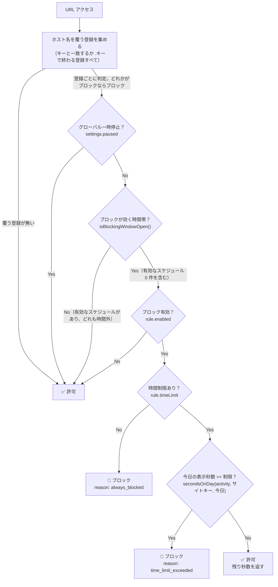
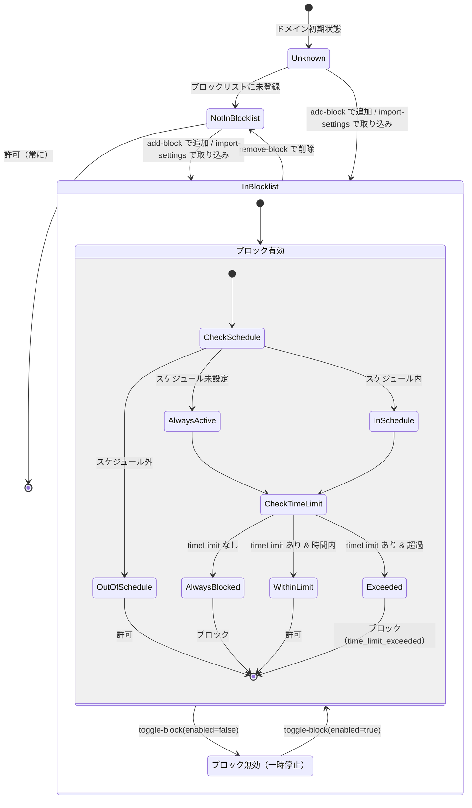
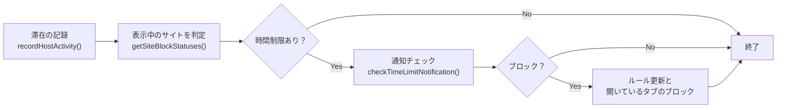
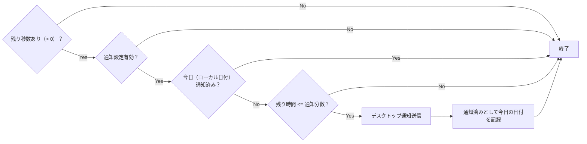

# ブロック状態管理 - ステートマシーン図

このドキュメントはブロック機能の状態遷移を定義しています。

## 概要

VisionFocusのブロック機能は、複数の条件を組み合わせてドメインのブロック状態を判定します。

## ブロック判定フロー

```mermaid
flowchart TD
    Start["URL アクセス"] --> Host["ホスト名を覆う登録を集める<br/>（キーと一致するか .キー で終わる登録すべて）"]

    Host -->|覆う登録が無い| Unblocked["✅ 許可"]
    Host -->|登録ごとに判定。どれかがブロックならブロック| A{"グローバル一時停止？<br/>settings.paused"}

    A -->|Yes| Unblocked
    A -->|No| D{"ブロックが効く時間帯？<br/>isBlockingWindowOpen()"}

    D -->|No（有効なスケジュールがあり、どれも時間外）| Unblocked
    D -->|Yes（有効なスケジュール 0 件を含む）| C{"ブロック有効？<br/>rule.enabled"}

    C -->|No| Unblocked
    C -->|Yes| E{"時間制限あり？<br/>rule.timeLimit"}

    E -->|No| Blocked["🚫 ブロック<br/>reason: always_blocked"]
    E -->|Yes| K{"今日の表示秒数 >= 制限？<br/>secondsOnDay(activity, サイトキー, 今日)"}

    K -->|Yes| TimeLimitExceeded["🚫 ブロック<br/>reason: time_limit_exceeded"]
    K -->|No| Within["✅ 許可<br/>残り秒数を返す"]
```

一時停止から時間制限までの条件を並べるのは `src/lib/blockRule.ts` の `evaluateBlock()` だけである。
`src/lib/blockService.ts` は保存値（`settings` と `activity`）を読み、登録（ブロック設定）ごとに
今日の表示秒数を添えて `evaluateBlock()` に渡し、ホスト名を覆う登録の結論を束ねるだけにする。

- 判定（`getBlockStateForDomain()` / URL 起点の `getBlockState()`）、記録（`shouldTrackBlockForDomain()`）、
  ルール生成（`getActiveBlockedDomains()`）はどれも同じ `evaluateBlock()` を通る。
  条件をどこか 1 箇所に並べ直すと、開いているタブと新しい遷移で結果がずれたり、
  ブロックされていないのにブロック回数が増えたりする
- ルール生成はすべての登録を `evaluateBlock()` に通し、ブロックする登録のサイトキーを返す。
  ルールは `||サイトキー` で、本体とすべてのサブドメインを止める
- 判定も同じ範囲で結論を出す。ホスト名を覆う登録（自分と祖先のキー）のどれかがブロックなら
  ブロックする（親の登録のブロックは子のサブドメインも覆う。子の登録を無効にしても親の結論は外れない）。
  どれもブロックでなければ、残り秒数がいちばん少ない時間制限の値を返す
- 有効なスケジュールが 1 件以上あれば、すべての項目はスケジュール内だけブロックする
  （時間制限の無い項目もスケジュール外は閲覧できる）。すべて無効にしたスケジュールは
  「スケジュール無し」と同じで、常に判定に進む。スケジュール外でも滞在時間は記録するが、
  制限には使わない

### サイトキー

ブロックリストの項目は、`*.` と `www.` を除いて小文字にしたドメイン（サイトキー）に揃えてから照合する
（`src/lib/siteKey.ts`）。

- `*.example.com` / `www.example.com` / `example.com` はどれも `example.com` になる
- 同じサイトキーの項目が複数あっても 1 つにまとめない。どれかがブロックならブロックする
- 時間制限の使用量は登録のサイトキーの行で数える。`www.example.com` と `m.example.com` の滞在は
  同じ枠に入る。滞在はホスト名が属する最も長い追跡中のキーの行に記録されるので、親子を両方登録すると
  子のサブドメインでの滞在は親の使用量に入らない（サイト同士の入れ子の登録を拒否するのは別の段階で扱う）

## 状態遷移図

```mermaid
stateDiagram-v2
    [*] --> Unknown: ドメイン初期状態

    Unknown --> NotInBlocklist: ブロックリストに未登録
    Unknown --> InBlocklist: add-block で追加 / import-settings で取り込み

    state InBlocklist {
        [*] --> Enabled

        Enabled: ブロック有効
        Disabled: ブロック無効（一時停止）

        Enabled --> Disabled: toggle-block(enabled=false)
        Disabled --> Enabled: toggle-block(enabled=true)

        state Enabled {
            [*] --> CheckSchedule

            CheckSchedule --> OutOfSchedule: スケジュール外
            CheckSchedule --> InSchedule: スケジュール内
            CheckSchedule --> AlwaysActive: スケジュール未設定

            AlwaysActive --> CheckTimeLimit
            InSchedule --> CheckTimeLimit
            OutOfSchedule --> [*]: 許可

            CheckTimeLimit --> AlwaysBlocked: timeLimit なし
            CheckTimeLimit --> WithinLimit: timeLimit あり & 時間内
            CheckTimeLimit --> Exceeded: timeLimit あり & 超過

            AlwaysBlocked --> [*]: ブロック
            WithinLimit --> [*]: 許可
            Exceeded --> [*]: ブロック（time_limit_exceeded）
        }
    }

    InBlocklist --> NotInBlocklist: remove-block で削除
    NotInBlocklist --> InBlocklist: add-block で追加 / import-settings で取り込み

    NotInBlocklist --> [*]: 許可（常に）
```

## ブロック理由（BlockReason）

| 理由                  | 説明                 | 条件                       |
| --------------------- | -------------------- | -------------------------- |
| `always_blocked`      | 常時ブロック         | timeLimit が未設定         |
| `time_limit_exceeded` | 時間制限超過         | 今日の表示秒数 >= 制限秒数 |
| `null`                | ブロックされていない | 上記以外                   |

## 状態を決定する要素

| 要素               | 保存場所                             | 型                  | 説明                           |
| ------------------ | ------------------------------------ | ------------------- | ------------------------------ |
| グローバル一時停止 | `settings.paused`                    | `boolean`           | 拡張機能全体の一時停止         |
| ブロックリスト     | `settings.blockList`                 | `BlockItem[]`       | ブロック対象ドメインリスト     |
| サイト別有効/無効  | `blockItem.enabled`                  | `boolean`           | 個別サイトのブロック ON/OFF    |
| サイト別時間制限   | `blockItem.timeLimit`                | `TimeLimit \| null` | 「1日30分まで」などの設定      |
| スケジュール       | `settings.schedules`                 | `Schedule[]`        | ブロック有効時間帯             |
| 時間制限使用量     | `activity[今日][サイトキー].seconds` | `number`            | 今日（ローカル日付）の表示秒数 |
| YouTube 設定       | `settings.youtube`                   | `YouTubeSettings`   | アクセスブロックと時間制限     |

### YouTube の扱い

YouTube のアクセスブロックと時間制限はブロックリストの外（`settings.youtube`）に保存されている。
`blockService` はこれを `youtube.com` のサイトキーのブロック設定に組み立て、
ブロックリストの項目と同じ `evaluateBlock()` に通す。

| `settings.youtube`                         | 結果                                            |
| ------------------------------------------ | ----------------------------------------------- |
| `enabled && blockAccess`、`timeLimit` なし | 常時ブロック（`always_blocked`）                |
| `enabled && blockAccess`、`timeLimit` あり | 上限に達したらブロック（`time_limit_exceeded`） |
| `blockAccess` が無効                       | ブロックしない（時間制限も使わない）            |

- YouTube の設定も 1 件の登録として数える。ブロックリストに `youtube.com` と同じサイトキーの項目があっても、
  どちらかがブロックならブロックする
- 使用量は `youtube.com` の今日の行を読む（`www.youtube.com` / `m.youtube.com` の滞在も同じ行に入る）。
  滞在は YouTube 機能が有効なら常に記録されるが、ブロックと通知に使うのはアクセスブロックと時間制限が
  有効なときだけで、アクセスブロックが無効ならコンテンツスクリプトが画面を隠すこともない
- 非表示の設定（Shorts / おすすめ / コメント / ホームフィード）はこの状態遷移とは独立で、
  `enabled` なら `blockAccess` の値に関わらず適用される。制限を併用していると上限までは
  YouTube を開けるため（`src/lib/youtubeHideStyles.ts` の `generateYouTubeHideCSS()`）

## ブロックの記録とブロック画面

ブロックが成立すると、ブロック画面（`newtab.html`）へリダイレクトし、
`recordBlockedDomain()` が 3 つの記録を残す。

| 記録                       | 保存場所                    | 使い道                                 |
| -------------------------- | --------------------------- | -------------------------------------- |
| サイト別ブロック回数       | `analytics.siteBlockCounts` | ブロック画面の「〜回ブロックしました」 |
| 最後にブロックしたドメイン | `chrome.storage.session`    | ブロック画面の帯に出すドメイン名       |
| 当日のブロック回数         | `analytics.dailyStats`      | 統計                                   |

リダイレクトが起きる経路は 2 つあり、**どちらも同じ記録を残す**。

| 経路                                   | 何が引き金か                         | 記録の呼び出し元                                  |
| -------------------------------------- | ------------------------------------ | ------------------------------------------------- |
| `declarativeNetRequest` のリダイレクト | ブロック対象への新しい遷移           | `listeners/navigationTracking.ts`（遷移イベント） |
| `chrome.tabs.update` による差し替え    | 設定変更で既に開いているタブを飛ばす | `blocker.ts` の `blockExistingTabs()`             |

- 後者は元ドメインの `webNavigation.onBeforeNavigate` を起こさないため、
  記録を遷移イベント側だけに置くと記録が残らず、帯が出ない
- 記録はリダイレクトより先に行う（ブロック画面が読み出す時点で値が無いと帯が出ない）
- **記録はブロックが成立したときだけ残る。** 遷移イベント側は
  `shouldTrackBlockForDomain()`（＝上のフローの結論）で確かめてから記録する。
  時間制限つきのサイトは上限に達するまで遷移しても通るため、ここで記録すると
  「〜回ブロックしました」と統計が実際より多くなる

### `newtab.html` は web accessible でなければならない

`declarativeNetRequest` のリダイレクト先は、公開リソース
（`manifest.web_accessible_resources`）でなければ他サイトからの遷移で拒否される。
宣言が無いと、検索結果や SNS のリンクから踏んだときだけ `ERR_BLOCKED_BY_CLIENT` に
なり、ブロック画面自体が表示されない（アドレスバーへの直打ちはブラウザ発の遷移なので通る）。
宣言は `wxt.config.ts` にあり、`scripts/__tests__/wxt-config-manifest.test.ts` が固定している。

出典: [declarativeNetRequest](https://developer.chrome.com/docs/extensions/reference/api/declarativeNetRequest)

## 日付が変わったとき

使用量は「今日（端末のローカル時刻の日付）の行」を読むだけなので、リセット処理は持たない。
0 時を過ぎると別の行を読むことになり、使用量は 0 から数え直しになる。

- 開いているタブと新しい遷移のルールは、毎分の `check-schedule` アラームが
  `updateBlockRules()` で作り直すときに今日の行で判定し直す（日付が変わってから 1 分以内に解除される）
- 時間制限を途中で設定した日も、その日に既に表示していた秒数を数える
  （設定した時点で上限を超えていれば、すぐにブロックされる）

## 時間制限の適用と通知

`src/background/handlers/tracker-heartbeat.ts` は記録間隔ごとに、表示中のページの滞在を
`activity` の今日の行へ加算してから、同じページのサイトを判定する（加算より先に判定すると 1 間隔遅れる）。

```mermaid
flowchart LR
    A["滞在の記録<br/>recordHostActivity()"] --> B["表示中のサイトを判定<br/>getSiteBlockStatuses()"]
    B --> C{"時間制限あり？"}
    C -->|No| End["終了"]
    C -->|Yes| N["通知チェック<br/>checkTimeLimitNotification()"]
    N --> X{"ブロック？"}
    X -->|Yes| R["ルール更新と<br/>開いているタブのブロック"]
    X -->|No| End
    R --> End
```

通知チェックは次の順に見る。残り秒数は判定（`evaluateBlock()`）の値で、一時停止中・スケジュール外・
無効な項目では残り秒数が無いので通知しない。

```mermaid
flowchart LR
    B{"残り秒数あり（> 0）？"} -->|No| End["終了"]
    B -->|Yes| C{"通知設定有効？"}
    C -->|No| End
    C -->|Yes| E{"今日（ローカル日付）<br/>通知済み？"}
    E -->|Yes| End
    E -->|No| F{"残り時間 <= 通知分数？"}
    F -->|No| End
    F -->|Yes| G["デスクトップ通知送信"]
    G --> H["通知済みとして今日の日付を記録"]
    H --> End
```

## 関連ファイル

| ファイル                                         | 責務                                                        |
| ------------------------------------------------ | ----------------------------------------------------------- |
| `src/background/blocker.ts`                      | ルール更新と開いているタブのブロック                        |
| `src/background/handlers/tracker-heartbeat.ts`   | 滞在の記録と時間制限の適用                                  |
| `src/background/notifications.ts`                | 通知判定と送信                                              |
| `src/background/listeners/alarmHandlers.ts`      | 毎分のルール再計算（`check-schedule`）                      |
| `src/lib/blockRule.ts`                           | ブロックの条件（`evaluateBlock()`）                         |
| `src/lib/blockService.ts`                        | 保存値を読み `evaluateBlock()` に渡す判定とルール生成の入口 |
| `src/lib/activityStats.ts`                       | 今日の表示秒数（`secondsOnDay()`）                          |
| `src/lib/blockRecordService.ts`                  | ブロック成立時の記録の一元管理                              |
| `src/background/listeners/navigationTracking.ts` | 遷移イベントからの記録                                      |
| `wxt.config.ts`                                  | manifest（リダイレクト先の公開宣言）                        |
