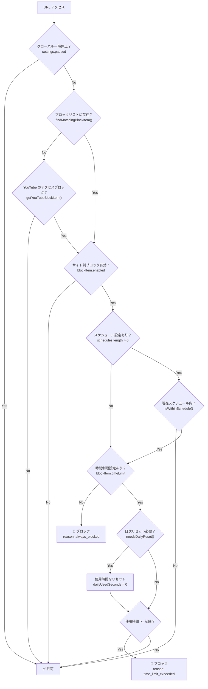
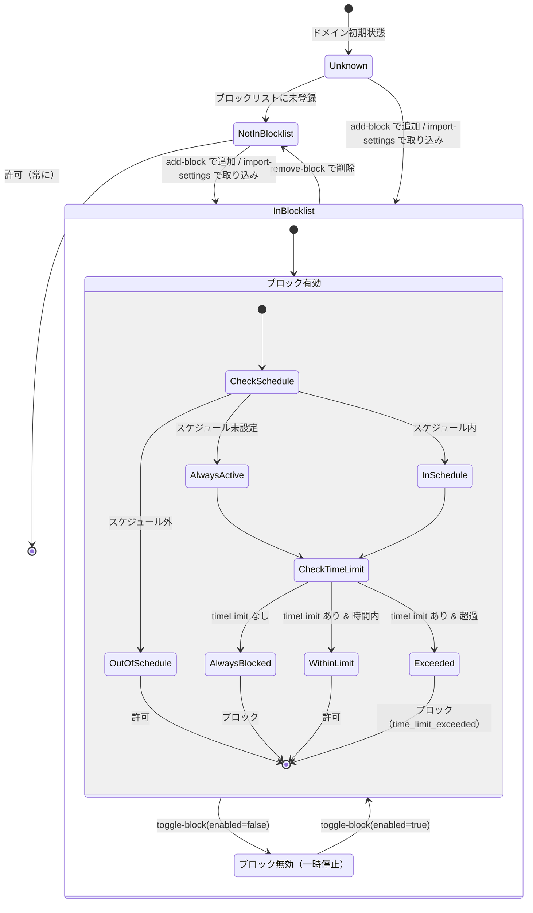
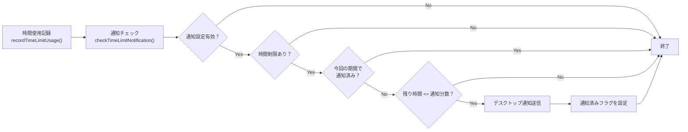

# ブロック状態管理 - ステートマシーン図

このドキュメントはブロック機能の状態遷移を定義しています。

## 概要

VisionFocusのブロック機能は、複数の条件を組み合わせてドメインのブロック状態を判定します。

## ブロック判定フロー

```mermaid
flowchart TD
    Start["URL アクセス"] --> A{"グローバル一時停止？<br/>settings.paused"}

    A -->|Yes| Unblocked["✅ 許可"]
    A -->|No| B{"ブロックリストに存在？<br/>findMatchingBlockItem()"}

    B -->|No| YT{"YouTube のアクセスブロック？<br/>getYouTubeBlockItem()"}
    B -->|Yes| C{"サイト別ブロック有効？<br/>blockItem.enabled"}

    YT -->|No| Unblocked
    YT -->|Yes| C

    C -->|No| Unblocked
    C -->|Yes| D{"スケジュール設定あり？<br/>schedules.length > 0"}

    D -->|No| E{"時間制限設定あり？<br/>blockItem.timeLimit"}
    D -->|Yes| F{"現在スケジュール内？<br/>isWithinSchedule()"}

    F -->|No| Unblocked
    F -->|Yes| E

    E -->|No| Blocked["🚫 ブロック<br/>reason: always_blocked"]
    E -->|Yes| H{"日次リセット必要？<br/>needsDailyReset()"}

    H -->|Yes| J["使用時間をリセット<br/>dailyUsedSeconds = 0"]
    H -->|No| K{"使用時間 >= 制限？"}

    J --> K

    K -->|Yes| TimeLimitExceeded["🚫 ブロック<br/>reason: time_limit_exceeded"]
    K -->|No| Unblocked
```

「ブロックリスト → YouTube の仮想ブロック項目」の 2 段の照合は
`findMatchingBlockItem()` に閉じている。

このフロー自体を持つのは `getBlockStateForDomain()` だけである。
URL 起点の判定（`getBlockState()`）は URL からドメインを取り出して渡すだけ、
記録（`shouldTrackBlockForDomain()`）は返ってきた `blocked` をそのまま使う。
同じ条件をもう 1 箇所に並べると片方だけが条件を取りこぼし、
ブロックはされるのに記録されないドメインや、ブロックされていないのに
ブロック回数が増えるドメインが生まれる。

## 状態遷移図

```mermaid
stateDiagram-v2
    [*] --> Unknown: ドメイン初期状態

    Unknown --> NotInBlocklist: ブロックリストに未登録
    Unknown --> InBlocklist: add-block で追加 / import-settings で取り込み

    state InBlocklist {
        [*] --> Enabled

        Enabled: ブロック有効
        Disabled: ブロック無効（一時停止）

        Enabled --> Disabled: toggle-block(enabled=false)
        Disabled --> Enabled: toggle-block(enabled=true)

        state Enabled {
            [*] --> CheckSchedule

            CheckSchedule --> OutOfSchedule: スケジュール外
            CheckSchedule --> InSchedule: スケジュール内
            CheckSchedule --> AlwaysActive: スケジュール未設定

            AlwaysActive --> CheckTimeLimit
            InSchedule --> CheckTimeLimit
            OutOfSchedule --> [*]: 許可

            CheckTimeLimit --> AlwaysBlocked: timeLimit なし
            CheckTimeLimit --> WithinLimit: timeLimit あり & 時間内
            CheckTimeLimit --> Exceeded: timeLimit あり & 超過

            AlwaysBlocked --> [*]: ブロック
            WithinLimit --> [*]: 許可
            Exceeded --> [*]: ブロック（time_limit_exceeded）
        }
    }

    InBlocklist --> NotInBlocklist: remove-block で削除
    NotInBlocklist --> InBlocklist: add-block で追加 / import-settings で取り込み

    NotInBlocklist --> [*]: 許可（常に）
```

## ブロック理由（BlockReason）

| 理由                  | 説明                 | 条件                 |
| --------------------- | -------------------- | -------------------- |
| `always_blocked`      | 常時ブロック         | timeLimit が未設定   |
| `time_limit_exceeded` | 時間制限超過         | 使用時間 >= 制限時間 |
| `null`                | ブロックされていない | 上記以外             |

## 状態を決定する要素

| 要素               | 保存場所                   | 型                               | 説明                        |
| ------------------ | -------------------------- | -------------------------------- | --------------------------- |
| グローバル一時停止 | `settings.paused`          | `boolean`                        | 拡張機能全体の一時停止      |
| ブロックリスト     | `settings.blockList`       | `BlockItem[]`                    | ブロック対象ドメインリスト  |
| サイト別有効/無効  | `blockItem.enabled`        | `boolean`                        | 個別サイトのブロック ON/OFF |
| サイト別時間制限   | `blockItem.timeLimit`      | `TimeLimit \| null`              | 「1日30分まで」などの設定   |
| スケジュール       | `settings.schedules`       | `Schedule[]`                     | ブロック有効時間帯          |
| 時間制限使用量     | `analytics.timeLimitUsage` | `Record<string, TimeLimitUsage>` | 実際の消費時間              |
| YouTube 設定       | `settings.youtube`         | `YouTubeSettings`                | アクセスブロックと時間制限  |

### YouTube の扱い（仮想のブロック項目）

YouTube はブロックリストに項目を持たない。`getYouTubeBlockItem()` が
`settings.youtube` から「仮想のブロック項目」を組み立て、判定（`getBlockState()`）と
ルール生成（`getActiveBlockedDomains()`）の両方がそれを使う。意味論はブロックリストと同じ。

| `settings.youtube`                         | 結果                                      |
| ------------------------------------------ | ----------------------------------------- |
| `enabled && blockAccess`、`timeLimit` なし | 常時ブロック（`always_blocked`）          |
| `enabled && blockAccess`、`timeLimit` あり | 超過後にブロック（`time_limit_exceeded`） |
| `blockAccess` が無効                       | ブロックしない（時間制限も使わない）      |

- ブロックリストに同じドメインの項目があれば、そちらの設定が優先される
- 時間制限の使用実績はホスト名ではなく `youtube.com` をキーに記録される
  （`youtubeBlockService` の `YOUTUBE_DOMAIN`）
- 計測・超過判定・残り時間・通知は `enabled && blockAccess && timeLimit` のときだけ動く
  （`youtubeBlockService` の `isYouTubeTimeLimitActive()`）。アクセスブロックが無効なら
  計測も通知も行わず、コンテンツスクリプトが画面を隠すこともない（#407）
- 非表示の設定（Shorts / おすすめ / コメント / ホームフィード）はこの状態遷移とは独立で、
  `enabled` なら `blockAccess` の値に関わらず適用される。制限を併用していると上限までは
  YouTube を開けるため（`src/lib/youtubeHideStyles.ts` の `generateYouTubeHideCSS()`。#422）

## ブロックの記録とブロック画面

ブロックが成立すると、ブロック画面（`newtab.html`）へリダイレクトし、
`recordBlockedDomain()` が 3 つの記録を残す。

| 記録                       | 保存場所                    | 使い道                                 |
| -------------------------- | --------------------------- | -------------------------------------- |
| サイト別ブロック回数       | `analytics.siteBlockCounts` | ブロック画面の「〜回ブロックしました」 |
| 最後にブロックしたドメイン | `chrome.storage.session`    | ブロック画面の帯に出すドメイン名       |
| 当日のブロック回数         | `analytics.dailyStats`      | 統計                                   |

リダイレクトが起きる経路は 2 つあり、**どちらも同じ記録を残す**。

| 経路                                   | 何が引き金か                         | 記録の呼び出し元                                  |
| -------------------------------------- | ------------------------------------ | ------------------------------------------------- |
| `declarativeNetRequest` のリダイレクト | ブロック対象への新しい遷移           | `listeners/navigationTracking.ts`（遷移イベント） |
| `chrome.tabs.update` による差し替え    | 設定変更で既に開いているタブを飛ばす | `blocker.ts` の `blockExistingTabs()`             |

- 後者は元ドメインの `webNavigation.onBeforeNavigate` を起こさないため、
  記録を遷移イベント側だけに置くと記録が残らず、帯が出ない
- 記録はリダイレクトより先に行う（ブロック画面が読み出す時点で値が無いと帯が出ない）
- **記録はブロックが成立したときだけ残る。** 遷移イベント側は
  `shouldTrackBlockForDomain()`（＝上のフローの結論）で確かめてから記録する。
  時間制限つきのサイトは上限に達するまで遷移しても通るため、ここで記録すると
  「〜回ブロックしました」と統計が実際より多くなる

### `newtab.html` は web accessible でなければならない

`declarativeNetRequest` のリダイレクト先は、公開リソース
（`manifest.web_accessible_resources`）でなければ他サイトからの遷移で拒否される。
宣言が無いと、検索結果や SNS のリンクから踏んだときだけ `ERR_BLOCKED_BY_CLIENT` に
なり、ブロック画面自体が表示されない（アドレスバーへの直打ちはブラウザ発の遷移なので通る）。
宣言は `wxt.config.ts` にあり、`scripts/__tests__/wxt-config-manifest.test.ts` が固定している。

出典: [declarativeNetRequest](https://developer.chrome.com/docs/extensions/reference/api/declarativeNetRequest)

## リセットタイミング

### 日次リセット（Daily）

- 条件: `lastDailyReset !== 今日の日付`
- 処理: `dailyUsedSeconds = 0`, `lastDailyReset = 今日`
- トリガー: `recordTimeLimitUsage()` または `resetExpiredUsage()`

## 通知フロー

```mermaid
flowchart LR
    A["時間使用記録<br/>recordTimeLimitUsage()"] --> B["通知チェック<br/>checkTimeLimitNotification()"]
    B --> C{"通知設定有効？"}
    C -->|No| End["終了"]
    C -->|Yes| D{"時間制限あり？"}
    D -->|No| End
    D -->|Yes| E{"今回の期間で<br/>通知済み？"}
    E -->|Yes| End
    E -->|No| F{"残り時間 <= 通知分数？"}
    F -->|No| End
    F -->|Yes| G["デスクトップ通知送信"]
    G --> H["通知済みフラグを設定"]
    H --> End
```

## 関連ファイル

| ファイル                                         | 責務                                 |
| ------------------------------------------------ | ------------------------------------ |
| `src/background/blocker.ts`                      | メインのブロック判定、ルール更新     |
| `src/background/time-limit.ts`                   | 時間制限の判定と記録                 |
| `src/background/notifications.ts`                | 通知判定と送信                       |
| `src/background/listeners/alarmHandlers.ts`      | アラームによるリセット処理           |
| `src/lib/blockService.ts`                        | ブロック状態の一元管理               |
| `src/lib/blockRecordService.ts`                  | ブロック成立時の記録の一元管理       |
| `src/lib/youtubeBlockService.ts`                 | YouTube の使用時間記録と超過判定     |
| `src/background/listeners/navigationTracking.ts` | 遷移イベントからの記録               |
| `wxt.config.ts`                                  | manifest（リダイレクト先の公開宣言） |
