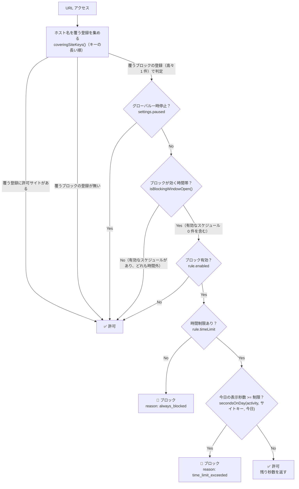
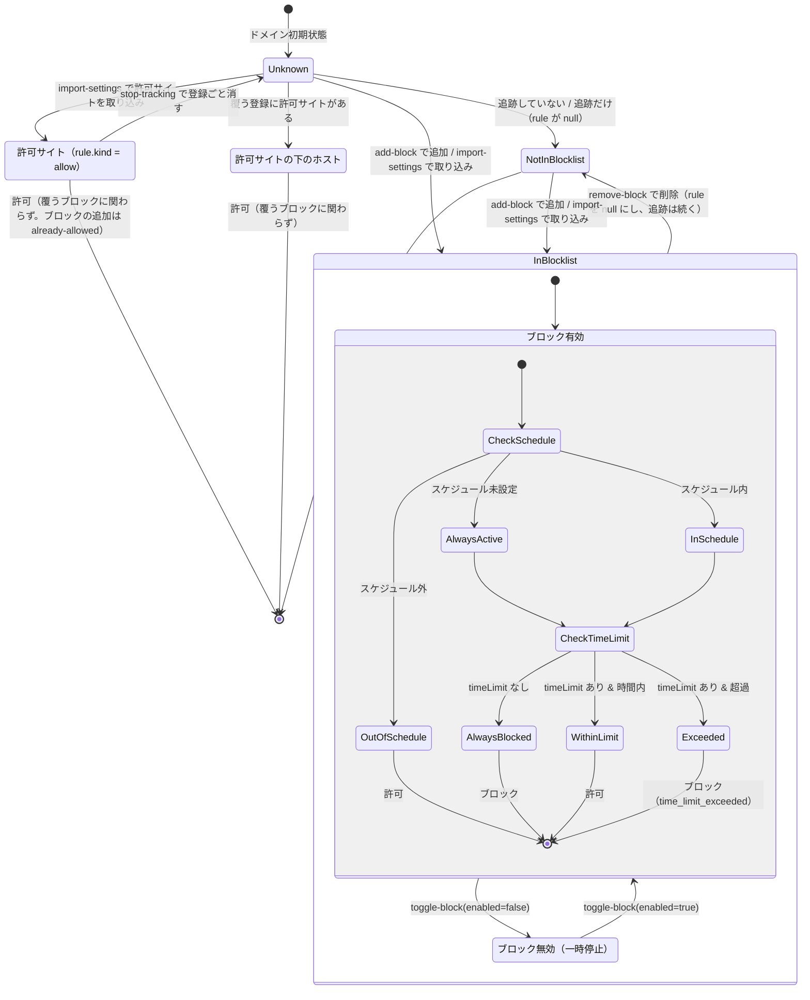
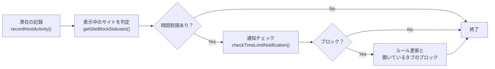
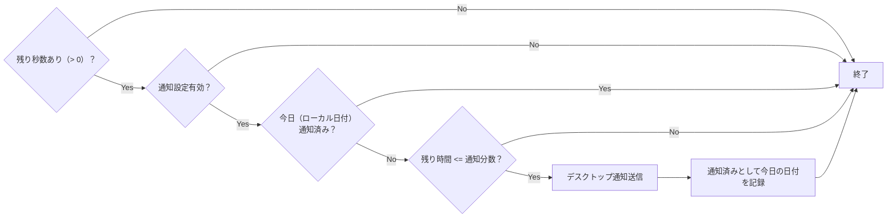

# ブロック状態管理 - ステートマシーン図

このドキュメントはブロック機能の状態遷移を定義しています。

## 概要

VisionFocusのブロック機能は、複数の条件を組み合わせてドメインのブロック状態を判定します。

## ブロック判定フロー

```mermaid
flowchart TD
    Start["URL アクセス"] --> Host["ホスト名を覆う登録を集める<br/>coveringSiteKeys()（キーの長い順）"]

    Host -->|覆う登録に許可サイトがある| Unblocked["✅ 許可"]
    Host -->|覆うブロックの登録が無い| Unblocked
    Host -->|覆うブロックの登録（高々 1 件）で判定| A{"グローバル一時停止？<br/>settings.paused"}

    A -->|Yes| Unblocked
    A -->|No| D{"ブロックが効く時間帯？<br/>isBlockingWindowOpen()"}

    D -->|No（有効なスケジュールがあり、どれも時間外）| Unblocked
    D -->|Yes（有効なスケジュール 0 件を含む）| C{"ブロック有効？<br/>rule.enabled"}

    C -->|No| Unblocked
    C -->|Yes| E{"時間制限あり？<br/>rule.timeLimit"}

    E -->|No| Blocked["🚫 ブロック<br/>reason: always_blocked"]
    E -->|Yes| K{"今日の表示秒数 >= 制限？<br/>secondsOnDay(activity, サイトキー, 今日)"}

    K -->|Yes| TimeLimitExceeded["🚫 ブロック<br/>reason: time_limit_exceeded"]
    K -->|No| Within["✅ 許可<br/>残り秒数を返す"]
```

一時停止から時間制限までの条件を並べるのは `src/lib/blockRule.ts` の `evaluateBlock()` だけである。
`src/lib/blockService.ts` は保存値（`settings` と `sites` と `activity`）を読み、ホスト名を覆う登録から
判定に使うブロックの登録を選び、今日の表示秒数を添えて `evaluateBlock()` に渡すだけにする。

- 判定（`getBlockStateForDomain()` / URL 起点の `getBlockState()`。記録の要否と理由もこの結論を使う）、
  ルール生成（`getRuleTargets()`）はどれも同じ `evaluateBlock()` を通る。
  条件をどこか 1 箇所に並べ直すと、開いているタブと新しい遷移で結果がずれたり、
  ブロックされていないのにブロック回数が増えたりする
- 判定: ホスト名を覆う登録（自分と祖先のキー）に許可サイトがあれば通す。無ければ覆うブロックの登録の規則で決める。
  入れ子の決まり（下の「サイトキー」）により、覆うブロックの登録は高々 1 件なので、代表を選ぶ処理は無い
- ルール生成（`getRuleTargets()`）は、今ブロックしているブロックの登録を `redirect`、許可サイトすべてを `allow` として返す。
  ルールの条件は `requestDomains: [サイトキー]` で、本体とすべてのサブドメインに一致する。
  `redirect` は優先度 1、`allow` は優先度 2 の固定値で、許可サイトのルールは覆うブロックの転送より必ず優先される
  （上にブロックが無い許可サイトの `allow` は、どのリクエストの結果も変えない）
- 判定とルールは一致する: ホストに許可サイトが掛かっていればその `allow` が一致して通す（判定も通す）。
  掛かっていなければ、一致しうるのはホストを覆うブロックの `redirect` だけで、それは判定がブロックのときにだけ出ている
- 有効なスケジュールが 1 件以上あれば、すべての項目はスケジュール内だけブロックする
  （時間制限の無い項目もスケジュール外は閲覧できる）。すべて無効にしたスケジュールは
  「スケジュール無し」と同じで、常に判定に進む。スケジュール外でも滞在時間は記録するが、
  制限には使わない

### サイトキー

追跡中のサイトは、`*.` と `www.` を除いて小文字にしたドメイン（サイトキー）で保存し、そのキーで照合する
（`src/lib/siteKey.ts`）。

- `*.example.com` / `www.example.com` / `example.com` はどれも `example.com` になる（追加時に正規化する）
- 時間制限の使用量はサイトキーの行で数える。`www.example.com` と `m.example.com` の滞在は同じ枠に入る
- 祖先・子孫の組を許すのは、子孫が許可サイトのときだけ（`findNestingConflict()`）。
  追加（`add-block` / `add-tracked-site` / `import-settings`）と、YouTube 設定で youtube.com を新しく作るときに検査する。
  ブロック・規則なしは、祖先がある・許可サイトでない子孫があると拒む。許可サイトは、許可サイトでない子孫があると拒む。
  ブロック・規則なしの入れ子を許すと、子のサブドメインでの滞在が親の使用量に入らず、子を登録するだけで親の時間制限を回避できる。
  許可サイトはその回避を意図して登録するもので、ブロックリストの側から見える
- 許可サイトでの滞在は許可サイトの行に入り（ホストが属するのはキーが最も長い登録）、親の使用量には入らない

## 状態遷移図

```mermaid
stateDiagram-v2
    [*] --> Unknown: ドメイン初期状態

    Unknown --> NotInBlocklist: 追跡していない / 追跡だけ（rule が null）
    Unknown --> InBlocklist: add-block で追加 / import-settings で取り込み
    Unknown --> Allowed: import-settings で許可サイトを取り込み
    Unknown --> AllowedHost: 覆う登録に許可サイトがある

    Allowed: 許可サイト（rule.kind = allow）
    AllowedHost: 許可サイトの下のホスト

    state InBlocklist {
        [*] --> Enabled

        Enabled: ブロック有効
        Disabled: ブロック無効（一時停止）

        Enabled --> Disabled: toggle-block(enabled=false)
        Disabled --> Enabled: toggle-block(enabled=true)

        state Enabled {
            [*] --> CheckSchedule

            CheckSchedule --> OutOfSchedule: スケジュール外
            CheckSchedule --> InSchedule: スケジュール内
            CheckSchedule --> AlwaysActive: スケジュール未設定

            AlwaysActive --> CheckTimeLimit
            InSchedule --> CheckTimeLimit
            OutOfSchedule --> [*]: 許可

            CheckTimeLimit --> AlwaysBlocked: timeLimit なし
            CheckTimeLimit --> WithinLimit: timeLimit あり & 時間内
            CheckTimeLimit --> Exceeded: timeLimit あり & 超過

            AlwaysBlocked --> [*]: ブロック
            WithinLimit --> [*]: 許可
            Exceeded --> [*]: ブロック（time_limit_exceeded）
        }
    }

    InBlocklist --> NotInBlocklist: remove-block で削除（rule を null にし、追跡は続く）
    NotInBlocklist --> InBlocklist: add-block で追加 / import-settings で取り込み

    Allowed --> Unknown: stop-tracking で登録ごと消す
    Allowed --> [*]: 許可（覆うブロックに関わらず。ブロックの追加は already-allowed）
    AllowedHost --> [*]: 許可（覆うブロックに関わらず）

    NotInBlocklist --> [*]: 許可（常に）
```

## ブロック理由（BlockReason）

| 理由                  | 説明                 | 条件                       |
| --------------------- | -------------------- | -------------------------- |
| `always_blocked`      | 常時ブロック         | timeLimit が未設定         |
| `time_limit_exceeded` | 時間制限超過         | 今日の表示秒数 >= 制限秒数 |
| `null`                | ブロックされていない | 上記以外                   |

## 状態を決定する要素

| 要素               | 保存場所                             | 型                  | 説明                                                   |
| ------------------ | ------------------------------------ | ------------------- | ------------------------------------------------------ |
| グローバル一時停止 | `settings.paused`                    | `boolean`           | 拡張機能全体の一時停止                                 |
| サイトの規則       | `sites[サイトキー].rule`             | `SiteRule \| null`  | `kind` がブロックか許可。null なら規則なし（追跡だけ） |
| 覆う許可サイト     | `sites[祖先か自分のキー].rule.kind`  | `'allow'`           | あればブロックの規則に関わらず通す                     |
| サイト別有効/無効  | `sites[サイトキー].rule.enabled`     | `boolean`           | ブロックの規則の ON/OFF                                |
| サイト別時間制限   | `sites[サイトキー].rule.timeLimit`   | `TimeLimit \| null` | ブロックの規則の「1日30分まで」などの設定              |
| スケジュール       | `settings.schedules`                 | `Schedule[]`        | ブロック有効時間帯                                     |
| 時間制限使用量     | `activity[今日][サイトキー].seconds` | `number`            | 今日（ローカル日付）の表示秒数                         |

### YouTube の扱い

`youtube.com` も普通の追跡中のサイトで、アクセスブロックと時間制限は `sites['youtube.com'].rule`（ブロックの規則）が持つ。
判定は他のサイトと同じ `evaluateBlock()` を通り、YouTube だけの条件は無い。

- 設定画面の YouTube の節で機能全体を無効にすると、非表示機能（`youtube`）と規則（`rule`）の両方が
  null になる。アクセスブロックを OFF にするとブロックの規則の `enabled` が false になる（ブロックリストのトグル OFF と同じ。
  時間制限は残り、ON に戻せば復元される）
- 節の「有効」表示は `youtube` があるか、ブロックの規則が有効なとき。無効のブロックの規則だけの youtube.com は有効に数えない
- youtube.com が無い状態から YouTube 設定を保存すると、youtube.com を新しく作る前に入れ子を検査する。
  許可サイトでない子孫（例: 規則なしで追跡中の `m.youtube.com`）があれば書かずに `nested-site` を返し、節に理由を出す。
  youtube.com が許可サイトとして登録されていれば、保存は `already-allowed` で拒む（許可をブロックに変えない）
- 使用量は `youtube.com` の今日の行を読む（`www.youtube.com` / `m.youtube.com` の滞在も同じ行に入る。
  `music.youtube.com` のような許可サイトの滞在はその許可サイトの行に入る）。
  滞在は追跡中なら常に記録されるが、ブロックと通知に使うのはブロックの規則が有効なときだけ
- youtube.com をブロックし `music.youtube.com` を許可サイトにすると、ルールは youtube.com の `redirect`（優先度 1）と
  `music.youtube.com` の `allow`（優先度 2）になる。`music.youtube.com` は通り、`www.youtube.com` / `m.youtube.com` は止まる
- 非表示の設定（Shorts / おすすめ / コメント / ホームフィード）はこの状態遷移とは独立で、
  `sites['youtube.com'].youtube` があればブロックの規則の値に関わらず適用される。制限を併用していると上限までは
  YouTube を開けるため（`src/lib/youtubeHideStyles.ts` の `generateYouTubeHideCSS()`）。
  ただし許可サイトに当たるホスト（例: `music.youtube.com`）には当てない（`src/entrypoints/youtube.content.ts`）

## ブロックの記録とブロック画面

ブロックが成立すると、ブロック画面（`newtab.html`）へリダイレクトし、
`recordBlockedDomain()` が 2 つの記録を残す。

| 記録                             | 保存場所                                               | 使い道                                                           |
| -------------------------------- | ------------------------------------------------------ | ---------------------------------------------------------------- |
| 最後にブロックしたドメインと理由 | `chrome.storage.session`                               | ブロック画面の帯に出すドメイン名と、帯の文言（理由で切り替える） |
| ブロック回数                     | `activity` の今日の行の `blocks`（追跡中のサイトだけ） | ブロック画面の「〜回ブロックしました」・今日のサマリー・分析     |

リダイレクトが起きる経路は 2 つあり、**どちらも同じ記録を残す**。

| 経路                                   | 何が引き金か                         | 記録の呼び出し元                                  |
| -------------------------------------- | ------------------------------------ | ------------------------------------------------- |
| `declarativeNetRequest` のリダイレクト | ブロック対象への新しい遷移           | `listeners/navigationTracking.ts`（遷移イベント） |
| `chrome.tabs.update` による差し替え    | 設定変更で既に開いているタブを飛ばす | `blocker.ts` の `blockExistingTabs()`             |

- 後者は元ドメインの `webNavigation.onBeforeNavigate` を起こさないため、
  記録を遷移イベント側だけに置くと記録が残らず、帯が出ない
- 記録はリダイレクトより先に行う（ブロック画面が読み出す時点で値が無いと帯が出ない）
- 理由は上の「ブロック理由（BlockReason）」のうちブロックが成立したもの（`always_blocked` / `time_limit_exceeded`）で、
  ドメインと 1 つの組で残す。ブロック画面は URL ではなくこの記録から理由を読む（`declarativeNetRequest` のリダイレクトは
  行き先を 1 種類にしか決められず、理由を運べないため）
- **記録はブロックが成立したときだけ残る。** 遷移イベント側は
  `getBlockStateForDomain()`（＝上のフローの結論）で確かめ、その理由を添えて記録する。
  時間制限つきのサイトは上限に達するまで遷移しても通るため、ここで記録すると
  「〜回ブロックしました」と統計が実際より多くなる

### `newtab.html` は web accessible でなければならない

`declarativeNetRequest` のリダイレクト先は、公開リソース
（`manifest.web_accessible_resources`）でなければ他サイトからの遷移で拒否される。
宣言が無いと、検索結果や SNS のリンクから踏んだときだけ `ERR_BLOCKED_BY_CLIENT` に
なり、ブロック画面自体が表示されない（アドレスバーへの直打ちはブラウザ発の遷移なので通る）。
宣言は `wxt.config.ts` にあり、`scripts/__tests__/wxt-config-manifest.test.ts` が固定している。

出典: [declarativeNetRequest](https://developer.chrome.com/docs/extensions/reference/api/declarativeNetRequest)

## 日付が変わったとき

使用量は「今日（端末のローカル時刻の日付）の行」を読むだけなので、リセット処理は持たない。
0 時を過ぎると別の行を読むことになり、使用量は 0 から数え直しになる。

- 開いているタブと新しい遷移のルールは、毎分の `check-schedule` アラームが
  `updateBlockRules()` で作り直すときに今日の行で判定し直す（日付が変わってから 1 分以内に解除される）
- 時間制限を途中で設定した日も、その日に既に表示していた秒数を数える
  （設定した時点で上限を超えていれば、すぐにブロックされる）

## 時間制限の適用と通知

`src/background/handlers/tracker-heartbeat.ts` は記録間隔ごとに、表示中のページの滞在を
`activity` の今日の行へ加算してから、同じページのサイトを判定する（加算より先に判定すると 1 間隔遅れる）。

```mermaid
flowchart LR
    A["滞在の記録<br/>recordHostActivity()"] --> B["表示中のサイトを判定<br/>getSiteBlockStatuses()"]
    B --> C{"時間制限あり？"}
    C -->|No| End["終了"]
    C -->|Yes| N["通知チェック<br/>checkTimeLimitNotification()"]
    N --> X{"ブロック？"}
    X -->|Yes| R["ルール更新と<br/>開いているタブのブロック"]
    X -->|No| End
    R --> End
```

通知チェックは次の順に見る。残り秒数は判定（`evaluateBlock()`）の値で、一時停止中・スケジュール外・
無効な項目では残り秒数が無いので通知しない。

```mermaid
flowchart LR
    B{"残り秒数あり（> 0）？"} -->|No| End["終了"]
    B -->|Yes| C{"通知設定有効？"}
    C -->|No| End
    C -->|Yes| E{"今日（ローカル日付）<br/>通知済み？"}
    E -->|Yes| End
    E -->|No| F{"残り時間 <= 通知分数？"}
    F -->|No| End
    F -->|Yes| G["デスクトップ通知送信"]
    G --> H["通知済みとして今日の日付を記録"]
    H --> End
```

## 関連ファイル

| ファイル                                         | 責務                                                           |
| ------------------------------------------------ | -------------------------------------------------------------- |
| `src/background/blocker.ts`                      | ルール更新と開いているタブのブロック                           |
| `src/background/handlers/tracker-heartbeat.ts`   | 滞在の記録と時間制限の適用                                     |
| `src/background/notifications.ts`                | 通知判定と送信                                                 |
| `src/background/listeners/alarmHandlers.ts`      | 毎分のルール再計算（`check-schedule`）                         |
| `src/lib/blockRule.ts`                           | ブロックの条件（`evaluateBlock()`）                            |
| `src/lib/blockService.ts`                        | 保存値を読み `evaluateBlock()` に渡す判定とルール生成の入口    |
| `src/lib/siteKey.ts`                             | サイトキーの正規化・照合（`coveringSiteKeys()`）と入れ子の検査 |
| `src/lib/activityStats.ts`                       | 今日の表示秒数（`secondsOnDay()`）                             |
| `src/lib/blockRecordService.ts`                  | ブロック成立時の記録の一元管理                                 |
| `src/background/listeners/navigationTracking.ts` | 遷移イベントからの記録                                         |
| `wxt.config.ts`                                  | manifest（リダイレクト先の公開宣言）                           |
