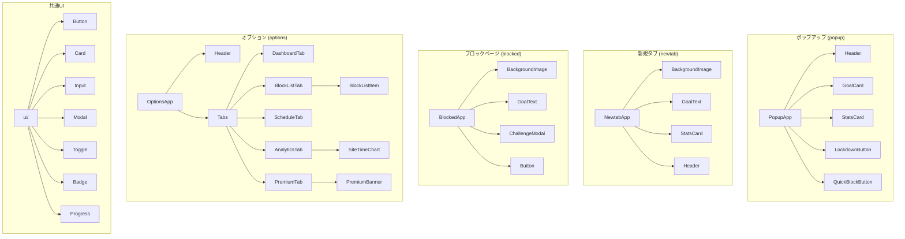

# コンポーネント設計

## 1. コンポーネント一覧

### UI コンポーネント（共通）

| コンポーネント名 | 種別 | 説明               |
| ---------------- | ---- | ------------------ |
| Button           | ui   | 汎用ボタン         |
| Card             | ui   | カードコンテナ     |
| Input            | ui   | テキスト入力       |
| Modal            | ui   | モーダルダイアログ |
| Toggle           | ui   | ON/OFFスイッチ     |
| Badge            | ui   | ステータスバッジ   |
| Tabs             | ui   | タブナビゲーション |
| Progress         | ui   | プログレスバー     |
| Tooltip          | ui   | ツールチップ       |

### 機能コンポーネント

| コンポーネント名    | 種別    | 説明                            |
| ------------------- | ------- | ------------------------------- |
| Header              | layout  | ヘッダー（ロゴ + ナビ）         |
| GoalCard            | feature | 目標表示カード                  |
| StatsCard           | feature | 統計表示カード                  |
| BlockListItem       | feature | ブロックリスト項目              |
| SiteTimeChart       | feature | サイト利用時間グラフ            |
| ChallengeModal      | feature | 解除チャレンジモーダル          |
| LockdownButton      | feature | ロックダウンモードボタン        |
| QuickBlockButton    | feature | クイックブロックボタン          |
| ScheduleEditor      | feature | スケジュール編集                |
| PremiumBanner       | feature | 有料版アップグレードバナー      |
| ImageUploader       | feature | 背景画像アップロード（Premium） |
| FontPicker          | feature | フォント選択（20種類以上）      |
| AnalyticsChart      | feature | 分析グラフ（recharts）          |
| ReportCard          | feature | 週次/月次レポート表示           |
| DownloadButton      | feature | 壁紙ダウンロード（Premium）     |
| SiteCategoryManager | feature | サイトカテゴリ管理UI            |
| UpgradePrompt       | feature | プレミアムアップグレード促進    |

### 新規タブ用コンポーネント

| コンポーネント名 | 種別   | 説明                    |
| ---------------- | ------ | ----------------------- |
| GoalDisplay      | newtab | 目標テキスト表示・編集  |
| MiniStats        | newtab | ミニ統計カード（3項目） |

### オプション画面用コンポーネント

| コンポーネント名 | 種別    | 説明                       |
| ---------------- | ------- | -------------------------- |
| GeneralTab       | options | 一般設定（プリセット管理） |
| BlocklistTab     | options | ブロックリスト管理         |
| SchedulesTab     | options | スケジュール管理           |
| AnalyticsTab     | options | 分析タブ                   |
| PremiumTab       | options | プレミアムタブ             |
| ScheduleModal    | modal   | スケジュール編集モーダル   |
| NewPresetModal   | modal   | 新規プリセット作成モーダル |

### ページコンポーネント

| コンポーネント名 | コンテキスト | 説明                       |
| ---------------- | ------------ | -------------------------- |
| PopupApp         | popup        | ポップアップ全体           |
| NewtabApp        | newtab       | 新規タブ（ダッシュボード） |
| BlockedApp       | blocked      | ブロックページ             |
| OptionsApp       | options      | オプション画面             |

## 2. コンポーネント階層図



## 3. 主要コンポーネント詳細

---

### Button

汎用ボタンコンポーネント。

**Props**

| Prop      | 型                                                | デフォルト  | 説明             |
| --------- | ------------------------------------------------- | ----------- | ---------------- |
| variant   | `'primary' \| 'secondary' \| 'danger' \| 'ghost'` | `'primary'` | ボタンスタイル   |
| size      | `'sm' \| 'md' \| 'lg'`                            | `'md'`      | サイズ           |
| disabled  | `boolean`                                         | `false`     | 無効状態         |
| loading   | `boolean`                                         | `false`     | ローディング状態 |
| fullWidth | `boolean`                                         | `false`     | 幅100%           |
| onClick   | `() => void`                                      | -           | クリックハンドラ |
| children  | `ReactNode`                                       | -           | ボタンテキスト   |

**使用例**

```tsx
<Button variant="primary" onClick={handleSave}>
  保存
</Button>

<Button variant="danger" size="sm" loading={isDeleting}>
  削除
</Button>
```

---

### Card

汎用カードコンテナ。

**Props**

| Prop     | 型                                      | デフォルト  | 説明                               |
| -------- | --------------------------------------- | ----------- | ---------------------------------- |
| variant  | `'default' \| 'outlined' \| 'elevated'` | `'default'` | カードスタイル                     |
| padding  | `'none' \| 'sm' \| 'md' \| 'lg'`        | `'md'`      | 内側余白                           |
| onClick  | `() => void`                            | -           | クリックハンドラ（クリッカブル時） |
| children | `ReactNode`                             | -           | カード内容                         |

---

### Input

テキスト入力フィールド。

**Props**

| Prop        | 型                            | デフォルト | 説明             |
| ----------- | ----------------------------- | ---------- | ---------------- |
| type        | `'text' \| 'url' \| 'number'` | `'text'`   | 入力タイプ       |
| value       | `string`                      | -          | 入力値           |
| onChange    | `(value: string) => void`     | -          | 変更ハンドラ     |
| placeholder | `string`                      | -          | プレースホルダー |
| error       | `string`                      | -          | エラーメッセージ |
| disabled    | `boolean`                     | `false`    | 無効状態         |
| label       | `string`                      | -          | ラベル           |

---

### Modal

モーダルダイアログ。

**Props**

| Prop     | 型                     | デフォルト | 説明           |
| -------- | ---------------------- | ---------- | -------------- |
| isOpen   | `boolean`              | -          | 表示状態       |
| onClose  | `() => void`           | -          | 閉じるハンドラ |
| title    | `string`               | -          | タイトル       |
| size     | `'sm' \| 'md' \| 'lg'` | `'md'`     | サイズ         |
| children | `ReactNode`            | -          | モーダル内容   |

---

### GoalCard

目標表示カード。ダッシュボードやポップアップで使用。

**Props**

| Prop     | 型                       | デフォルト | 説明             |
| -------- | ------------------------ | ---------- | ---------------- |
| goalText | `string`                 | -          | 目標テキスト     |
| onClick  | `() => void`             | -          | クリックハンドラ |
| editable | `boolean`                | `false`    | 編集可能かどうか |
| onEdit   | `(text: string) => void` | -          | 編集完了ハンドラ |

**使用例**

```tsx
<GoalCard
  goalText="ライバルを追い抜き、圧倒的な成果を出す"
  onClick={() => chrome.tabs.create({ url: 'newtab.html' })}
/>
```

---

### StatsCard

統計情報を表示するカード。

**Props**

| Prop  | 型                                            | デフォルト  | 説明                     |
| ----- | --------------------------------------------- | ----------- | ------------------------ |
| label | `string`                                      | -           | ラベル（例: "浪費時間"） |
| value | `string`                                      | -           | 値（例: "1h 23m"）       |
| type  | `'waste' \| 'invest' \| 'block' \| 'neutral'` | `'neutral'` | タイプ（色分け用）       |
| icon  | `ReactNode`                                   | -           | アイコン                 |

**使用例**

```tsx
<StatsCard label="浪費時間" value="1h 23m" type="waste" />
```

---

### BlockListItem

ブロックリストの1項目を表示。

**Props**

| Prop       | 型           | デフォルト | 説明                   |
| ---------- | ------------ | ---------- | ---------------------- |
| domain     | `string`     | -          | ドメイン名             |
| isWildcard | `boolean`    | `false`    | ワイルドカードかどうか |
| onEdit     | `() => void` | -          | 編集ハンドラ           |
| onDelete   | `() => void` | -          | 削除ハンドラ           |

---

### ChallengeModal

解除チャレンジ用モーダル。

**Props**

| Prop          | 型           | デフォルト | 説明                   |
| ------------- | ------------ | ---------- | ---------------------- |
| isOpen        | `boolean`    | -          | 表示状態               |
| onClose       | `() => void` | -          | 閉じるハンドラ         |
| onSuccess     | `() => void` | -          | チャレンジ成功ハンドラ |
| challengeText | `string`     | -          | 入力すべきテキスト     |

**内部ロジック**

- ユーザーが `challengeText` を正確に入力したら成功
- 成功時は `onSuccess` を呼び出し、一定時間（5分）アクセス許可
- 大文字小文字を区別する

---

### LockdownButton

ロックダウンモードの有効化/無効化ボタン。

**Props**

| Prop     | 型                          | デフォルト | 説明           |
| -------- | --------------------------- | ---------- | -------------- |
| isActive | `boolean`                   | -          | 現在の状態     |
| onToggle | `(active: boolean) => void` | -          | トグルハンドラ |
| disabled | `boolean`                   | `false`    | 無効状態       |

**挙動**

- 有効化時は確認モーダルを表示
- 有効中はアイコンとラベルが変化

---

### SiteTimeChart

サイト利用時間の棒グラフ。

**Props**

| Prop   | 型                             | デフォルト | 説明           |
| ------ | ------------------------------ | ---------- | -------------- |
| data   | `DailyStat[]`                  | -          | 日別統計データ |
| period | `'today' \| 'week' \| 'month'` | `'week'`   | 表示期間       |

**使用ライブラリ**

軽量なグラフライブラリ（Chart.js または自前のSVG）を使用。Chrome拡張のサイズ制約を考慮。

---

### ScheduleEditor

時間帯ブロックのスケジュール編集。

**Props**

| Prop         | 型                                | デフォルト | 説明               |
| ------------ | --------------------------------- | ---------- | ------------------ |
| schedules    | `Schedule[]`                      | -          | 現在のスケジュール |
| onChange     | `(schedules: Schedule[]) => void` | -          | 変更ハンドラ       |
| maxSchedules | `number`                          | `10`       | 最大スケジュール数 |

---

### PremiumBanner

有料版へのアップグレードを促すバナー。

**Props**

| Prop      | 型           | デフォルト | 説明                         |
| --------- | ------------ | ---------- | ---------------------------- |
| feature   | `string`     | -          | 制限されている機能名         |
| onUpgrade | `() => void` | -          | アップグレードボタンハンドラ |

**使用例**

```tsx
<PremiumBanner
  feature="30日以上の分析履歴"
  onUpgrade={() => chrome.tabs.create({ url: 'options.html#premium' })}
/>
```

## 4. カスタムフック

### useStorage（@plasmohq/storage/hook）

Plasmo提供のストレージ同期フック。chrome.storage の値をReactで自動同期。

```typescript
import { useStorage } from '@plasmohq/storage/hook'

const [settings, setSettings] = useStorage<AppSettings>(
  {
    key: 'settings',
    instance: storage,
  },
  DEFAULT_SETTINGS
)
```

---

### useBlocklist

ブロックリスト管理フック。

```typescript
function useBlocklist(props: {
  settings: AppSettings | undefined
  setSettings: (settings: AppSettings) => void
}): {
  newDomain: string
  setNewDomain: (domain: string) => void
  blockError: string
  handleAddDomain: () => void
  handleRemoveDomain: (domain: string) => void
}
```

**機能**

- ドメインの追加・削除
- ワイルドカード（\*.example.com）対応
- 重複チェック
- バリデーションエラー管理

---

### useSchedules

スケジュール管理フック。

```typescript
interface ScheduleFormData {
  name: string
  startTime: string
  endTime: string
  days: number[]
  presetId: string
}

function useSchedules(props: {
  settings: AppSettings | undefined
  setSettings: (settings: AppSettings) => void
}): {
  showScheduleModal: boolean
  setShowScheduleModal: (show: boolean) => void
  editingSchedule: Schedule | null
  scheduleForm: ScheduleFormData
  setScheduleForm: (form: ScheduleFormData) => void
  openAddSchedule: () => void
  openEditSchedule: (schedule: Schedule) => void
  handleSaveSchedule: () => void
  handleDeleteSchedule: (id: string) => void
  handleToggleSchedule: (id: string) => void
}
```

**機能**

- スケジュールの追加・編集・削除
- 有効/無効の切り替え
- プリセット連携（presetId）

---

### usePresets

プリセット管理フック。

```typescript
function usePresets(props: {
  vision: VisionSettings | undefined
  setVision: (vision: VisionSettings) => void
}): {
  // プリセット一覧（ドラフト状態）
  draftPresets: DashboardPreset[]
  selectedPresetId: string | null
  draftDisplaySettings: DashboardDisplaySettings
  editingPresetName: string
  isDirty: boolean
  visionSaved: boolean

  // モーダル制御
  showSavePresetModal: boolean
  setShowSavePresetModal: (show: boolean) => void
  presetName: string
  setPresetName: (name: string) => void

  // プリセット操作
  handleSelectPreset: (id: string | null) => void
  handleCreatePreset: () => void
  handleDeletePreset: (id: string) => void
  handleApplyPreset: () => void
  handleSaveSelectedPreset: () => void

  // 設定変更
  handlePresetNameChange: (name: string) => void
  handleGoalTextChange: (text: string) => void
  handleGoalSubTextChange: (text: string) => void
  handleTextColorChange: (color: string) => void
  handleBackgroundTypeChange: (type: 'image' | 'color') => void
  handleBackgroundChange: (imageId: string) => void
  handleBackgroundColorChange: (color: string) => void
  handleCustomBackgroundChange: (data: string | null) => void
  handleFontSettingsChange: (settings: Partial<FontSettings>) => void
}
```

**機能**

- プリセットの作成・選択・削除・適用
- 設定変更時のドラフト管理
- ストレージへの永続化

---

### useAnalytics

分析データ取得フック。

```typescript
function useAnalytics(period: 'today' | 'week' | 'month'): {
  dailyStats: DailyStat[]
  siteRanking: SiteTime[]
  totalWasteTime: number
  totalInvestTime: number
  loading: boolean
}
```

---

### usePremium

プレミアム状態管理フック。

```typescript
function usePremium(): {
  isPremium: boolean
  expiresAt: Date | null
  checkLicense: () => Promise<void>
}
```

## 5. 型定義

### BlockItem

```typescript
interface BlockItem {
  id: string
  domain: string // ドメイン（ワイルドカード可）
  isWildcard: boolean // ワイルドカードかどうか
  createdAt: string // 作成日時
}
```

### Schedule

```typescript
interface Schedule {
  id: string
  name: string // スケジュール名
  startTime: string // 開始時刻 (HH:mm)
  endTime: string // 終了時刻 (HH:mm)
  days: number[] // 曜日 (0=日, 1=月, ..., 6=土)
  enabled: boolean // 有効/無効
  presetId?: string // このスケジュールで適用するプリセットID
}
```

### DashboardDisplaySettings

```typescript
interface DashboardDisplaySettings {
  goalText: string // 目標テキスト
  goalSubText: string // サブテキスト
  textColor: string // テキスト色
  backgroundType: 'image' | 'color'
  backgroundImage: string // 背景画像ID
  backgroundColor: string // 背景色
  customBackgroundData: string | null // Base64アップロード画像（Premium）
  fontSettings: FontSettings // フォント設定
}
```

### DashboardPreset

```typescript
interface DashboardPreset extends DashboardDisplaySettings {
  id: string
  name: string
  createdAt: string
}
```

### VisionSettings

```typescript
interface VisionSettings {
  defaultSettings: DashboardDisplaySettings // デフォルト設定
  presets: DashboardPreset[] // ユーザー作成プリセット
  activePresetId: string | null // 現在有効なプリセットID
}
```

### FontSettings

```typescript
type FontFamily = 'system' | 'inter' | 'roboto' | 'noto-sans-jp' | ... // 20種類以上

interface FontSettings {
  family: FontFamily
  size: 'sm' | 'md' | 'lg' | 'xl'
  weight: 'normal' | 'medium' | 'semibold' | 'bold'
}
```

### FeatureLimits

```typescript
interface FeatureLimits {
  maxBlockList: number
  historyDays: number
  maxPresets: number
}

const FEATURE_LIMITS = {
  free: {
    maxBlockList: Infinity, // Unlimited for all users
    historyDays: 7,
    maxPresets: 1,
  },
  premium: {
    maxBlockList: Infinity,
    historyDays: Infinity,
    maxPresets: 5,
  },
}
```

### DailyStat

```typescript
interface DailyStat {
  date: string // YYYY-MM-DD
  wasteTime: number // 浪費時間（秒）
  investTime: number // 投資時間（秒）
  blockCount: number // ブロック回数
}
```

### SiteTime

```typescript
interface SiteTime {
  domain: string // ドメイン
  time: number // 滞在時間（秒）
  category: 'waste' | 'invest' | 'neutral'
}
```
