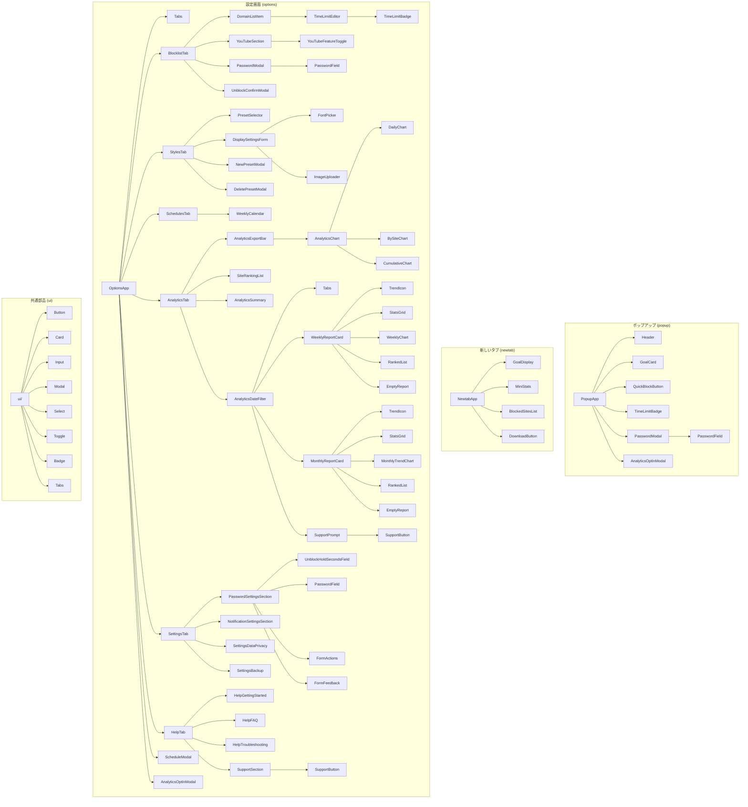

# コンポーネント設計

この文書が扱う部品は、`src/components` と `src/entrypoints/*/App.tsx` が `export function` で公開しているコンポーネントである（ファイル内だけで使う補助のコンポーネントは載せない）。
各部品の振る舞いの詳細は、実体の JSDoc を正とする。

## 1. コンポーネント一覧

### 共通部品（`src/components/ui`）

| コンポーネント名 | 役割                                                 |
| ---------------- | ---------------------------------------------------- |
| Button           | 色・大きさ・読み込み中表示を切り替えられるボタン     |
| Card             | 内容を囲む白い枠（`onClick` でボタンとして振る舞う） |
| Input            | ラベルとエラー文つきの 1 行入力欄                    |
| Modal            | 画面を暗くした上に重ねるダイアログ                   |
| Select           | プルダウン                                           |
| Toggle           | オン・オフのスイッチ                                 |
| Badge            | 色付きの短いラベル                                   |
| Tabs             | 横並びのタブ                                         |

### 機能部品（`src/components/features`）

| コンポーネント名  | 置き場所            | 役割                                                                       |
| ----------------- | ------------------- | -------------------------------------------------------------------------- |
| Header            | `Header/`           | ロゴ・バージョン・一時停止のスイッチ・設定とヘルプのボタンを並べたヘッダー |
| GoalCard          | `GoalCard/`         | 今日の目標のカード（その場で編集できる）                                   |
| QuickBlockButton  | `QuickBlockButton/` | ドメインを入力してすぐブロックに加える欄                                   |
| TimeLimitBadge    | `TimeLimitBadge/`   | 時間制限の残り時間のバッジ                                                 |
| ImageUploader     | `ImageUploader/`    | 背景画像の選択・圧縮・プレビュー                                           |
| FontPicker        | `FontPicker/`       | フォントのカテゴリ・種類・大きさ・太さの選択とプレビュー                   |
| DownloadButton    | `DownloadButton/`   | 解像度を選んで画面を壁紙画像として保存するボタン                           |
| AnalyticsChart    | `AnalyticsChart/`   | 直近の合計閲覧時間と、種類を切り替えられるグラフ                           |
| DailyChart        | `AnalyticsChart/`   | 日ごとの閲覧時間の折れ線グラフ                                             |
| BySiteChart       | `AnalyticsChart/`   | サイトごとの閲覧時間の横棒グラフ                                           |
| CumulativeChart   | `AnalyticsChart/`   | 日ごとの累計閲覧時間の縦棒グラフ                                           |
| WeeklyReportCard  | `ReportCard/`       | 週のレポートのカード（週を移動できる）                                     |
| MonthlyReportCard | `ReportCard/`       | 月のレポートのカード（月を移動できる）                                     |
| TrendIcon         | `ReportCard/`       | 傾向の矢印アイコンと文言                                                   |
| StatsGrid         | `ReportCard/`       | 期間の時間・前期間比・ブロック回数・解除回数の 4 枠                        |
| WeeklyChart       | `ReportCard/`       | 曜日ごとの時間（棒）とブロック回数（折れ線）                               |
| MonthlyTrendChart | `ReportCard/`       | 月内の週ごとの時間（棒）とブロック回数（折れ線）                           |
| RankedList        | `ReportCard/`       | サイトの上位を順位つきで並べる表                                           |
| EmptyReport       | `ReportCard/`       | レポートに出すデータが無いときの表示                                       |
| SupportButton     | `Support/`          | 支援を呼びかけるボタン                                                     |
| SupportPrompt     | `Support/`          | 支援を呼びかける帯（支援・閉じるボタンつき）                               |
| SupportSection    | `Support/`          | 支援を呼びかける説明のカード                                               |

### 新しいタブ用部品（`src/components/newtab`）

| コンポーネント名 | 役割                                                   |
| ---------------- | ------------------------------------------------------ |
| GoalDisplay      | 中央に大きく出す目標と補足（編集中は入力欄）           |
| MiniStats        | 今日のブロック回数とブロックを続けている日数の小さな枠 |
| BlockedSitesList | ブロック中のサイトの開閉できる一覧                     |

### 設定画面用部品（`src/components/options`）

| コンポーネント名            | 置き場所     | 役割                                                                   |
| --------------------------- | ------------ | ---------------------------------------------------------------------- |
| BlocklistTab                | `.`          | ブロックタブ（追加欄・ブロック中のサイト一覧・YouTube の設定）         |
| StylesTab                   | `.`          | スタイルタブ（プリセットの選択・表示設定の編集・作成と削除）           |
| SchedulesTab                | `.`          | スケジュールタブ（週のカレンダーとスケジュールの一覧）                 |
| WeeklyCalendar              | `.`          | スケジュールを時間帯の枠として重ねた週のカレンダー                     |
| AnalyticsTab                | `.`          | 分析タブ（書き出し・順位・計測対象の追加・計測中のサイト・レポート）   |
| SettingsTab                 | `.`          | 設定タブ（解除保護・通知・データとプライバシー・バックアップ）         |
| PasswordSettingsSection     | `.`          | 解除保護の設定（長押しの秒数とパスワード）のカード                     |
| UnblockHoldSecondsField     | `.`          | 解除の確認で長押しさせる秒数の選択欄                                   |
| SettingsDataPrivacy         | `.`          | 匿名の利用統計を共有するかのスイッチのカード                           |
| SettingsBackup              | `.`          | 設定の JSON 書き出しと読み込みのカード                                 |
| HelpTab                     | `.`          | ヘルプタブ（はじめかた・よくある質問・困ったとき・支援・問い合わせ）   |
| HelpGettingStarted          | `.`          | 主な機能の使い方のカード                                               |
| HelpFAQ                     | `.`          | よくある質問のカード                                                   |
| HelpTroubleshooting         | `.`          | 困ったときの症状と対処のカード                                         |
| AnalyticsExportBar          | `analytics/` | 計測データの書き出し・再読み込み・グラフ・共有・画像保存・削除のカード |
| SiteRankingList             | `analytics/` | ブロック回数の多いサイトの順位（保持期間全体）                         |
| AnalyticsSummary            | `analytics/` | 計測中のサイト一覧（状態・解除してからの時間・合計）                   |
| AnalyticsDateFilter         | `analytics/` | 週と月のレポートの切り替えと期間の移動                                 |
| DomainListItem              | `blocklist/` | ブロック中のサイト 1 件の行                                            |
| TimeLimitEditor             | `blocklist/` | サイトの時間制限の編集欄                                               |
| NotificationSettingsSection | `blocklist/` | 時間制限の終わりが近づいたときの通知設定のカード                       |
| YouTubeSection              | `blocklist/` | YouTube の設定のカード                                                 |
| YouTubeFeatureToggle        | `blocklist/` | YouTube の機能 1 つ分のスイッチの行                                    |
| PresetSelector              | `styles/`    | プリセットの一覧と保存・適用・削除の操作                               |
| DisplaySettingsForm         | `styles/`    | 選択中のプリセットの表示設定のフォーム                                 |
| PasswordField               | `password/`  | 伏せ字を切り替えられるパスワード入力欄                                 |
| FormActions                 | `password/`  | パスワードのフォームの取消・実行ボタン                                 |
| FormFeedback                | `password/`  | パスワードのフォームの操作結果の表示                                   |
| ScheduleModal               | `modals/`    | スケジュールの追加・編集のモーダル                                     |
| NewPresetModal              | `modals/`    | 新しいプリセットの名前を入力するモーダル                               |
| DeletePresetModal           | `modals/`    | プリセット削除の確認モーダル                                           |
| PasswordModal               | `modals/`    | パスワードを入力させて照合するモーダル                                 |
| UnblockConfirmModal         | `modals/`    | ブロックの削除・無効化を長押しで確定させる確認モーダル                 |
| AnalyticsOptInModal         | `modals/`    | 匿名の利用統計を共有するかを尋ねるダイアログ                           |

### ユーティリティ（lib）

| ファイル名   | 説明                                                                                   |
| ------------ | -------------------------------------------------------------------------------------- |
| blockList.ts | 「ブロック中のサイト」一覧に並べるサイトの導出（`blockListSites`。youtube.com を除く） |
| export.ts    | CSVエクスポート機能                                                                    |
| wallpaper.ts | 壁紙キャプチャ・ダウンロード                                                           |

### ページコンポーネント（`src/entrypoints`）

| コンポーネント名 | 置き場所          | 役割                                                                         |
| ---------------- | ----------------- | ---------------------------------------------------------------------------- |
| PopupApp         | `popup/App.tsx`   | ツールバーのポップアップ（今見ているサイトのブロック・今日の記録・一時停止） |
| NewtabApp        | `newtab/App.tsx`  | 新しいタブ（目標と今日の記録。ブロックで移ってきたときはそのサイトの情報も） |
| OptionsApp       | `options/App.tsx` | 設定画面（ブロック・表示・スケジュール・分析・設定・ヘルプのタブ）           |

ブロックしたサイトからの移動先は `NewtabApp` が兼ねる（専用のページは無い）。

## 2. コンポーネント階層図

描画の親子関係を示す。共通部品（`ui/`）への矢印は、`Tabs` を除いて省く。


```mermaid
graph TD
    subgraph "ポップアップ (popup)"
        PA[PopupApp]
        PA --> PH[Header]
        PA --> GC[GoalCard]
        PA --> QB[QuickBlockButton]
        PA --> TLB1[TimeLimitBadge]
        PA --> PM1[PasswordModal]
        PA --> AOM1[AnalyticsOptInModal]
        PM1 --> PF1[PasswordField]
    end

    subgraph "新しいタブ (newtab)"
        NA[NewtabApp]
        NA --> GD[GoalDisplay]
        NA --> MS[MiniStats]
        NA --> BSL[BlockedSitesList]
        NA --> DB[DownloadButton]
    end

    subgraph "設定画面 (options)"
        OA[OptionsApp]
        OA --> TB[Tabs]
        OA --> BLT[BlocklistTab]
        OA --> STT[StylesTab]
        OA --> SCT[SchedulesTab]
        OA --> AT[AnalyticsTab]
        OA --> SET[SettingsTab]
        OA --> HT[HelpTab]
        OA --> SM[ScheduleModal]
        OA --> AOM2[AnalyticsOptInModal]

        BLT --> DLI[DomainListItem]
        BLT --> YTS[YouTubeSection]
        BLT --> PM2[PasswordModal]
        BLT --> UCM[UnblockConfirmModal]
        DLI --> TLE[TimeLimitEditor]
        TLE --> TLB2[TimeLimitBadge]
        YTS --> YTF[YouTubeFeatureToggle]
        PM2 --> PF2[PasswordField]

        STT --> PS[PresetSelector]
        STT --> DSF[DisplaySettingsForm]
        STT --> NPM[NewPresetModal]
        STT --> DPM[DeletePresetModal]
        DSF --> FP[FontPicker]
        DSF --> IU[ImageUploader]

        SCT --> WC[WeeklyCalendar]

        AT --> AEB[AnalyticsExportBar]
        AT --> SRL[SiteRankingList]
        AT --> AS[AnalyticsSummary]
        AT --> ADF[AnalyticsDateFilter]
        AEB --> AC[AnalyticsChart]
        AC --> DC[DailyChart]
        AC --> BSC[BySiteChart]
        AC --> CC[CumulativeChart]
        ADF --> TB2[Tabs]
        ADF --> WRC[WeeklyReportCard]
        ADF --> MRC[MonthlyReportCard]
        ADF --> SP[SupportPrompt]
        WRC --> TI1[TrendIcon]
        WRC --> SG1[StatsGrid]
        WRC --> WCH[WeeklyChart]
        WRC --> RL1[RankedList]
        WRC --> ER1[EmptyReport]
        MRC --> TI2[TrendIcon]
        MRC --> SG2[StatsGrid]
        MRC --> MTC[MonthlyTrendChart]
        MRC --> RL2[RankedList]
        MRC --> ER2[EmptyReport]
        SP --> SB1[SupportButton]

        SET --> PSS[PasswordSettingsSection]
        SET --> NSS[NotificationSettingsSection]
        SET --> SDP[SettingsDataPrivacy]
        SET --> SBK[SettingsBackup]
        PSS --> UHS[UnblockHoldSecondsField]
        PSS --> PF3[PasswordField]
        PSS --> FA[FormActions]
        PSS --> FF[FormFeedback]

        HT --> HGS[HelpGettingStarted]
        HT --> HF[HelpFAQ]
        HT --> HTS[HelpTroubleshooting]
        HT --> SS[SupportSection]
        SS --> SB2[SupportButton]
    end

    subgraph "共通部品 (ui)"
        UI[ui/]
        UI --> Button
        UI --> Card
        UI --> Input
        UI --> Modal
        UI --> Select
        UI --> Toggle
        UI --> Badge
        UI --> Tabs
    end
```

## 3. コンポーネント詳細

各節は置き場所と Props を示す（役割は「1. コンポーネント一覧」）。Props の説明は実体の Props 型の JSDoc を要約したもので、「省略時」が「必須」でないものは省略できる。

---

### Button

`src/components/ui/Button/Button.tsx`。下表のほかに `button` 要素の属性（`onClick` / `disabled` / `type` など）をそのまま受け取る。

| Prop      | 型                                                | 省略時      | 説明                                        |
| --------- | ------------------------------------------------- | ----------- | ------------------------------------------- |
| variant   | `'primary' \| 'secondary' \| 'danger' \| 'ghost'` | `'primary'` | 色の種類                                    |
| size      | `'sm' \| 'md' \| 'lg'`                            | `'md'`      | 余白と文字の大きさ                          |
| loading   | `boolean`                                         | `false`     | true の間は回転アイコンを出して押せなくする |
| fullWidth | `boolean`                                         | `false`     | 親の幅いっぱいに広げる                      |
| children  | `ReactNode`                                       | 必須        | ラベル                                      |

`disabled` か `loading` のどちらかが true なら押せない。

```tsx
<Button variant="primary" onClick={handleSave}>
  保存
</Button>

<Button variant="danger" size="sm" loading={isDeleting}>
  削除
</Button>
```

---

### Card

`src/components/ui/Card/Card.tsx`。下表のほかに `div` 要素の属性（`onClick` など）をそのまま受け取る。

| Prop     | 型                                      | 省略時      | 説明                 |
| -------- | --------------------------------------- | ----------- | -------------------- |
| variant  | `'default' \| 'outlined' \| 'elevated'` | `'default'` | 枠線と影の付け方     |
| padding  | `'none' \| 'sm' \| 'md' \| 'lg'`        | `'md'`      | 内側の余白           |
| children | `ReactNode`                             | 必須        | カードの中に出す内容 |

---

### Input

`src/components/ui/Input/Input.tsx`。下表のほかに `input` 要素の属性（`value` / `type` / `placeholder` / `disabled` など）をそのまま受け取る。`onChange` だけは文字列を受け取る形に置き換えている。

| Prop               | 型                        | 省略時   | 説明                                        |
| ------------------ | ------------------------- | -------- | ------------------------------------------- |
| label              | `string`                  | 出さない | 入力欄の上のラベル                          |
| error              | `string`                  | 出さない | 入力欄の下に赤字で出すエラー文              |
| onChange           | `(value: string) => void` | -        | 入力のたびに入力欄の文字列を受け取る        |
| containerClassName | `string`                  | `''`     | ラベル・入力欄・エラー文を包む div のクラス |

`id` を省略すると、ラベルとの対応用に自動で振る。

---

### Modal

`src/components/ui/Modal/Modal.tsx`

| Prop     | 型                     | 省略時   | 説明                                                 |
| -------- | ---------------------- | -------- | ---------------------------------------------------- |
| isOpen   | `boolean`              | 必須     | false の間は何も描画しない                           |
| onClose  | `() => void`           | 必須     | 背景か閉じるボタンが押されたときに呼ぶ               |
| title    | `string`               | 出さない | 見出し（省略時は見出しと閉じるボタンの帯を出さない） |
| size     | `'sm' \| 'md' \| 'lg'` | `'md'`   | ダイアログの最大幅                                   |
| children | `ReactNode`            | 必須     | 本文                                                 |

---

### Select

`src/components/ui/Select/Select.tsx`

| Prop        | 型                                   | 省略時   | 説明                                  |
| ----------- | ------------------------------------ | -------- | ------------------------------------- |
| value       | `string`                             | 必須     | 選択中の選択肢の value                |
| onChange    | `(value: string) => void`            | 必須     | 選択が変わったときに value を受け取る |
| options     | `{ value: string; label: string }[]` | 必須     | 選択肢（並び順のまま出す）            |
| placeholder | `string`                             | 出さない | 先頭に出す選べない案内文              |
| className   | `string`                             | `''`     | 外側の div に足すクラス               |
| disabled    | `boolean`                            | `false`  | 選択できなくする                      |

---

### Toggle

`src/components/ui/Toggle/Toggle.tsx`

| Prop        | 型                           | 省略時   | 説明                               |
| ----------- | ---------------------------- | -------- | ---------------------------------- |
| checked     | `boolean`                    | 必須     | true ならオン                      |
| onChange    | `(checked: boolean) => void` | 必須     | 切り替え後の状態を受け取る         |
| label       | `string`                     | 出さない | スイッチの右に出す文言             |
| disabled    | `boolean`                    | `false`  | 切り替えられなくする               |
| size        | `'sm' \| 'md' \| 'lg'`       | `'md'`   | スイッチの大きさ                   |
| data-testid | `string`                     | -        | スイッチ本体の button に付ける目印 |

---

### Badge

`src/components/ui/Badge/Badge.tsx`

| Prop     | 型                                                                       | 省略時      | 説明                 |
| -------- | ------------------------------------------------------------------------ | ----------- | -------------------- |
| variant  | `'default' \| 'success' \| 'warning' \| 'danger' \| 'info' \| 'premium'` | `'default'` | 色の種類             |
| children | `ReactNode`                                                              | 必須        | バッジの中に出す内容 |

---

### Tabs

`src/components/ui/Tabs/Tabs.tsx`

| Prop      | 型                                                           | 省略時 | 説明                         |
| --------- | ------------------------------------------------------------ | ------ | ---------------------------- |
| tabs      | `Tab[]`（`{ id: string; label: string; icon?: ReactNode }`） | 必須   | 左から並べるタブ             |
| activeTab | `string`                                                     | 必須   | 選択中のタブの id            |
| onChange  | `(tabId: string) => void`                                    | 必須   | 押されたタブの id を受け取る |
| className | `string`                                                     | `''`   | 外側の div に足すクラス      |

各タブの `data-testid` は `tab-${id}` になる。同じ画面に `Tabs` を複数置くときは id を重ねない。

---

### Header

`src/components/features/Header/Header.tsx`

| Prop            | 型                          | 省略時   | 説明                                                                 |
| --------------- | --------------------------- | -------- | -------------------------------------------------------------------- |
| showSettings    | `boolean`                   | `true`   | false なら設定ボタンを出さない                                       |
| onSettingsClick | `() => void`                | -        | 設定ボタンが押されたときに呼ぶ                                       |
| onHelpClick     | `() => void`                | 出さない | ヘルプボタンが押されたときに呼ぶ（省略時はボタンを出さない）         |
| paused          | `boolean`                   | `false`  | ブロックを一時停止中として表示する                                   |
| onPausedChange  | `(paused: boolean) => void` | 出さない | 一時停止のスイッチの切り替えを受け取る（省略時はスイッチを出さない） |

---

### GoalCard

`src/components/features/GoalCard/GoalCard.tsx`

| Prop     | 型                       | 省略時  | 説明                                                                 |
| -------- | ------------------------ | ------- | -------------------------------------------------------------------- |
| goalText | `string`                 | 必須    | 今日の目標（空白だけなら「目標未設定」の案内を出す）                 |
| onClick  | `() => void`             | -       | 編集中でないときにカードが押されたら呼ぶ                             |
| editable | `boolean`                | `false` | ホバー時に編集ボタンを出す                                           |
| onEdit   | `(text: string) => void` | -       | 編集を確定したとき（Enter かフォーカスが外れたとき）の文言を受け取る |

Esc で編集を取り消す。

---

### QuickBlockButton

`src/components/features/QuickBlockButton/QuickBlockButton.tsx`

| Prop          | 型                         | 省略時  | 説明                                                     |
| ------------- | -------------------------- | ------- | -------------------------------------------------------- |
| currentDomain | `string`                   | -       | 入力欄にあらかじめ入れるドメイン（変わるたびに入れ直す） |
| onBlock       | `(domain: string) => void` | 必須    | 前後の空白を除いたドメインを受け取る（空なら呼ばない）   |
| disabled      | `boolean`                  | `false` | 入力もブロックもできなくする                             |

---

### TimeLimitBadge

`src/components/features/TimeLimitBadge/TimeLimitBadge.tsx`

| Prop             | 型        | 省略時  | 説明                                                           |
| ---------------- | --------- | ------- | -------------------------------------------------------------- |
| remainingSeconds | `number`  | 必須    | その日の残り時間（秒。0 以下なら上限到達として表示する）       |
| limitSeconds     | `number`  | 必須    | 1 日の上限（秒。残りの割合の計算に使う）                       |
| showWarning      | `boolean` | `true`  | false なら残りが少なくても警告の色にしない                     |
| compact          | `boolean` | `false` | 「1 日あたり」の添え字を省き、残り時間を表示言語の書き方で出す |

---

### ImageUploader

`src/components/features/ImageUploader/ImageUploader.tsx`

| Prop      | 型                                  | 省略時  | 説明                                                                    |
| --------- | ----------------------------------- | ------- | ----------------------------------------------------------------------- |
| value     | `string \| null`                    | 必須    | 設定済みの画像のデータ URL（null なら未設定としてアップロード欄を出す） |
| onChange  | `(dataUrl: string \| null) => void` | 必須    | 圧縮した画像のデータ URL を受け取る。削除されたときは null              |
| maxSizeMB | `number`                            | `1`     | 圧縮後の上限サイズ（MB）                                                |
| disabled  | `boolean`                           | `false` | 選択・ドロップ・削除をできなくする                                      |

---

### FontPicker

`src/components/features/FontPicker/FontPicker.tsx`

| Prop        | 型                                 | 省略時                  | 説明                                             |
| ----------- | ---------------------------------- | ----------------------- | ------------------------------------------------ |
| value       | `FontSettings`                     | 必須                    | 選択中のフォントの種類・大きさ・太さ             |
| onChange    | `(settings: FontSettings) => void` | 必須                    | どれかが変わったときに変更後の設定全体を受け取る |
| disabled    | `boolean`                          | `false`                 | 薄く表示して操作できなくする                     |
| previewText | `string`                           | `'Focus on your goals'` | プレビュー欄に出す文言                           |

カテゴリを変えると、そのカテゴリの先頭のフォントを選ぶ。

---

### DownloadButton

`src/components/features/DownloadButton/DownloadButton.tsx`

| Prop      | 型                             | 省略時  | 説明                                                      |
| --------- | ------------------------------ | ------- | --------------------------------------------------------- |
| targetRef | `React.RefObject<HTMLElement>` | 必須    | 壁紙として画像化する要素（null の間は押しても何もしない） |
| disabled  | `boolean`                      | `false` | 押せなくする                                              |
| className | `string`                       | `''`    | 外側の div に足すクラス                                   |

---

### AnalyticsChart

`src/components/features/AnalyticsChart/AnalyticsChart.tsx`。集計する日数は同ファイルの `CHART_DAYS`。

| Prop     | 型                   | 省略時  | 説明                           |
| -------- | -------------------- | ------- | ------------------------------ |
| activity | `ActivityLog`        | 必須    | 日別・サイト別の閲覧時間の記録 |
| sites    | `readonly SiteKey[]` | 必須    | 集計に含めるサイト             |
| disabled | `boolean`            | `false` | 薄く表示して操作できなくする   |

---

### DailyChart

`src/components/features/AnalyticsChart/DailyChart.tsx`

| Prop | 型                                 | 省略時 | 説明                                                 |
| ---- | ---------------------------------- | ------ | ---------------------------------------------------- |
| data | `{ date: string; time: number }[]` | 必須   | 古い日から並べた閲覧時間（分。空なら「データなし」） |

---

### BySiteChart

`src/components/features/AnalyticsChart/BySiteChart.tsx`

| Prop | 型                  | 省略時 | 説明                                                                           |
| ---- | ------------------- | ------ | ------------------------------------------------------------------------------ |
| data | `BySiteChartData[]` | 必須   | 上から並べる棒（`domain` / `fullDomain` / `time`（分）。空なら「データなし」） |

---

### CumulativeChart

`src/components/features/AnalyticsChart/CumulativeChart.tsx`

| Prop | 型                                       | 省略時 | 説明                                             |
| ---- | ---------------------------------------- | ------ | ------------------------------------------------ |
| data | `{ date: string; cumulative: number }[]` | 必須   | 古い日から並べた累計（分。空なら「データなし」） |

---

### WeeklyReportCard

`src/components/features/ReportCard/ReportCard.tsx`。レポートは `AnalyticsDateFilter` が `src/lib/report.ts` で組み、このカードは描くだけ。

| Prop          | 型                     | 省略時  | 説明                                        |
| ------------- | ---------------------- | ------- | ------------------------------------------- |
| report        | `WeeklyReport \| null` | 必須    | 表示する週のレポート（null ならデータなし） |
| onPrevious    | `() => void`           | 必須    | 前の週へ移るボタンが押されたときに呼ぶ      |
| onNext        | `() => void`           | 必須    | 次の週へ移るボタンが押されたときに呼ぶ      |
| canGoNext     | `boolean`              | 必須    | false なら次の週へ移るボタンを押せなくする  |
| isCurrentWeek | `boolean`              | `false` | 今週（集計途中）の印を出す                  |

---

### MonthlyReportCard

`src/components/features/ReportCard/ReportCard.tsx`。レポートは `AnalyticsDateFilter` が `src/lib/report.ts` で組み、このカードは描くだけ。

| Prop           | 型                      | 省略時  | 説明                                        |
| -------------- | ----------------------- | ------- | ------------------------------------------- |
| report         | `MonthlyReport \| null` | 必須    | 表示する月のレポート（null ならデータなし） |
| onPrevious     | `() => void`            | 必須    | 前の月へ移るボタンが押されたときに呼ぶ      |
| onNext         | `() => void`            | 必須    | 次の月へ移るボタンが押されたときに呼ぶ      |
| canGoNext      | `boolean`               | 必須    | false なら次の月へ移るボタンを押せなくする  |
| isCurrentMonth | `boolean`               | `false` | 今月（集計途中）の印を出す                  |

---

### TrendIcon

`src/components/features/ReportCard/TrendIcon.tsx`

| Prop  | 型                                       | 省略時 | 説明                                           |
| ----- | ---------------------------------------- | ------ | ---------------------------------------------- |
| trend | `'improving' \| 'declining' \| 'stable'` | 必須   | 改善（緑の上向き）・悪化（赤の下向き）・横ばい |

---

### StatsGrid

`src/components/features/ReportCard/StatsGrid.tsx`

| Prop                   | 型               | 省略時 | 説明                                                           |
| ---------------------- | ---------------- | ------ | -------------------------------------------------------------- |
| wasteTime              | `number`         | 必須   | 対象サイトで過ごした時間（秒）                                 |
| blockCount             | `number`         | 必須   | ブロックした回数                                               |
| unblockCount           | `number`         | 必須   | ブロックを解除した回数                                         |
| wasteTimeChangePercent | `number \| null` | 必須   | 前の期間からの時間の増減（%。前の期間のデータが無ければ null） |

時間が減ったら緑、増えたら赤で示す。

---

### WeeklyChart

`src/components/features/ReportCard/WeeklyChart.tsx`

| Prop             | 型                                            | 省略時 | 説明                                                         |
| ---------------- | --------------------------------------------- | ------ | ------------------------------------------------------------ |
| dailyBreakdown   | `{ wasteTime: number; blockCount: number }[]` | 必須   | 月曜から並べた日ごとの集計（棒には `wasteTime`（秒）を使う） |
| dailyBlockCounts | `number[]`                                    | 必須   | 月曜から並べた日ごとのブロック回数（折れ線。欠けた日は 0）   |

---

### MonthlyTrendChart

`src/components/features/ReportCard/MonthlyTrendChart.tsx`

| Prop            | 型                                                               | 省略時 | 説明                                             |
| --------------- | ---------------------------------------------------------------- | ------ | ------------------------------------------------ |
| weeklyBreakdown | `{ weekStart: string; wasteTime: number; blockCount: number }[]` | 必須   | 月内の週を古い順に並べた集計（`wasteTime` は秒） |

---

### RankedList

`src/components/features/ReportCard/RankedList.tsx`

| Prop      | 型                                    | 省略時 | 説明                                                        |
| --------- | ------------------------------------- | ------ | ----------------------------------------------------------- |
| items     | `{ domain: string; value: number }[]` | 必須   | 上位から並べた行（先頭 3 件だけ出す。空なら「データなし」） |
| valueType | `'time' \| 'count'`                   | 必須   | 値を時間（秒）として整形するか、回数のまま出すか            |
| bgColor   | `string`                              | 必須   | 各行の背景色のクラス                                        |
| textColor | `string`                              | 必須   | 値の文字色のクラス                                          |

---

### EmptyReport

`src/components/features/ReportCard/EmptyReport.tsx`

| Prop    | 型       | 省略時 | 説明                     |
| ------- | -------- | ------ | ------------------------ |
| message | `string` | 必須   | アイコンの下に出す案内文 |

---

### SupportButton

`src/components/features/Support/SupportButton.tsx`

| Prop      | 型             | 省略時 | 説明                    |
| --------- | -------------- | ------ | ----------------------- |
| onClick   | `() => void`   | 必須   | 押されたときに呼ぶ      |
| size      | `'sm' \| 'md'` | `'md'` | ボタンの大きさ          |
| className | `string`       | `''`   | button 要素に足すクラス |

---

### SupportPrompt

`src/components/features/Support/SupportPrompt.tsx`

| Prop      | 型                    | 省略時 | 説明                                               |
| --------- | --------------------- | ------ | -------------------------------------------------- |
| onSupport | `() => Promise<void>` | 必須   | 支援ボタンが押されたときに呼ぶ（完了は待たない）   |
| onDismiss | `() => Promise<void>` | 必須   | 閉じるボタンが押されたときに呼ぶ（完了は待たない） |

---

### SupportSection

`src/components/features/Support/SupportSection.tsx`。Props は無い。

---

### GoalDisplay

`src/components/newtab/GoalDisplay.tsx`。編集の状態は呼び出し側が持つ。

| Prop             | 型                                 | 省略時 | 説明                                                 |
| ---------------- | ---------------------------------- | ------ | ---------------------------------------------------- |
| goalText         | `string`                           | 必須   | 目標（空白だけなら「目標未設定」の案内を出す）       |
| goalSubText      | `string`                           | 必須   | 目標の下に出す補足（空なら出さない。改行はそのまま） |
| textColor        | `string`                           | 必須   | 目標と補足の文字色（CSS の色）                       |
| fontStyle        | `React.CSSProperties`              | 必須   | 目標に当てるフォントの指定                           |
| isEditing        | `boolean`                          | 必須   | true なら入力欄と保存・取消ボタンを出す              |
| editText         | `string`                           | 必須   | 編集中の入力欄の文言                                 |
| canEdit          | `boolean`                          | 必須   | true ならホバー時に編集ボタンを出す                  |
| onEditTextChange | `(text: string) => void`           | 必須   | 入力欄の文言の変更を受け取る                         |
| onStartEdit      | `() => void`                       | 必須   | 編集ボタンが押されたときに呼ぶ                       |
| onSave           | `() => void`                       | 必須   | 保存ボタンが押されたときに呼ぶ                       |
| onCancel         | `() => void`                       | 必須   | 取消ボタンが押されたときに呼ぶ                       |
| onKeyDown        | `(e: React.KeyboardEvent) => void` | 必須   | 入力欄でのキー入力を受け取る                         |

---

### MiniStats

`src/components/newtab/MiniStats.tsx`

| Prop             | 型               | 省略時   | 説明                                                             |
| ---------------- | ---------------- | -------- | ---------------------------------------------------------------- |
| blockCount       | `number`         | 必須     | 今日ブロックした回数                                             |
| blockingDays     | `number \| null` | 必須     | ブロックリストに入れてからの日数（null なら枠を出さない）        |
| onAnalyticsClick | `() => void`     | 出さない | 分析を見るボタンが押されたときに呼ぶ（省略時はボタンを出さない） |

---

### BlockedSitesList

`src/components/newtab/BlockedSitesList.tsx`

| Prop         | 型                       | 省略時 | 説明                                                       |
| ------------ | ------------------------ | ------ | ---------------------------------------------------------- |
| trackedSites | `TrackedSites`           | 必須   | 登録済みのサイト（ブロックが有効なものだけを並べる）       |
| blockCounts  | `Record<string, number>` | 必須   | ドメインごとのブロック回数（無いドメインは回数を出さない） |
| maxVisible   | `number`                 | `5`    | 「もっと見る」を押す前に出す件数                           |

ブロック中のサイトが無ければ何も描画しない。

---

### BlocklistTab

`src/components/options/BlocklistTab.tsx`。無効化と削除は `useUnblockGuard` を通し、パスワードの照合（`PasswordModal`）か長押しの確認（`UnblockConfirmModal`）を挟む。一覧は `blockListSites`、YouTube の節へは `trackedSites` の youtube.com（無ければ null）を渡す。

| Prop              | 型                                                       | 省略時 | 説明                                                       |
| ----------------- | -------------------------------------------------------- | ------ | ---------------------------------------------------------- |
| newDomain         | `string`                                                 | 必須   | 追加欄に入力中のドメイン                                   |
| setNewDomain      | `(value: string) => void`                                | 必須   | 追加欄の入力の変更を受け取る                               |
| blockError        | `string`                                                 | 必須   | 追加に失敗した理由（空なら出さない）                       |
| onAddDomain       | `() => void`                                             | 必須   | 追加ボタンが押されたときに呼ぶ                             |
| onRemoveDomain    | `(domain: string) => void`                               | 必須   | 解除の確認を通ったあとに、削除するドメインを受け取る       |
| onToggleDomain    | `(domain: string, enabled: boolean) => void`             | 必須   | 有効・無効の切り替えを受け取る（無効化は確認を通ったあと） |
| onUpdateTimeLimit | `(domain: string, timeLimit: TimeLimit \| null) => void` | 必須   | 時間制限の変更を受け取る（null なら制限を外す）            |
| activity          | `ActivityLog`                                            | 必須   | 今日の使用時間とブロック回数を出すための記録               |
| trackedSites      | `TrackedSites`                                           | 必須   | 登録済みのサイト（ブロック設定のあるものを一覧に出す）     |
| onYouTubeChange   | `(youtube: YouTubeSettingsInput) => void`                | 必須   | YouTube の設定の変更を受け取る                             |

---

### StylesTab

`src/components/options/StylesTab.tsx`。Props は無い（設定は保存領域から直接読み書きし、編集の状態は `usePresets` が持つ）。

---

### SchedulesTab

`src/components/options/SchedulesTab.tsx`。スケジュールは設定のコンテキストから読む。

| Prop             | 型                                       | 省略時 | 説明                                                               |
| ---------------- | ---------------------------------------- | ------ | ------------------------------------------------------------------ |
| onAddSchedule    | `() => void`                             | 必須   | 追加ボタンが押されたときに呼ぶ                                     |
| onEditSchedule   | `(schedule: Schedule) => void`           | 必須   | 一覧の編集ボタンかカレンダー上の枠で選ばれたスケジュールを受け取る |
| onDeleteSchedule | `(id: string) => void`                   | 必須   | 削除するスケジュールの id を受け取る                               |
| onToggleSchedule | `(id: string, enabled: boolean) => void` | 必須   | 有効・無効の切り替えを受け取る                                     |

---

### WeeklyCalendar

`src/components/options/WeeklyCalendar.tsx`

| Prop            | 型                             | 省略時 | 説明                                                                     |
| --------------- | ------------------------------ | ------ | ------------------------------------------------------------------------ |
| schedules       | `Schedule[]`                   | 必須   | 並べるスケジュール（並び順で色を割り当てる。空ならカレンダーを出さない） |
| vision          | `VisionSettings \| undefined`  | 必須   | プリセット名を引くための表示設定（undefined ならプリセット名を出さない） |
| onScheduleClick | `(schedule: Schedule) => void` | 必須   | カレンダー上の枠で選ばれたスケジュールを受け取る                         |

日曜から土曜の列に時間帯の枠を重ね、今日の列に現在時刻の線を引く。無効なスケジュールは薄く取り消し線つきで出す。

---

### AnalyticsTab

`src/components/options/AnalyticsTab.tsx`。`trackedSites` から集計の母集団（サイトキー）を作って子へ渡す。

| Prop                   | 型                                     | 省略時 | 説明                                                    |
| ---------------------- | -------------------------------------- | ------ | ------------------------------------------------------- |
| activity               | `ActivityLog`                          | 必須   | 日別・サイト別の閲覧時間とブロック回数の記録            |
| trackedSites           | `TrackedSites`                         | 必須   | 登録済みのサイト（計測・ブロックの状態を含む）          |
| onReblock              | `(site: TrackedSite) => void`          | 必須   | ブロックに戻すサイトを受け取る                          |
| onReset                | `() => void`                           | 必須   | 計測データの削除を求められたときに呼ぶ                  |
| onStopTracking         | `(site: TrackedSite) => void`          | 必須   | 計測をやめるサイトを受け取る                            |
| onRefresh              | `() => Promise<void>`                  | 必須   | 計測データの読み直しを求められたときに呼ぶ              |
| onAddSite              | `(domain: string) => Promise<boolean>` | 必須   | 小文字にしたドメインを計測対象に加え、加えられたら true |
| addSiteError           | `string`                               | 必須   | 計測対象の追加に失敗した理由（空なら出さない）          |
| isSupportPromptVisible | `boolean`                              | 必須   | true ならレポートの下に支援の呼びかけを出す             |
| onSupport              | `() => Promise<void>`                  | 必須   | 支援の呼びかけで支援ボタンが押されたときに呼ぶ          |
| onDismissSupport       | `() => Promise<void>`                  | 必須   | 支援の呼びかけが閉じられたときに呼ぶ                    |

---

### SettingsTab

`src/components/options/SettingsTab.tsx`。設定はコンテキストから読み、未読み込みの項目は既定値で出す。

| Prop                   | 型                                                    | 省略時 | 説明                                       |
| ---------------------- | ----------------------------------------------------- | ------ | ------------------------------------------ |
| onPasswordUpdate       | `(settings: PasswordSettings) => Promise<void>`       | 必須   | パスワード設定を保存する                   |
| onUnblockConfirmUpdate | `(settings: UnblockConfirmSettings) => Promise<void>` | 必須   | 解除の確認（長押しの秒数）の設定を保存する |
| onUpdateNotifications  | `(notifications: NotificationSettings) => void`       | 必須   | 通知の設定を保存する                       |
| onAnalyticsOptInChange | `(optIn: AnalyticsOptIn) => Promise<void>`            | 必須   | 利用統計の共有の選択を保存する             |
| onSettingsChange       | `() => void`                                          | 必須   | バックアップから読み込んだあとに呼ぶ       |

---

### PasswordSettingsSection

`src/components/options/PasswordSettingsSection.tsx`。パスワードの保護中は長押しの秒数を変えられない。

| Prop                   | 型                                                    | 省略時 | 説明                                                         |
| ---------------------- | ----------------------------------------------------- | ------ | ------------------------------------------------------------ |
| passwordSettings       | `PasswordSettings`                                    | 必須   | 現在のパスワード設定（有効かつハッシュがあるときだけ保護中） |
| onUpdate               | `(settings: PasswordSettings) => Promise<void>`       | 必須   | 設定・変更・解除したパスワード設定を保存する（失敗は例外）   |
| holdSeconds            | `UnblockHoldSeconds`                                  | 必須   | 解除の確認で長押しさせる秒数                                 |
| onUnblockConfirmUpdate | `(settings: UnblockConfirmSettings) => Promise<void>` | 必須   | 長押しの秒数を変えたときに確認設定を保存する                 |

---

### UnblockHoldSecondsField

`src/components/options/UnblockHoldSecondsField.tsx`

| Prop        | 型                                                    | 省略時 | 説明                                                     |
| ----------- | ----------------------------------------------------- | ------ | -------------------------------------------------------- |
| holdSeconds | `UnblockHoldSeconds`                                  | 必須   | 現在の秒数                                               |
| onUpdate    | `(settings: UnblockConfirmSettings) => Promise<void>` | 必須   | 選び直した秒数を確認設定として保存する（完了は待たない） |
| disabled    | `boolean`                                             | 必須   | true なら選べなくし、パスワード保護中である旨を注記する  |

---

### SettingsDataPrivacy

`src/components/options/SettingsDataPrivacy.tsx`

| Prop                   | 型                                         | 省略時 | 説明                                                 |
| ---------------------- | ------------------------------------------ | ------ | ---------------------------------------------------- |
| settings               | `AppSettings`                              | -      | 現在の設定（undefined の間は共有しない側で表示する） |
| onAnalyticsOptInChange | `(optIn: AnalyticsOptIn) => Promise<void>` | 必須   | 共有の切り替えを、選んだ状態とその日時として保存する |

---

### SettingsBackup

`src/components/options/SettingsBackup.tsx`。読み込んだ設定の保存は background に任せる。

| Prop             | 型           | 省略時 | 説明                               |
| ---------------- | ------------ | ------ | ---------------------------------- |
| onSettingsChange | `() => void` | -      | 読み込みが保存まで済んだあとに呼ぶ |

---

### HelpTab

`src/components/options/HelpTab.tsx`。Props は無い。

---

### HelpGettingStarted

`src/components/options/HelpGettingStarted.tsx`。Props は無い。

---

### HelpFAQ

`src/components/options/HelpFAQ.tsx`。Props は無い。

---

### HelpTroubleshooting

`src/components/options/HelpTroubleshooting.tsx`。Props は無い。

---

### AnalyticsExportBar

`src/components/options/analytics/AnalyticsExportBar.tsx`

| Prop         | 型                    | 省略時 | 説明                                         |
| ------------ | --------------------- | ------ | -------------------------------------------- |
| activity     | `ActivityLog`         | 必須   | 日別・サイト別の閲覧時間とブロック回数の記録 |
| trackedSites | `TrackedSites`        | 必須   | 登録済みのサイト（書き出しとグラフの対象）   |
| onRefresh    | `() => Promise<void>` | 必須   | 再読み込みボタンが押されたときに呼ぶ         |
| onReset      | `() => void`          | 必須   | 確認のモーダルで削除が選ばれたときに呼ぶ     |

---

### SiteRankingList

`src/components/options/analytics/SiteRankingList.tsx`

| Prop     | 型                   | 省略時 | 説明                                         |
| -------- | -------------------- | ------ | -------------------------------------------- |
| activity | `ActivityLog`        | 必須   | 日別・サイト別のブロック回数と解除回数の記録 |
| sites    | `readonly SiteKey[]` | 必須   | 順位づけの対象にするサイト                   |

ブロックの記録が無ければ何も描画しない。

---

### AnalyticsSummary

`src/components/options/analytics/AnalyticsSummary.tsx`。状態（ブロック中・無効・計測のみ）の順に並べる。

| Prop           | 型                            | 省略時 | 説明                                           |
| -------------- | ----------------------------- | ------ | ---------------------------------------------- |
| activity       | `ActivityLog`                 | 必須   | 日別・サイト別の閲覧時間と解除の記録           |
| trackedSites   | `TrackedSites`                | 必須   | 登録済みのサイト（計測・ブロックの状態を含む） |
| onReblock      | `(site: TrackedSite) => void` | 必須   | ブロックに戻すサイトを受け取る                 |
| onStopTracking | `(site: TrackedSite) => void` | 必須   | 計測をやめるサイトを受け取る                   |

---

### AnalyticsDateFilter

`src/components/options/analytics/AnalyticsDateFilter.tsx`。今の期間より先へは進めない。

| Prop                   | 型                    | 省略時 | 説明                                           |
| ---------------------- | --------------------- | ------ | ---------------------------------------------- |
| activity               | `ActivityLog`         | 必須   | 日別・サイト別の閲覧時間とブロック回数の記録   |
| sites                  | `readonly SiteKey[]`  | 必須   | レポートの集計に含めるサイト                   |
| isSupportPromptVisible | `boolean`             | 必須   | true ならレポートの下に支援の呼びかけを出す    |
| onSupport              | `() => Promise<void>` | 必須   | 支援の呼びかけで支援ボタンが押されたときに呼ぶ |
| onDismissSupport       | `() => Promise<void>` | 必須   | 支援の呼びかけが閉じられたときに呼ぶ           |

---

### DomainListItem

`src/components/options/blocklist/DomainListItem.tsx`

| Prop              | 型                                                       | 省略時 | 説明                                                  |
| ----------------- | -------------------------------------------------------- | ------ | ----------------------------------------------------- |
| site              | `BlockedSite`                                            | 必須   | 行に出すブロック設定つきのサイト                      |
| blockCount        | `number`                                                 | 必須   | ブロックした回数（0 なら出さない）                    |
| usedSeconds       | `number`                                                 | 必須   | 今日の使用時間（秒。時間制限の残りの計算に使う）      |
| onToggle          | `(domain: string, enabled: boolean) => void`             | 必須   | 有効・無効の切り替えを受け取る                        |
| onRemove          | `(domain: string) => void`                               | 必須   | 削除ボタンが押されたドメインを受け取る                |
| onUpdateTimeLimit | `(domain: string, timeLimit: TimeLimit \| null) => void` | 必須   | 保存された時間制限を受け取る（null なら常にブロック） |

---

### TimeLimitEditor

`src/components/options/blocklist/TimeLimitEditor.tsx`

| Prop        | 型                                                        | 省略時 | 説明                                                |
| ----------- | --------------------------------------------------------- | ------ | --------------------------------------------------- |
| site        | `BlockedSite`                                             | 必須   | 時間制限を編集するブロック中のサイト                |
| onUpdate    | `(timeLimit: TimeLimit \| null) => void \| Promise<void>` | 必須   | 保存した時間制限を受け取る（null なら常にブロック） |
| usedSeconds | `number`                                                  | 必須   | 今日の使用時間（秒。残り時間のバッジに使う）        |

既存の分数が選択肢に無いときは、最も近い選択肢に直して `onUpdate` を呼ぶ。

---

### NotificationSettingsSection

`src/components/options/blocklist/NotificationSettingsSection.tsx`。置き場所は `blocklist/` だが、描画するのは `SettingsTab`。

| Prop          | 型                                              | 省略時 | 説明                                                               |
| ------------- | ----------------------------------------------- | ------ | ------------------------------------------------------------------ |
| notifications | `NotificationSettings \| undefined`             | 必須   | 現在の通知設定（undefined の間は、通知する・5 分前として表示する） |
| onUpdate      | `(notifications: NotificationSettings) => void` | 必須   | 変更後の通知設定全体を受け取る                                     |

---

### YouTubeSection

`src/components/options/blocklist/YouTubeSection.tsx`。送る値 `YouTubeSettingsInput` は `site` から組み立てる。

| Prop             | 型                                        | 省略時 | 説明                                                                 |
| ---------------- | ----------------------------------------- | ------ | -------------------------------------------------------------------- |
| site             | `TrackedSite \| null`                     | 必須   | YouTube の登録内容（null ならすべてオフとして表示する）              |
| onYouTubeChange  | `(youtube: YouTubeSettingsInput) => void` | 必須   | 変更後の YouTube の設定全体を受け取る                                |
| onRequestUnblock | `(request: UnblockRequest) => void`       | 必須   | 全体の有効化かアクセスのブロックをオフにするときに解除の確認を求める |

---

### YouTubeFeatureToggle

`src/components/options/blocklist/YouTubeFeatureToggle.tsx`

| Prop        | 型                           | 省略時  | 説明                              |
| ----------- | ---------------------------- | ------- | --------------------------------- |
| icon        | `React.ReactNode`            | 必須    | 左に出すアイコン                  |
| title       | `string`                     | 必須    | 項目の名前                        |
| description | `string`                     | 必須    | 名前の下に出す説明                |
| checked     | `boolean`                    | 必須    | true ならオン（背景を赤系にする） |
| onChange    | `(checked: boolean) => void` | 必須    | 切り替え後の状態を受け取る        |
| disabled    | `boolean`                    | `false` | 薄く表示して切り替えられなくする  |

---

### PresetSelector

`src/components/options/styles/PresetSelector.tsx`。プリセットが無ければ作成を促す。

| Prop    | 型                            | 省略時 | 説明                                                            |
| ------- | ----------------------------- | ------ | --------------------------------------------------------------- |
| presets | `UsePresetsReturn`            | 必須   | `usePresets` が返す、下書きの一覧と選択・保存・適用・削除の操作 |
| vision  | `VisionSettings \| undefined` | 必須   | 適用中のプリセットを示す表示設定（undefined なら印を出さない）  |

---

### DisplaySettingsForm

`src/components/options/styles/DisplaySettingsForm.tsx`。プリセットを選んでいなければ何も描画しない。

| Prop    | 型                 | 省略時 | 説明                                                  |
| ------- | ------------------ | ------ | ----------------------------------------------------- |
| presets | `UsePresetsReturn` | 必須   | `usePresets` が返す、選択中のプリセットの下書きと操作 |

---

### PasswordField

`src/components/options/password/PasswordField.tsx`

| Prop         | 型                                                       | 省略時 | 説明                                                       |
| ------------ | -------------------------------------------------------- | ------ | ---------------------------------------------------------- |
| fieldId      | `string`                                                 | 必須   | ラベルの指し先とテスト用の目印（同じ画面の欄ごとに別の値） |
| label        | `string`                                                 | 必須   | 入力欄の上のラベル                                         |
| value        | `string`                                                 | 必須   | 入力中のパスワード                                         |
| onChange     | `(value: string) => void`                                | 必須   | 入力欄の文字列を受け取る                                   |
| show         | `boolean`                                                | 必須   | true なら伏せ字にしない                                    |
| onToggleShow | `() => void`                                             | 必須   | 目のアイコンが押されたときに呼ぶ                           |
| placeholder  | `string`                                                 | 必須   | 未入力のときの案内文                                       |
| onKeyDown    | `(event: React.KeyboardEvent<HTMLInputElement>) => void` | -      | 入力欄でのキー入力を受け取る                               |
| autoFocus    | `boolean`                                                | -      | true なら表示したときにフォーカスを当てる                  |

---

### FormActions

`src/components/options/password/FormActions.tsx`

| Prop           | 型                       | 省略時          | 説明                                    |
| -------------- | ------------------------ | --------------- | --------------------------------------- |
| onCancel       | `() => void`             | 必須            | 取消ボタンが押されたときに呼ぶ          |
| onSubmit       | `() => void`             | 必須            | 実行ボタンが押されたときに呼ぶ          |
| submitLabel    | `string`                 | 必須            | 実行ボタンの文言                        |
| submitDisabled | `boolean`                | 必須            | true なら実行ボタンを押せなくする       |
| isProcessing   | `boolean`                | 必須            | true の間は実行ボタンを「処理中」にする |
| submitVariant  | `ButtonProps['variant']` | `Button` の既定 | 実行ボタンの色の種類                    |

---

### FormFeedback

`src/components/options/password/FormFeedback.tsx`

| Prop    | 型               | 省略時 | 説明                                      |
| ------- | ---------------- | ------ | ----------------------------------------- |
| error   | `string \| null` | 必須   | 赤字で出す失敗の文言（null なら出さない） |
| success | `string \| null` | 必須   | 緑字で出す成功の文言（null なら出さない） |

---

### ScheduleModal

`src/components/options/modals/ScheduleModal.tsx`

| Prop            | 型                                 | 省略時   | 説明                                                           |
| --------------- | ---------------------------------- | -------- | -------------------------------------------------------------- |
| isOpen          | `boolean`                          | 必須     | false の間は表示しない                                         |
| onClose         | `() => void`                       | 必須     | 取消ボタンか背景が押されたときに呼ぶ                           |
| editingSchedule | `Schedule \| null`                 | 必須     | 編集中のスケジュール（null なら新規追加）                      |
| scheduleForm    | `ScheduleFormData`                 | 必須     | フォームの名前・時間帯・曜日・プリセット                       |
| onFormChange    | `(form: ScheduleFormData) => void` | 必須     | 変更後のフォーム全体を受け取る（曜日は昇順に並べ直す）         |
| onSave          | `() => void`                       | 必須     | 保存ボタンが押されたときに呼ぶ                                 |
| vision          | `VisionSettings \| undefined`      | 必須     | プリセットの選択肢を引く表示設定（undefined なら「なし」だけ） |
| error           | `string \| null`                   | 出さない | 保存できない理由                                               |

---

### NewPresetModal

`src/components/options/modals/NewPresetModal.tsx`

| Prop               | 型                       | 省略時 | 説明                                             |
| ------------------ | ------------------------ | ------ | ------------------------------------------------ |
| isOpen             | `boolean`                | 必須   | false の間は表示しない                           |
| onClose            | `() => void`             | 必須   | 閉じるときに呼ぶ（続けて名前を空に戻す）         |
| presetName         | `string`                 | 必須   | 入力中の名前（空白だけなら追加ボタンを押せない） |
| onPresetNameChange | `(name: string) => void` | 必須   | 名前の入力の変更を受け取る                       |
| onCreate           | `() => void`             | 必須   | 追加ボタンが押されたときに呼ぶ                   |

---

### DeletePresetModal

`src/components/options/modals/DeletePresetModal.tsx`

| Prop          | 型           | 省略時 | 説明                                                                           |
| ------------- | ------------ | ------ | ------------------------------------------------------------------------------ |
| isOpen        | `boolean`    | 必須   | false の間は表示しない                                                         |
| onClose       | `() => void` | 必須   | 取消ボタンか背景が押されたときに呼ぶ                                           |
| onConfirm     | `() => void` | 必須   | 削除ボタンが押されたときに呼ぶ                                                 |
| scheduleCount | `number`     | 必須   | そのプリセットを使っているスケジュールの数（スケジュールは残る旨と一緒に出す） |

---

### PasswordModal

`src/components/options/modals/PasswordModal.tsx`。Enter でも照合する。

| Prop         | 型           | 省略時     | 説明                                                     |
| ------------ | ------------ | ---------- | -------------------------------------------------------- |
| isOpen       | `boolean`    | 必須       | false の間は表示しない。開くたびに入力とエラーを空に戻す |
| onClose      | `() => void` | 必須       | 閉じるときに呼ぶ（照合が通ったあとにも呼ぶ）             |
| onSuccess    | `() => void` | 必須       | 照合が通ったときに呼ぶ                                   |
| passwordHash | `string`     | 必須       | 照合に使う保存済みのハッシュ                             |
| title        | `string`     | 既定の文言 | 見出し                                                   |
| description  | `string`     | 既定の文言 | 見出しの下の説明                                         |

---

### UnblockConfirmModal

`src/components/options/modals/UnblockConfirmModal/UnblockConfirmModal.tsx`

| Prop        | 型                   | 省略時 | 説明                                                        |
| ----------- | -------------------- | ------ | ----------------------------------------------------------- |
| isOpen      | `boolean`            | 必須   | false の間は表示しない。閉じると長押しの進み具合を 0 に戻す |
| onClose     | `() => void`         | 必須   | 取消・背景が押されたとき、および確定したあとに呼ぶ          |
| onConfirm   | `() => void`         | 必須   | ボタンを `holdSeconds` 秒押し続けたときに呼ぶ               |
| domain      | `string`             | 必須   | 解除するサイトのドメイン                                    |
| blockStyle  | `string`             | 必須   | 現在のブロックのしかたを表す文言（確認文に埋め込む）        |
| action      | `UnblockAction`      | 必須   | 削除（`'delete'`）か無効化（`'toggle'`）か                  |
| holdSeconds | `UnblockHoldSeconds` | 必須   | 確定までに押し続けさせる秒数                                |

---

### AnalyticsOptInModal

`src/components/options/modals/AnalyticsOptInModal.tsx`。まだ選んでいない間だけ表示する（選んだかは設定のコンテキストから読む）。

| Prop    | 型           | 省略時 | 説明                       |
| ------- | ------------ | ------ | -------------------------- |
| onAllow | `() => void` | 必須   | 共有を許可するボタンで呼ぶ |
| onDeny  | `() => void` | 必須   | 共有しないボタンで呼ぶ     |

---

### PopupApp

`src/entrypoints/popup/App.tsx`。Props は無い。`SettingsProvider` で包んで描画する。

---

### NewtabApp

`src/entrypoints/newtab/App.tsx`。Props は無い。

---

### OptionsApp

`src/entrypoints/options/App.tsx`。Props は無い。`SettingsProvider` で包んで描画する。

---

## 4. カスタムフック

### useStorageItem

ストレージ同期フック。`@wxt-dev/storage` の項目定義（`src/lib/storage.ts`）を受け取り、chrome.storage の値を React で自動同期する。初期値は項目定義の `fallback`。

```typescript
import { useStorageItem } from '~/hooks';
import { settingsItem } from '~/lib/storage';

const [settings, setSettings] = useStorageItem(settingsItem);
```

---

### useBlocklist

ブロックリスト管理フック。

```typescript
function useBlocklist(props: {
  settings: AppSettings | undefined;
  setSettings: (settings: AppSettings) => void;
}): {
  newDomain: string;
  setNewDomain: (domain: string) => void;
  blockError: string;
  handleAddDomain: () => void;
  handleRemoveDomain: (domain: string) => void;
};
```

**機能**

- ドメインの追加・削除
- ワイルドカード（\*.example.com）対応
- 重複チェック
- バリデーションエラー管理

---

### useSchedules

スケジュール管理フック。

```typescript
interface ScheduleFormData {
  name: string;
  startTime: string;
  endTime: string;
  days: number[];
  presetId: string;
}

function useSchedules(props: {
  settings: AppSettings | undefined;
  setSettings: (settings: AppSettings) => void;
}): {
  showScheduleModal: boolean;
  setShowScheduleModal: (show: boolean) => void;
  editingSchedule: Schedule | null;
  scheduleForm: ScheduleFormData;
  setScheduleForm: (form: ScheduleFormData) => void;
  scheduleError: string | null;
  openAddSchedule: () => void;
  openEditSchedule: (schedule: Schedule) => void;
  handleSaveSchedule: () => void;
  handleDeleteSchedule: (id: string) => void;
  handleToggleSchedule: (id: string) => void;
};
```

**機能**

- スケジュールの追加・編集・削除
- 有効/無効の切り替え
- スタイル連携（presetId）
- 保存時の重複チェック（`findOverlappingSchedule`。重なる場合は保存せず `scheduleError` を返す）

---

### usePresets

スタイル管理フック。

```typescript
function usePresets(props: {
  vision: VisionSettings | undefined;
  setVision: (vision: VisionSettings) => void;
  // スタイル削除時にスケジュールのスタイル連携を外すために扱う
  settings: AppSettings | undefined;
  setSettings: (settings: AppSettings) => void;
}): {
  // スタイル一覧（ドラフト状態）
  draftPresets: DashboardPreset[];
  selectedPresetId: string | null;
  draftDisplaySettings: DashboardDisplaySettings;
  editingPresetName: string;
  isDirty: boolean;
  visionSaved: boolean;

  // モーダル制御
  showSavePresetModal: boolean;
  setShowSavePresetModal: (show: boolean) => void;
  presetName: string;
  setPresetName: (name: string) => void;

  // スタイル操作
  handleSelectPreset: (id: string | null) => void;
  handleCreatePreset: () => void;
  // 削除は「確認 → 確定」の 2 段。参照しているスケジュールが 0 件なら確認せず削除する
  deleteTargetPresetId: string | null;
  deleteTargetScheduleCount: number;
  handleRequestDeletePreset: (id: string) => void;
  handleConfirmDeletePreset: () => void;
  handleCancelDeletePreset: () => void;
  handleApplyPreset: () => void;
  handleSaveSelectedPreset: () => void;

  // 設定変更
  handlePresetNameChange: (name: string) => void;
  handleGoalTextChange: (text: string) => void;
  handleGoalSubTextChange: (text: string) => void;
  handleTextColorChange: (color: string) => void;
  handleBackgroundTypeChange: (type: 'image' | 'color') => void;
  handleBackgroundChange: (imageId: string) => void;
  handleBackgroundColorChange: (color: string) => void;
  handleCustomBackgroundChange: (data: string | null) => void;
  handleFontSettingsChange: (settings: Partial<FontSettings>) => void;
};
```

**機能**

- スタイルの作成・選択・削除・適用
- 削除時、参照しているスケジュールの `presetId` を外す（`enabled` は変えない）。
  参照が 1 件以上あるときは件数を示して確認する
- 設定変更時のドラフト管理
- ストレージへの永続化

---

### useAnalytics

分析タブの追跡サイトの操作（再ブロック・追跡の追加と停止・リセット）。
返す値は追加を拒否した理由（`addSiteError`）だけ（一覧の行は `sites` から、数値は `activity` から画面が導出する）。
どの操作もメッセージ（`add-block` / `toggle-block` / `add-tracked-site` / `stop-tracking` / `reset-activity`）で background に依頼する
（追跡中のサイトと事実の表を書けるのは background だけ）。

```typescript
function useAnalytics(): {
  addSiteError: string;
  handleReblock: (site: TrackedSite) => Promise<void>;
  handleResetAnalytics: () => Promise<void>;
  handleStopTracking: (site: TrackedSite) => Promise<void>;
  handleRefreshAnalytics: () => Promise<void>;
  handleAddSiteToTrack: (domain: string) => Promise<boolean>;
};
```

- `handleReblock`: ブロック設定が無ければ `add-block`、無効なら `toggle-block`（ON）。ブロック中なら何もしない
- `handleStopTracking`: `stop-tracking` を依頼するだけ（ブロック設定か YouTube 機能を持つサイトは background が拒否する。ブロック設定を消すのはブロックリストタブの確認つきの経路だけ）
- `handleAddSiteToTrack`: 追加できたら true。拒否されたらハンドラの `error`（失敗の種類）を `messageErrorText` で文言にして `addSiteError` に入れ、false

---

### useActivitySources

画面が導出に使う入力（事実の表 `activity` と、その母集団である追跡中のサイト）を保存値から読むフック（`src/hooks/useActivityStats.ts`）。
どちらも保存値の変更に追従する。数値の集計は画面に書かず、`src/lib/activityStats.ts` の純粋関数に通す。

```typescript
function useActivitySources(): {
  activity: ActivityLog;
  sites: SiteKey[];
};
```

---

### useYouTubeSettings

YouTube 設定の保存フック。

```typescript
function useYouTubeSettings(): {
  handleYouTubeChange: (youtube: YouTubeSettingsInput) => Promise<void>;
};
```

**機能**

- 保存は background の `update-youtube-settings` ハンドラが `sites['youtube.com']` に行い、画面は `sites` の監視で表示を追従させる
- ハンドラ側でブロックルールの更新・既存タブのブロック・解除の記録まで行うため、アクセスブロックを有効化した時点で開いている YouTube のタブもブロックされる
- `YouTubeSettingsInput`（`src/types/messageSchemas.ts`）は YouTube の節が送る値（機能全体の有効・非表示機能・アクセスブロック・時間制限）。`YouTubeSection` が `sites['youtube.com']` から組み立て、`youtube.com` への書き方への変換はハンドラが行う

---

### useUnblockGuard

ブロックを弱める操作を、確認を通してから実行するフック。

```typescript
function useUnblockGuard(isPasswordProtected: boolean): {
  pending: PendingUnblock | null;
  isPasswordModalOpen: boolean;
  isConfirmModalOpen: boolean;
  requestUnblock: (request: UnblockRequest) => void;
  confirm: () => void;
  close: () => void;
};

interface UnblockRequest {
  domain: string;
  timeLimit: TimeLimit | null | undefined;
  action: 'toggle' | 'delete';
  onConfirm: () => void;
}
```

**機能**

- パスワード保護中は `PasswordModal`、それ以外は `UnblockConfirmModal`（長押し確認）へ振り分ける
- 確認が通ったときだけ `onConfirm` を呼ぶ。キャンセルすると何も実行しない
- ブロック方式の表示は `timeLimit` の有無で「1 日の上限 / 常時ブロック」を出し分ける
- 対象の操作: ブロックリストの無効化・削除、YouTube の「有効化」「アクセスをブロック」の OFF（`BlocklistTab` が持ち、`YouTubeSection` には `onRequestUnblock` として渡す）

---

## 5. 型定義

Props に出てくる保存値の型の定義と各フィールドの意味は [DATA_MODEL.md](./DATA_MODEL.md) を正とする。

| 型                       | 定義の場所             | 説明                                                                                          |
| ------------------------ | ---------------------- | --------------------------------------------------------------------------------------------- |
| TrackedSite              | `src/types/site.ts`    | [DATA_MODEL.md の TrackedSite](./DATA_MODEL.md#trackedsite追跡中のサイト)                     |
| Schedule                 | `src/types/storage.ts` | [DATA_MODEL.md の Schedule](./DATA_MODEL.md#scheduleスケジュール)                             |
| VisionSettings           | `src/types/vision.ts`  | [DATA_MODEL.md の VisionSettings](./DATA_MODEL.md#visionsettingsダッシュボード設定)           |
| DashboardDisplaySettings | `src/types/vision.ts`  | [DATA_MODEL.md の DashboardDisplaySettings](./DATA_MODEL.md#dashboarddisplaysettings表示設定) |
| DashboardPreset          | `src/types/vision.ts`  | [DATA_MODEL.md の DashboardPreset](./DATA_MODEL.md#dashboardpresetスタイル)                   |
| FontSettings             | `src/types/font.ts`    | [DATA_MODEL.md の FontSettings](./DATA_MODEL.md#fontsettingsフォント設定)                     |
