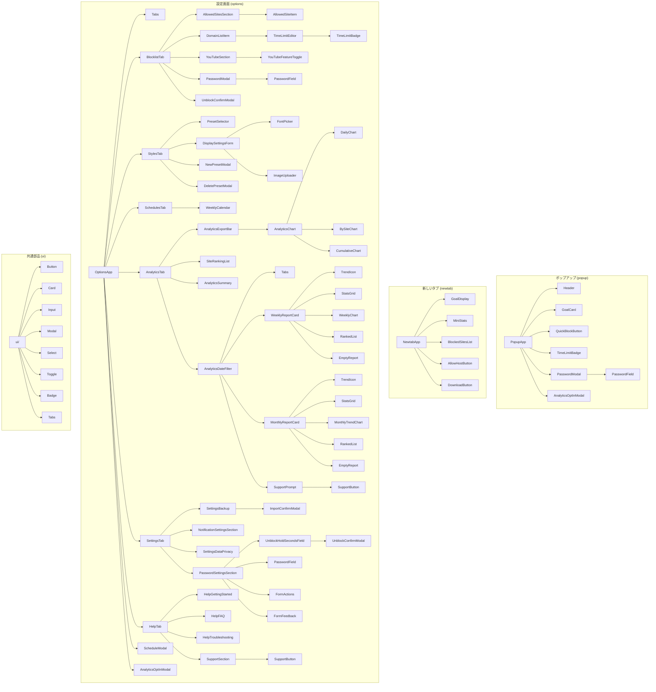

# コンポーネント設計

この文書が扱う部品は、`src/components` と `src/entrypoints/*/App.tsx` が `export function` で公開しているコンポーネントである（ファイル内だけで使う補助のコンポーネントは載せない）。
各部品の振る舞いの詳細は、実体の JSDoc を正とする。

部品とフックは保存領域に書かない。保存値は [useStorageItem](#usestorageitem) の購読で読み、変更は background へメッセージで依頼する（書き手の規則と、それを守る lint は [DATA_MODEL.md の「考え方」](./DATA_MODEL.md#考え方)）。

## 1. コンポーネント一覧

### 共通部品（`src/components/ui`）

| コンポーネント名 | 役割                                                 |
| ---------------- | ---------------------------------------------------- |
| Button           | 色・大きさ・読み込み中表示を切り替えられるボタン     |
| Card             | 内容を囲む白い枠（`onClick` でボタンとして振る舞う） |
| Input            | ラベルとエラー文つきの 1 行入力欄                    |
| Modal            | 画面を暗くした上に重ねるダイアログ                   |
| Select           | プルダウン                                           |
| Toggle           | オン・オフのスイッチ                                 |
| Badge            | 色付きの短いラベル                                   |
| Tabs             | 横並びのタブ                                         |

### 機能部品（`src/components/features`）

| コンポーネント名  | 置き場所            | 役割                                                                       |
| ----------------- | ------------------- | -------------------------------------------------------------------------- |
| Header            | `Header/`           | ロゴ・バージョン・一時停止のスイッチ・設定とヘルプのボタンを並べたヘッダー |
| GoalCard          | `GoalCard/`         | 今日の目標のカード（その場で編集できる）                                   |
| QuickBlockButton  | `QuickBlockButton/` | ドメインを入力してすぐブロックに加える欄                                   |
| TimeLimitBadge    | `TimeLimitBadge/`   | 時間制限の残り時間のバッジ                                                 |
| ImageUploader     | `ImageUploader/`    | 背景画像の選択・圧縮・プレビュー                                           |
| FontPicker        | `FontPicker/`       | フォントのカテゴリ・種類・大きさ・太さの選択とプレビュー                   |
| DownloadButton    | `DownloadButton/`   | 解像度を選んで画面を壁紙画像として保存するボタン                           |
| AnalyticsChart    | `AnalyticsChart/`   | 直近の合計閲覧時間と、種類を切り替えられるグラフ                           |
| DailyChart        | `AnalyticsChart/`   | 日ごとの閲覧時間の折れ線グラフ                                             |
| BySiteChart       | `AnalyticsChart/`   | サイトごとの閲覧時間の横棒グラフ                                           |
| CumulativeChart   | `AnalyticsChart/`   | 日ごとの累計閲覧時間の縦棒グラフ                                           |
| WeeklyReportCard  | `ReportCard/`       | 週のレポートのカード（週を移動できる）                                     |
| MonthlyReportCard | `ReportCard/`       | 月のレポートのカード（月を移動できる）                                     |
| TrendIcon         | `ReportCard/`       | 傾向の矢印アイコンと文言                                                   |
| StatsGrid         | `ReportCard/`       | 期間の時間・前期間比・ブロック回数・解除回数の 4 枠                        |
| WeeklyChart       | `ReportCard/`       | 曜日ごとの時間（棒）とブロック回数（折れ線）                               |
| MonthlyTrendChart | `ReportCard/`       | 月内の週ごとの時間（棒）とブロック回数（折れ線）                           |
| RankedList        | `ReportCard/`       | サイトの上位を順位つきで並べる表                                           |
| EmptyReport       | `ReportCard/`       | レポートに出すデータが無いときの表示                                       |
| SupportButton     | `Support/`          | 支援を呼びかけるボタン                                                     |
| SupportPrompt     | `Support/`          | 支援を呼びかける帯（支援・閉じるボタンつき）                               |
| SupportSection    | `Support/`          | 支援を呼びかける説明のカード                                               |

### 新しいタブ用部品（`src/components/newtab`）

| コンポーネント名 | 役割                                                             |
| ---------------- | ---------------------------------------------------------------- |
| GoalDisplay      | 中央に大きく出す目標と補足（編集中は入力欄）                     |
| MiniStats        | 今日のブロック回数とブロックを続けている日数の小さな枠           |
| BlockedSitesList | ブロック中のサイトの開閉できる一覧                               |
| AllowHostButton  | ブロック画面の帯で、ブロックされたホストを許可サイトにするボタン |

### 設定画面用部品（`src/components/options`）

| コンポーネント名            | 置き場所     | 役割                                                                   |
| --------------------------- | ------------ | ---------------------------------------------------------------------- |
| BlocklistTab                | `.`          | ブロックタブ（「ブロック」節と「許可サイト」節）                       |
| StylesTab                   | `.`          | スタイルタブ（プリセットの選択・表示設定の編集・作成と削除）           |
| SchedulesTab                | `.`          | スケジュールタブ（週のカレンダーとスケジュールの一覧）                 |
| WeeklyCalendar              | `.`          | スケジュールを時間帯の枠として重ねた週のカレンダー                     |
| AnalyticsTab                | `.`          | 分析タブ（書き出し・順位・計測対象の追加・計測中のサイト・レポート）   |
| SettingsTab                 | `.`          | 設定タブ（解除保護・通知・データとプライバシー・バックアップ）         |
| PasswordSettingsSection     | `.`          | 解除保護の設定（長押しの秒数とパスワード）のカード                     |
| UnblockHoldSecondsField     | `.`          | 解除の確認で長押しさせる秒数の選択欄                                   |
| SettingsDataPrivacy         | `.`          | 匿名の利用統計を共有するかのスイッチのカード                           |
| SettingsBackup              | `.`          | 設定の JSON 書き出しと、書き出したファイルでの置き換えのカード         |
| HelpTab                     | `.`          | ヘルプタブ（はじめかた・よくある質問・困ったとき・支援・問い合わせ）   |
| HelpGettingStarted          | `.`          | 主な機能の使い方のカード                                               |
| HelpFAQ                     | `.`          | よくある質問のカード                                                   |
| HelpTroubleshooting         | `.`          | 困ったときの症状と対処のカード                                         |
| AnalyticsExportBar          | `analytics/` | 計測データの書き出し・再読み込み・グラフ・共有・画像保存・削除のカード |
| SiteRankingList             | `analytics/` | ブロック回数の多いサイトの順位（保持期間全体）                         |
| AnalyticsSummary            | `analytics/` | 計測中のサイト一覧（状態・解除してからの時間・合計）                   |
| AnalyticsDateFilter         | `analytics/` | 週と月のレポートの切り替えと期間の移動                                 |
| DomainListItem              | `blocklist/` | ブロック中のサイト 1 件の行                                            |
| AllowedSitesSection         | `blocklist/` | 「許可サイト」節（説明・追加欄・一覧）のカード                         |
| AllowedSiteItem             | `blocklist/` | 許可サイト 1 件の行                                                    |
| TimeLimitEditor             | `blocklist/` | サイトの時間制限の編集欄                                               |
| NotificationSettingsSection | `blocklist/` | 時間制限の終わりが近づいたときの通知設定のカード                       |
| YouTubeSection              | `blocklist/` | YouTube の設定のカード                                                 |
| YouTubeFeatureToggle        | `blocklist/` | YouTube の機能 1 つ分のスイッチの行                                    |
| PresetSelector              | `styles/`    | プリセットの一覧と保存・適用・削除の操作                               |
| DisplaySettingsForm         | `styles/`    | 選択中のプリセットの表示設定のフォーム                                 |
| PasswordField               | `password/`  | 伏せ字を切り替えられるパスワード入力欄                                 |
| FormActions                 | `password/`  | パスワードのフォームの取消・実行ボタン                                 |
| FormFeedback                | `password/`  | パスワードのフォームの操作結果の表示                                   |
| ScheduleModal               | `modals/`    | スケジュールの追加・編集のモーダル                                     |
| NewPresetModal              | `modals/`    | 新しいプリセットの名前を入力するモーダル                               |
| DeletePresetModal           | `modals/`    | プリセット削除の確認モーダル                                           |
| ImportConfirmModal          | `modals/`    | 設定の取り込みで上書きされることの確認モーダル                         |
| PasswordModal               | `modals/`    | パスワードを入力させて呼び出し元へ渡すモーダル                         |
| UnblockConfirmModal         | `modals/`    | ブロックを弱める操作を長押しで確定させる確認モーダル                   |
| AnalyticsOptInModal         | `modals/`    | 匿名の利用統計を共有するかを尋ねるダイアログ                           |

### ユーティリティ（lib）

| ファイル名   | 説明                                                                                   |
| ------------ | -------------------------------------------------------------------------------------- |
| blockList.ts | 「ブロック中のサイト」一覧に並べるサイトの導出（`blockListSites`。youtube.com を除く） |
| export.ts    | CSVエクスポート機能                                                                    |
| wallpaper.ts | 壁紙キャプチャ・ダウンロード                                                           |

### ページコンポーネント（`src/entrypoints`）

| コンポーネント名 | 置き場所          | 役割                                                                         |
| ---------------- | ----------------- | ---------------------------------------------------------------------------- |
| PopupApp         | `popup/App.tsx`   | ツールバーのポップアップ（今見ているサイトのブロック・今日の記録・一時停止） |
| NewtabApp        | `newtab/App.tsx`  | 新しいタブ（目標と今日の記録。ブロックで移ってきたときはそのサイトの情報も） |
| OptionsApp       | `options/App.tsx` | 設定画面（ブロック・表示・スケジュール・分析・設定・ヘルプのタブ）           |

ブロックしたサイトからの移動先は `NewtabApp` が兼ねる（専用のページは無い）。

## 2. コンポーネント階層図

描画の親子関係を示す。共通部品（`ui/`）への矢印は、`Tabs` を除いて省く。


```mermaid
graph TD
    subgraph "ポップアップ (popup)"
        PA[PopupApp]
        PA --> PH[Header]
        PA --> GC[GoalCard]
        PA --> QB[QuickBlockButton]
        PA --> TLB1[TimeLimitBadge]
        PA --> PM1[PasswordModal]
        PA --> AOM1[AnalyticsOptInModal]
        PM1 --> PF1[PasswordField]
    end

    subgraph "新しいタブ (newtab)"
        NA[NewtabApp]
        NA --> GD[GoalDisplay]
        NA --> MS[MiniStats]
        NA --> BSL[BlockedSitesList]
        NA --> AHB[AllowHostButton]
        NA --> DB[DownloadButton]
    end

    subgraph "設定画面 (options)"
        OA[OptionsApp]
        OA --> TB[Tabs]
        OA --> BLT[BlocklistTab]
        OA --> STT[StylesTab]
        OA --> SCT[SchedulesTab]
        OA --> AT[AnalyticsTab]
        OA --> SET[SettingsTab]
        OA --> HT[HelpTab]
        OA --> SM[ScheduleModal]
        OA --> AOM2[AnalyticsOptInModal]

        BLT --> DLI[DomainListItem]
        BLT --> YTS[YouTubeSection]
        BLT --> ASS[AllowedSitesSection]
        ASS --> ASI[AllowedSiteItem]
        BLT --> PM2[PasswordModal]
        BLT --> UCM[UnblockConfirmModal]
        DLI --> TLE[TimeLimitEditor]
        TLE --> TLB2[TimeLimitBadge]
        YTS --> YTF[YouTubeFeatureToggle]
        PM2 --> PF2[PasswordField]

        STT --> PS[PresetSelector]
        STT --> DSF[DisplaySettingsForm]
        STT --> NPM[NewPresetModal]
        STT --> DPM[DeletePresetModal]
        DSF --> FP[FontPicker]
        DSF --> IU[ImageUploader]

        SCT --> WC[WeeklyCalendar]

        AT --> AEB[AnalyticsExportBar]
        AT --> SRL[SiteRankingList]
        AT --> AS[AnalyticsSummary]
        AT --> ADF[AnalyticsDateFilter]
        AEB --> AC[AnalyticsChart]
        AC --> DC[DailyChart]
        AC --> BSC[BySiteChart]
        AC --> CC[CumulativeChart]
        ADF --> TB2[Tabs]
        ADF --> WRC[WeeklyReportCard]
        ADF --> MRC[MonthlyReportCard]
        ADF --> SP[SupportPrompt]
        WRC --> TI1[TrendIcon]
        WRC --> SG1[StatsGrid]
        WRC --> WCH[WeeklyChart]
        WRC --> RL1[RankedList]
        WRC --> ER1[EmptyReport]
        MRC --> TI2[TrendIcon]
        MRC --> SG2[StatsGrid]
        MRC --> MTC[MonthlyTrendChart]
        MRC --> RL2[RankedList]
        MRC --> ER2[EmptyReport]
        SP --> SB1[SupportButton]

        SET --> PSS[PasswordSettingsSection]
        SET --> NSS[NotificationSettingsSection]
        SET --> SDP[SettingsDataPrivacy]
        SET --> SBK[SettingsBackup]
        SBK --> ICM[ImportConfirmModal]
        PSS --> UHS[UnblockHoldSecondsField]
        UHS --> UCM2[UnblockConfirmModal]
        PSS --> PF3[PasswordField]
        PSS --> FA[FormActions]
        PSS --> FF[FormFeedback]

        HT --> HGS[HelpGettingStarted]
        HT --> HF[HelpFAQ]
        HT --> HTS[HelpTroubleshooting]
        HT --> SS[SupportSection]
        SS --> SB2[SupportButton]
    end

    subgraph "共通部品 (ui)"
        UI[ui/]
        UI --> Button
        UI --> Card
        UI --> Input
        UI --> Modal
        UI --> Select
        UI --> Toggle
        UI --> Badge
        UI --> Tabs
    end
```

## 3. コンポーネント詳細

各節は置き場所と Props を示す（役割は「1. コンポーネント一覧」）。Props の説明は実体の Props 型の JSDoc を要約したもので、「省略時」が「必須」でないものは省略できる。

---

### Button

`src/components/ui/Button/Button.tsx`。下表のほかに `button` 要素の属性（`onClick` / `disabled` / `type` など）をそのまま受け取る。

| Prop      | 型                                                | 省略時      | 説明                                        |
| --------- | ------------------------------------------------- | ----------- | ------------------------------------------- |
| variant   | `'primary' \| 'secondary' \| 'danger' \| 'ghost'` | `'primary'` | 色の種類                                    |
| size      | `'sm' \| 'md' \| 'lg'`                            | `'md'`      | 余白と文字の大きさ                          |
| loading   | `boolean`                                         | `false`     | true の間は回転アイコンを出して押せなくする |
| fullWidth | `boolean`                                         | `false`     | 親の幅いっぱいに広げる                      |
| children  | `ReactNode`                                       | 必須        | ラベル                                      |

`disabled` か `loading` のどちらかが true なら押せない。

```tsx
<Button variant="primary" onClick={handleSave}>
  保存
</Button>

<Button variant="danger" size="sm" loading={isDeleting}>
  削除
</Button>
```

---

### Card

`src/components/ui/Card/Card.tsx`。下表のほかに `div` 要素の属性（`onClick` など）をそのまま受け取る。

| Prop     | 型                                      | 省略時      | 説明                 |
| -------- | --------------------------------------- | ----------- | -------------------- |
| variant  | `'default' \| 'outlined' \| 'elevated'` | `'default'` | 枠線と影の付け方     |
| padding  | `'none' \| 'sm' \| 'md' \| 'lg'`        | `'md'`      | 内側の余白           |
| children | `ReactNode`                             | 必須        | カードの中に出す内容 |

---

### Input

`src/components/ui/Input/Input.tsx`。下表のほかに `input` 要素の属性（`value` / `type` / `placeholder` / `disabled` など）をそのまま受け取る。`onChange` だけは文字列を受け取る形に置き換えている。

| Prop               | 型                        | 省略時   | 説明                                        |
| ------------------ | ------------------------- | -------- | ------------------------------------------- |
| label              | `string`                  | 出さない | 入力欄の上のラベル                          |
| error              | `string`                  | 出さない | 入力欄の下に赤字で出すエラー文              |
| onChange           | `(value: string) => void` | -        | 入力のたびに入力欄の文字列を受け取る        |
| containerClassName | `string`                  | `''`     | ラベル・入力欄・エラー文を包む div のクラス |

`id` を省略すると、ラベルとの対応用に自動で振る。

---

### Modal

`src/components/ui/Modal/Modal.tsx`

| Prop     | 型                     | 省略時   | 説明                                                 |
| -------- | ---------------------- | -------- | ---------------------------------------------------- |
| isOpen   | `boolean`              | 必須     | false の間は何も描画しない                           |
| onClose  | `() => void`           | 必須     | 背景か閉じるボタンが押されたときに呼ぶ               |
| title    | `string`               | 出さない | 見出し（省略時は見出しと閉じるボタンの帯を出さない） |
| size     | `'sm' \| 'md' \| 'lg'` | `'md'`   | ダイアログの最大幅                                   |
| children | `ReactNode`            | 必須     | 本文                                                 |

---

### Select

`src/components/ui/Select/Select.tsx`

| Prop        | 型                                   | 省略時   | 説明                                  |
| ----------- | ------------------------------------ | -------- | ------------------------------------- |
| value       | `string`                             | 必須     | 選択中の選択肢の value                |
| onChange    | `(value: string) => void`            | 必須     | 選択が変わったときに value を受け取る |
| options     | `{ value: string; label: string }[]` | 必須     | 選択肢（並び順のまま出す）            |
| placeholder | `string`                             | 出さない | 先頭に出す選べない案内文              |
| className   | `string`                             | `''`     | 外側の div に足すクラス               |
| disabled    | `boolean`                            | `false`  | 選択できなくする                      |

---

### Toggle

`src/components/ui/Toggle/Toggle.tsx`

| Prop        | 型                           | 省略時   | 説明                               |
| ----------- | ---------------------------- | -------- | ---------------------------------- |
| checked     | `boolean`                    | 必須     | true ならオン                      |
| onChange    | `(checked: boolean) => void` | 必須     | 切り替え後の状態を受け取る         |
| label       | `string`                     | 出さない | スイッチの右に出す文言             |
| disabled    | `boolean`                    | `false`  | 切り替えられなくする               |
| size        | `'sm' \| 'md' \| 'lg'`       | `'md'`   | スイッチの大きさ                   |
| data-testid | `string`                     | -        | スイッチ本体の button に付ける目印 |

---

### Badge

`src/components/ui/Badge/Badge.tsx`

| Prop     | 型                                                          | 省略時      | 説明                 |
| -------- | ----------------------------------------------------------- | ----------- | -------------------- |
| variant  | `'default' \| 'success' \| 'warning' \| 'danger' \| 'info'` | `'default'` | 色の種類             |
| children | `ReactNode`                                                 | 必須        | バッジの中に出す内容 |

---

### Tabs

`src/components/ui/Tabs/Tabs.tsx`

| Prop      | 型                                                           | 省略時 | 説明                         |
| --------- | ------------------------------------------------------------ | ------ | ---------------------------- |
| tabs      | `Tab[]`（`{ id: string; label: string; icon?: ReactNode }`） | 必須   | 左から並べるタブ             |
| activeTab | `string`                                                     | 必須   | 選択中のタブの id            |
| onChange  | `(tabId: string) => void`                                    | 必須   | 押されたタブの id を受け取る |
| className | `string`                                                     | `''`   | 外側の div に足すクラス      |

各タブの `data-testid` は `tab-${id}` になる。

---

### Header

`src/components/features/Header/Header.tsx`

| Prop            | 型                          | 省略時   | 説明                                                                 |
| --------------- | --------------------------- | -------- | -------------------------------------------------------------------- |
| showSettings    | `boolean`                   | `true`   | false なら設定ボタンを出さない                                       |
| onSettingsClick | `() => void`                | -        | 設定ボタンが押されたときに呼ぶ                                       |
| onHelpClick     | `() => void`                | 出さない | ヘルプボタンが押されたときに呼ぶ（省略時はボタンを出さない）         |
| paused          | `boolean`                   | `false`  | ブロックを一時停止中として表示する                                   |
| onPausedChange  | `(paused: boolean) => void` | 出さない | 一時停止のスイッチの切り替えを受け取る（省略時はスイッチを出さない） |

---

### GoalCard

`src/components/features/GoalCard/GoalCard.tsx`

| Prop     | 型                       | 省略時  | 説明                                                                 |
| -------- | ------------------------ | ------- | -------------------------------------------------------------------- |
| goalText | `string`                 | 必須    | 今日の目標（空白だけなら「目標未設定」の案内を出す）                 |
| onClick  | `() => void`             | -       | 編集中でないときにカードが押されたら呼ぶ                             |
| editable | `boolean`                | `false` | ホバー時に編集ボタンを出す                                           |
| onEdit   | `(text: string) => void` | -       | 編集を確定したとき（Enter かフォーカスが外れたとき）の文言を受け取る |

Esc で編集を取り消す。

---

### QuickBlockButton

`src/components/features/QuickBlockButton/QuickBlockButton.tsx`

| Prop          | 型                         | 省略時  | 説明                                                     |
| ------------- | -------------------------- | ------- | -------------------------------------------------------- |
| currentDomain | `string`                   | -       | 入力欄にあらかじめ入れるドメイン（変わるたびに入れ直す） |
| onBlock       | `(domain: string) => void` | 必須    | 前後の空白を除いたドメインを受け取る（空なら呼ばない）   |
| disabled      | `boolean`                  | `false` | 入力もブロックもできなくする                             |

---

### TimeLimitBadge

`src/components/features/TimeLimitBadge/TimeLimitBadge.tsx`

| Prop             | 型        | 省略時  | 説明                                                           |
| ---------------- | --------- | ------- | -------------------------------------------------------------- |
| remainingSeconds | `number`  | 必須    | その日の残り時間（秒。0 以下なら上限到達として表示する）       |
| limitSeconds     | `number`  | 必須    | 1 日の上限（秒。残りの割合の計算に使う）                       |
| showWarning      | `boolean` | `true`  | false なら残りが少なくても警告の色にしない                     |
| compact          | `boolean` | `false` | 「1 日あたり」の添え字を省き、残り時間を表示言語の書き方で出す |

---

### ImageUploader

`src/components/features/ImageUploader/ImageUploader.tsx`

| Prop      | 型                                  | 省略時  | 説明                                                                                       |
| --------- | ----------------------------------- | ------- | ------------------------------------------------------------------------------------------ |
| value     | `string \| null`                    | 必須    | 設定済みの画像のデータ URL（null なら未設定としてアップロード欄を出す）                    |
| onChange  | `(dataUrl: string \| null) => void` | 必須    | 圧縮した画像のデータ URL を受け取る。削除されたときは null                                 |
| maxSizeMB | `number`                            | `1`     | 圧縮後の上限サイズ（MB）                                                                   |
| disabled  | `boolean`                           | `false` | 選択・ドロップ・削除をできなくする                                                         |
| loading   | `boolean`                           | `false` | 保存済みの画像を読み込み中。value が無ければアップロード欄の代わりに読み込み中の表示を出す |

---

### FontPicker

`src/components/features/FontPicker/FontPicker.tsx`

| Prop        | 型                                 | 省略時                  | 説明                                             |
| ----------- | ---------------------------------- | ----------------------- | ------------------------------------------------ |
| value       | `FontSettings`                     | 必須                    | 選択中のフォントの種類・大きさ・太さ             |
| onChange    | `(settings: FontSettings) => void` | 必須                    | どれかが変わったときに変更後の設定全体を受け取る |
| disabled    | `boolean`                          | `false`                 | 薄く表示して操作できなくする                     |
| previewText | `string`                           | `'Focus on your goals'` | プレビュー欄に出す文言                           |

カテゴリを変えると、そのカテゴリの先頭のフォントを選ぶ。

---

### DownloadButton

`src/components/features/DownloadButton/DownloadButton.tsx`

| Prop      | 型                             | 省略時  | 説明                                                      |
| --------- | ------------------------------ | ------- | --------------------------------------------------------- |
| targetRef | `React.RefObject<HTMLElement>` | 必須    | 壁紙として画像化する要素（null の間は押しても何もしない） |
| disabled  | `boolean`                      | `false` | 押せなくする                                              |
| className | `string`                       | `''`    | 外側の div に足すクラス                                   |

---

### AnalyticsChart

`src/components/features/AnalyticsChart/AnalyticsChart.tsx`。集計する日数は同ファイルの `CHART_DAYS`。

| Prop     | 型                     | 省略時  | 説明                                                                                     |
| -------- | ---------------------- | ------- | ---------------------------------------------------------------------------------------- |
| activity | `ActivityLog`          | 必須    | 日別・サイト別の閲覧時間の記録                                                           |
| sites    | `readonly SiteKey[]`   | 必須    | 集計に含めるサイト（variant の母集団）                                                   |
| variant  | `'waste' \| 'allowed'` | 必須    | 数える時間の種類。浪費時間か許可サイトの時間かで、合計の見出しの文言と色だけを切り替える |
| disabled | `boolean`              | `false` | 薄く表示して操作できなくする                                                             |

---

### DailyChart

`src/components/features/AnalyticsChart/DailyChart.tsx`

| Prop | 型                                 | 省略時 | 説明                                                 |
| ---- | ---------------------------------- | ------ | ---------------------------------------------------- |
| data | `{ date: string; time: number }[]` | 必須   | 古い日から並べた閲覧時間（分。空なら「データなし」） |

---

### BySiteChart

`src/components/features/AnalyticsChart/BySiteChart.tsx`

| Prop | 型                  | 省略時 | 説明                                                                           |
| ---- | ------------------- | ------ | ------------------------------------------------------------------------------ |
| data | `BySiteChartData[]` | 必須   | 上から並べる棒（`domain` / `fullDomain` / `time`（分）。空なら「データなし」） |

---

### CumulativeChart

`src/components/features/AnalyticsChart/CumulativeChart.tsx`

| Prop | 型                                       | 省略時 | 説明                                             |
| ---- | ---------------------------------------- | ------ | ------------------------------------------------ |
| data | `{ date: string; cumulative: number }[]` | 必須   | 古い日から並べた累計（分。空なら「データなし」） |

---

### WeeklyReportCard

`src/components/features/ReportCard/ReportCard.tsx`。このカードと `MonthlyReportCard` はレポートを描くだけで、レポートは `AnalyticsDateFilter` が `src/lib/report.ts` で組む。集計値（`StatsGrid`）の下に、レポートの `allowedSeconds` を補助の 1 行「許可サイトの時間: <時間>」で出す（0 秒なら出さない。浪費時間には入らない）。

| Prop          | 型                     | 省略時  | 説明                                        |
| ------------- | ---------------------- | ------- | ------------------------------------------- |
| report        | `WeeklyReport \| null` | 必須    | 表示する週のレポート（null ならデータなし） |
| onPrevious    | `() => void`           | 必須    | 前の週へ移るボタンが押されたときに呼ぶ      |
| onNext        | `() => void`           | 必須    | 次の週へ移るボタンが押されたときに呼ぶ      |
| canGoNext     | `boolean`              | 必須    | false なら次の週へ移るボタンを押せなくする  |
| isCurrentWeek | `boolean`              | `false` | 今週（集計途中）の印を出す                  |

---

### MonthlyReportCard

`src/components/features/ReportCard/ReportCard.tsx`。許可サイトの時間の補助の 1 行は `WeeklyReportCard` と同じ。

| Prop           | 型                      | 省略時  | 説明                                        |
| -------------- | ----------------------- | ------- | ------------------------------------------- |
| report         | `MonthlyReport \| null` | 必須    | 表示する月のレポート（null ならデータなし） |
| onPrevious     | `() => void`            | 必須    | 前の月へ移るボタンが押されたときに呼ぶ      |
| onNext         | `() => void`            | 必須    | 次の月へ移るボタンが押されたときに呼ぶ      |
| canGoNext      | `boolean`               | 必須    | false なら次の月へ移るボタンを押せなくする  |
| isCurrentMonth | `boolean`               | `false` | 今月（集計途中）の印を出す                  |

---

### TrendIcon

`src/components/features/ReportCard/TrendIcon.tsx`

| Prop  | 型                                       | 省略時 | 説明                                           |
| ----- | ---------------------------------------- | ------ | ---------------------------------------------- |
| trend | `'improving' \| 'declining' \| 'stable'` | 必須   | 改善（緑の上向き）・悪化（赤の下向き）・横ばい |

---

### StatsGrid

`src/components/features/ReportCard/StatsGrid.tsx`

| Prop                   | 型               | 省略時 | 説明                                                           |
| ---------------------- | ---------------- | ------ | -------------------------------------------------------------- |
| wasteTime              | `number`         | 必須   | 対象サイトで過ごした時間（秒）                                 |
| blockCount             | `number`         | 必須   | ブロックした回数                                               |
| unblockCount           | `number`         | 必須   | ブロックを解除した回数                                         |
| wasteTimeChangePercent | `number \| null` | 必須   | 前の期間からの時間の増減（%。前の期間のデータが無ければ null） |

時間が減ったら緑、増えたら赤で示す。

---

### WeeklyChart

`src/components/features/ReportCard/WeeklyChart.tsx`

| Prop             | 型                                            | 省略時 | 説明                                                         |
| ---------------- | --------------------------------------------- | ------ | ------------------------------------------------------------ |
| dailyBreakdown   | `{ wasteTime: number; blockCount: number }[]` | 必須   | 月曜から並べた日ごとの集計（棒には `wasteTime`（秒）を使う） |
| dailyBlockCounts | `number[]`                                    | 必須   | 月曜から並べた日ごとのブロック回数（折れ線。欠けた日は 0）   |

---

### MonthlyTrendChart

`src/components/features/ReportCard/MonthlyTrendChart.tsx`

| Prop            | 型                                                               | 省略時 | 説明                                             |
| --------------- | ---------------------------------------------------------------- | ------ | ------------------------------------------------ |
| weeklyBreakdown | `{ weekStart: string; wasteTime: number; blockCount: number }[]` | 必須   | 月内の週を古い順に並べた集計（`wasteTime` は秒） |

---

### RankedList

`src/components/features/ReportCard/RankedList.tsx`

| Prop      | 型                                    | 省略時 | 説明                                                        |
| --------- | ------------------------------------- | ------ | ----------------------------------------------------------- |
| items     | `{ domain: string; value: number }[]` | 必須   | 上位から並べた行（先頭 3 件だけ出す。空なら「データなし」） |
| valueType | `'time' \| 'count'`                   | 必須   | 値を時間（秒）として整形するか、回数のまま出すか            |
| bgColor   | `string`                              | 必須   | 各行の背景色のクラス                                        |
| textColor | `string`                              | 必須   | 値の文字色のクラス                                          |

---

### EmptyReport

`src/components/features/ReportCard/EmptyReport.tsx`

| Prop    | 型       | 省略時 | 説明                     |
| ------- | -------- | ------ | ------------------------ |
| message | `string` | 必須   | アイコンの下に出す案内文 |

---

### SupportButton

`src/components/features/Support/SupportButton.tsx`

| Prop      | 型             | 省略時 | 説明                    |
| --------- | -------------- | ------ | ----------------------- |
| onClick   | `() => void`   | 必須   | 押されたときに呼ぶ      |
| size      | `'sm' \| 'md'` | `'md'` | ボタンの大きさ          |
| className | `string`       | `''`   | button 要素に足すクラス |

---

### SupportPrompt

`src/components/features/Support/SupportPrompt.tsx`

| Prop      | 型                    | 省略時 | 説明                                               |
| --------- | --------------------- | ------ | -------------------------------------------------- |
| onSupport | `() => Promise<void>` | 必須   | 支援ボタンが押されたときに呼ぶ（完了は待たない）   |
| onDismiss | `() => Promise<void>` | 必須   | 閉じるボタンが押されたときに呼ぶ（完了は待たない） |

---

### SupportSection

`src/components/features/Support/SupportSection.tsx`。Props は無い。

---

### GoalDisplay

`src/components/newtab/GoalDisplay.tsx`。編集の状態は呼び出し側が持つ。

| Prop             | 型                                 | 省略時   | 説明                                                 |
| ---------------- | ---------------------------------- | -------- | ---------------------------------------------------- |
| goalText         | `string`                           | 必須     | 目標（空白だけなら「目標未設定」の案内を出す）       |
| goalSubText      | `string`                           | 必須     | 目標の下に出す補足（空なら出さない。改行はそのまま） |
| textColor        | `string`                           | 必須     | 目標と補足の文字色（CSS の色）                       |
| fontStyle        | `React.CSSProperties`              | 必須     | 目標に当てるフォントの指定                           |
| isEditing        | `boolean`                          | 必須     | true なら入力欄と保存・取消ボタンを出す              |
| editText         | `string`                           | 必須     | 編集中の入力欄の文言                                 |
| canEdit          | `boolean`                          | 必須     | true ならホバー時に編集ボタンを出す                  |
| onEditTextChange | `(text: string) => void`           | 必須     | 入力欄の文言の変更を受け取る                         |
| onStartEdit      | `() => void`                       | 必須     | 編集ボタンが押されたときに呼ぶ                       |
| onSave           | `() => void`                       | 必須     | 保存ボタンが押されたときに呼ぶ                       |
| onCancel         | `() => void`                       | 必須     | 取消ボタンが押されたときに呼ぶ                       |
| onKeyDown        | `(e: React.KeyboardEvent) => void` | 必須     | 入力欄でのキー入力を受け取る                         |
| error            | `string \| null`                   | 出さない | 保存できなかった理由（編集中だけ出す）               |

---

### MiniStats

`src/components/newtab/MiniStats.tsx`

| Prop             | 型               | 省略時   | 説明                                                             |
| ---------------- | ---------------- | -------- | ---------------------------------------------------------------- |
| blockCount       | `number`         | 必須     | 今日ブロックした回数                                             |
| blockingDays     | `number \| null` | 必須     | ブロックリストに入れてからの日数（null なら枠を出さない）        |
| onAnalyticsClick | `() => void`     | 出さない | 分析を見るボタンが押されたときに呼ぶ（省略時はボタンを出さない） |

---

### BlockedSitesList

`src/components/newtab/BlockedSitesList.tsx`

| Prop         | 型                       | 省略時 | 説明                                                       |
| ------------ | ------------------------ | ------ | ---------------------------------------------------------- |
| trackedSites | `TrackedSites`           | 必須   | 登録済みのサイト（ブロックが有効なものだけを並べる）       |
| blockCounts  | `Record<string, number>` | 必須   | ドメインごとのブロック回数（無いドメインは回数を出さない） |
| maxVisible   | `number`                 | `5`    | 「もっと見る」を押す前に出す件数                           |

ブロック中のサイトが無ければ何も描画しない。

---

### AllowHostButton

`src/components/newtab/AllowHostButton.tsx`。押すと確認なしで `onAllow` を呼び、送っている間はボタンを押せない。成功したらボタンを「（ホスト名） を許可しました」と `https://（ホスト名）/` を開くリンクに替え、失敗したら返された文言をボタンの下に出してボタンを残す。

| Prop    | 型                              | 省略時 | 説明                                                              |
| ------- | ------------------------------- | ------ | ----------------------------------------------------------------- |
| host    | `SiteKey`                       | 必須   | 許可サイトにするホストのサイトキー                                |
| onAllow | `() => Promise<string \| null>` | 必須   | ボタンが押されたときに呼ぶ。成功なら null、失敗なら出す文言を返す |

---

### BlocklistTab

`src/components/options/BlocklistTab.tsx`。「ブロック」節（追加欄・ブロック中のサイト一覧・YouTube の設定）と「許可サイト」節（[AllowedSitesSection](#allowedsitessection)）を並べる。ブロックの一覧は `blockListSites`、許可サイトの一覧は `allowedSiteRows`、ブロックの行と YouTube の節に出す許可サイトの件数は `allowedCountUnder`（いずれも `src/lib/blockList.ts`）で導く。ブロックの無効化・削除の確認は [useUnblockGuard](#useunblockguard)、YouTube の設定の保存は [useYouTubeSettings](#useyoutubesettings) を参照。許可サイトの追加・削除・切り替えには確認を挟まず、失敗の文言は「許可サイト」節の追加欄の下に出す。

| Prop                      | 型                                                                                 | 省略時 | 説明                                                                                                          |
| ------------------------- | ---------------------------------------------------------------------------------- | ------ | ------------------------------------------------------------------------------------------------------------- |
| newDomain                 | `string`                                                                           | 必須   | 追加欄に入力中のドメイン                                                                                      |
| setNewDomain              | `(value: string) => void`                                                          | 必須   | 追加欄の入力の変更を受け取る                                                                                  |
| blockError                | `string`                                                                           | 必須   | 追加に失敗した理由（空なら出さない）                                                                          |
| onAddDomain               | `() => void`                                                                       | 必須   | 追加ボタンが押されたときに呼ぶ                                                                                |
| onRemoveDomain            | `(domain: string, password?: string) => Promise<string \| null>`                   | 必須   | 解除の確認を通ったあとに、削除するドメインと入力されたパスワードを受け取る。失敗の文言（成功なら null）を返す |
| onToggleDomain            | `(domain: string, enabled: boolean, password?: string) => Promise<string \| null>` | 必須   | 有効・無効の切り替えを受け取る（無効化は確認を通ったあと）。失敗の文言（成功なら null）を返す                 |
| onUpdateTimeLimit         | `(domain: string, timeLimit: TimeLimit \| null) => void`                           | 必須   | 時間制限の変更を受け取る（null なら制限を外す）                                                               |
| activity                  | `ActivityLog`                                                                      | 必須   | 今日の使用時間とブロック回数を出すための記録                                                                  |
| trackedSites              | `TrackedSites`                                                                     | 必須   | 登録済みのサイト（ブロック設定のあるものを一覧に出す）                                                        |
| onYouTubeChange           | `(youtube: YouTubeSettingsInput, password?: string) => Promise<string \| null>`    | 必須   | YouTube の設定の変更を受け取る。失敗の文言（成功なら null）を返す                                             |
| onAddAllowedSite          | `(input: string) => Promise<string \| null>`                                       | 必須   | 「許可サイト」節の入力を受け取り、許可サイトにする。失敗の文言（成功なら null）を返す                         |
| onRemoveAllowedSite       | `(domain: string) => Promise<string \| null>`                                      | 必須   | 許可サイトの削除を受け取る（登録と記録が消える）。失敗の文言（成功なら null）を返す                           |
| onSetAllowedSiteRecording | `(domain: string, recordTime: boolean) => Promise<string \| null>`                 | 必須   | 許可サイトの「時間を記録する」の切り替えを受け取る。失敗の文言（成功なら null）を返す                         |

---

### StylesTab

`src/components/options/StylesTab.tsx`。Props は無い（保存値は購読で読み、編集の状態と background への依頼は [usePresets](#usepresets) が持つ）。

---

### SchedulesTab

`src/components/options/SchedulesTab.tsx`。スケジュールは設定のコンテキストから読む。

| Prop             | 型                                       | 省略時 | 説明                                                               |
| ---------------- | ---------------------------------------- | ------ | ------------------------------------------------------------------ |
| onAddSchedule    | `() => void`                             | 必須   | 追加ボタンが押されたときに呼ぶ                                     |
| onEditSchedule   | `(schedule: Schedule) => void`           | 必須   | 一覧の編集ボタンかカレンダー上の枠で選ばれたスケジュールを受け取る |
| onDeleteSchedule | `(id: string) => void`                   | 必須   | 削除するスケジュールの id を受け取る                               |
| onToggleSchedule | `(id: string, enabled: boolean) => void` | 必須   | 有効・無効の切り替えを受け取る                                     |

---

### WeeklyCalendar

`src/components/options/WeeklyCalendar.tsx`

| Prop            | 型                             | 省略時 | 説明                                                                     |
| --------------- | ------------------------------ | ------ | ------------------------------------------------------------------------ |
| schedules       | `Schedule[]`                   | 必須   | 並べるスケジュール（並び順で色を割り当てる。空ならカレンダーを出さない） |
| vision          | `VisionSettings \| undefined`  | 必須   | プリセット名を引くための表示設定（undefined ならプリセット名を出さない） |
| onScheduleClick | `(schedule: Schedule) => void` | 必須   | カレンダー上の枠で選ばれたスケジュールを受け取る                         |

今日の列に現在時刻の線を引く。無効なスケジュールは薄く取り消し線つきで出す。

---

### AnalyticsTab

`src/components/options/AnalyticsTab.tsx`。`trackedSites` から浪費時間の母集団（`wasteSiteKeys`）を作ってランキングへ渡し、浪費と許可サイト（`allowedSiteKeys`）の母集団の組（`SitePopulations`）をレポートへ渡す。書き出しのカードと追跡中のサイト一覧には `trackedSites` をそのまま渡す。

| Prop                   | 型                                     | 省略時 | 説明                                                    |
| ---------------------- | -------------------------------------- | ------ | ------------------------------------------------------- |
| activity               | `ActivityLog`                          | 必須   | 日別・サイト別の閲覧時間とブロック回数の記録            |
| trackedSites           | `TrackedSites`                         | 必須   | 登録済みのサイト（計測・ブロックの状態を含む）          |
| onReblock              | `(site: SiteEntry) => void`            | 必須   | ブロックに戻すサイトを受け取る                          |
| onReset                | `() => void`                           | 必須   | 計測データの削除を求められたときに呼ぶ                  |
| onStopTracking         | `(site: SiteEntry) => void`            | 必須   | 計測をやめるサイトを受け取る                            |
| onRefresh              | `() => Promise<void>`                  | 必須   | 計測データの読み直しを求められたときに呼ぶ              |
| onAddSite              | `(domain: string) => Promise<boolean>` | 必須   | 小文字にしたドメインを計測対象に加え、加えられたら true |
| addSiteError           | `string`                               | 必須   | 計測対象の追加に失敗した理由（空なら出さない）          |
| isSupportPromptVisible | `boolean`                              | 必須   | true ならレポートの下に支援の呼びかけを出す             |
| onSupport              | `() => Promise<void>`                  | 必須   | 支援の呼びかけで支援ボタンが押されたときに呼ぶ          |
| onDismissSupport       | `() => Promise<void>`                  | 必須   | 支援の呼びかけが閉じられたときに呼ぶ                    |

---

### SettingsTab

`src/components/options/SettingsTab.tsx`。設定はコンテキストから読み、未読み込みの項目は既定値で出す。

| Prop                   | 型                                                    | 省略時 | 説明                                       |
| ---------------------- | ----------------------------------------------------- | ------ | ------------------------------------------ |
| onUnblockConfirmUpdate | `(settings: UnblockConfirmSettings) => Promise<void>` | 必須   | 解除の確認（長押しの秒数）の設定を保存する |
| onUpdateNotifications  | `(notifications: NotificationSettings) => void`       | 必須   | 通知の設定を保存する                       |
| onAnalyticsOptInChange | `(enabled: boolean) => Promise<void>`                 | 必須   | 利用統計を共有するかの選択を保存する       |

---

### PasswordSettingsSection

`src/components/options/PasswordSettingsSection.tsx`。パスワードの保護中は長押しの秒数を変えられない。パスワードの設定・変更・解除は平文を `set-password` / `change-password` / `remove-password` で background へ送り、強度の検査・照合・ハッシュ化は background が行う（新しいパスワードと確認欄の一致と長さは送る前にも画面で確かめる）。

| Prop                   | 型                                                    | 省略時 | 説明                                                                                                                         |
| ---------------------- | ----------------------------------------------------- | ------ | ---------------------------------------------------------------------------------------------------------------------------- |
| passwordSettings       | `PasswordSettings`                                    | 必須   | 現在のパスワード設定（保護中かの判定は [DATA_MODEL.md の PasswordSettings](./DATA_MODEL.md#passwordsettingsパスワード保護)） |
| holdSeconds            | `UnblockHoldSeconds`                                  | 必須   | 解除の確認で長押しさせる秒数                                                                                                 |
| onUnblockConfirmUpdate | `(settings: UnblockConfirmSettings) => Promise<void>` | 必須   | 長押しの秒数を変えたときに確認設定を保存する                                                                                 |

---

### UnblockHoldSecondsField

`src/components/options/UnblockHoldSecondsField.tsx`。今より長い秒数はそのまま保存し、今より短い秒数は [useUnblockGuard](#useunblockguard) の `'shorten-hold'` で、今の秒数の長押し確認（[UnblockConfirmModal](#unblockconfirmmodal)）を通ってから保存する。確認をやめたら保存せず、欄は今の秒数を出し続ける（パスワード保護中は欄を選べないので、確認は長押しだけになる）。

| Prop        | 型                                                    | 省略時 | 説明                                                                                         |
| ----------- | ----------------------------------------------------- | ------ | -------------------------------------------------------------------------------------------- |
| holdSeconds | `UnblockHoldSeconds`                                  | 必須   | 現在の秒数                                                                                   |
| onUpdate    | `(settings: UnblockConfirmSettings) => Promise<void>` | 必須   | 選び直した秒数を確認設定として保存する（短くするときは確認を通ってから呼ぶ。完了は待たない） |
| disabled    | `boolean`                                             | 必須   | true なら選べなくし、パスワード保護中である旨を注記する                                      |

---

### SettingsDataPrivacy

`src/components/options/SettingsDataPrivacy.tsx`

| Prop                   | 型                                    | 省略時 | 説明                                                       |
| ---------------------- | ------------------------------------- | ------ | ---------------------------------------------------------- |
| settings               | `AppSettings`                         | -      | 現在の設定（undefined の間は共有しない側で表示する）       |
| onAnalyticsOptInChange | `(enabled: boolean) => Promise<void>` | 必須   | 共有の切り替えを保存する（選んだ日時は保存する側が付ける） |

---

### SettingsBackup

`src/components/options/SettingsBackup.tsx`。ファイルを選んで検査を通ったら、取り込む前に必ず [ImportConfirmModal](#importconfirmmodal) を開く（キャンセルなら何も変えない）。保存は background（`import-settings`）に任せ、画面は結果と警告だけを出す（取り込んだ設定の表示は保存値の購読が追従する）。パスワードが違う・無いと返されたときは確認を閉じずに理由を出す。

| Prop                | 型        | 省略時 | 説明                                                                                                                                          |
| ------------------- | --------- | ------ | --------------------------------------------------------------------------------------------------------------------------------------------- |
| isPasswordProtected | `boolean` | 必須   | true なら取り込みの確認でパスワードを入力させる（判定は [DATA_MODEL.md の PasswordSettings](./DATA_MODEL.md#passwordsettingsパスワード保護)） |

---

### HelpTab

`src/components/options/HelpTab.tsx`。Props は無い。

---

### HelpGettingStarted

`src/components/options/HelpGettingStarted.tsx`。Props は無い。

---

### HelpFAQ

`src/components/options/HelpFAQ.tsx`。Props は無い。

---

### HelpTroubleshooting

`src/components/options/HelpTroubleshooting.tsx`。Props は無い。

---

### AnalyticsExportBar

`src/components/options/analytics/AnalyticsExportBar.tsx`

| Prop         | 型                    | 省略時 | 説明                                                                                                                                      |
| ------------ | --------------------- | ------ | ----------------------------------------------------------------------------------------------------------------------------------------- |
| activity     | `ActivityLog`         | 必須   | 日別・サイト別の閲覧時間とブロック回数の記録                                                                                              |
| trackedSites | `TrackedSites`        | 必須   | 登録済みのサイト。書き出しと利用時間の推移は浪費時間の母集団で数え、許可サイトが 1 件以上あれば許可サイトの時間のグラフを別のカードに出す |
| onRefresh    | `() => Promise<void>` | 必須   | 再読み込みボタンが押されたときに呼ぶ                                                                                                      |
| onReset      | `() => void`          | 必須   | 確認のモーダルで削除が選ばれたときに呼ぶ                                                                                                  |

---

### SiteRankingList

`src/components/options/analytics/SiteRankingList.tsx`

| Prop     | 型                   | 省略時 | 説明                                         |
| -------- | -------------------- | ------ | -------------------------------------------- |
| activity | `ActivityLog`        | 必須   | 日別・サイト別のブロック回数と解除回数の記録 |
| sites    | `readonly SiteKey[]` | 必須   | 順位づけの対象にするサイト                   |

ブロックの記録が無ければ何も描画しない。

---

### AnalyticsSummary

`src/components/options/analytics/AnalyticsSummary.tsx`。状態（ブロック中・無効・計測のみ・許可）の順に並べる。許可サイトの行は「許可」の印と保持期間全体の時間だけを出して操作を出さず、「時間を記録する」が OFF なら時間の代わりに「記録していません」を出す。一覧の合計は無効と計測のみの行だけを足す。

| Prop           | 型                          | 省略時 | 説明                                           |
| -------------- | --------------------------- | ------ | ---------------------------------------------- |
| activity       | `ActivityLog`               | 必須   | 日別・サイト別の閲覧時間と解除の記録           |
| trackedSites   | `TrackedSites`              | 必須   | 登録済みのサイト（計測・ブロックの状態を含む） |
| onReblock      | `(site: SiteEntry) => void` | 必須   | ブロックに戻すサイトを受け取る                 |
| onStopTracking | `(site: SiteEntry) => void` | 必須   | 計測をやめるサイトを受け取る                   |

---

### AnalyticsDateFilter

`src/components/options/analytics/AnalyticsDateFilter.tsx`。今の期間より先へは進めない。

| Prop                   | 型                    | 省略時 | 説明                                                                                                          |
| ---------------------- | --------------------- | ------ | ------------------------------------------------------------------------------------------------------------- |
| activity               | `ActivityLog`         | 必須   | 日別・サイト別の閲覧時間とブロック回数の記録                                                                  |
| populations            | `SitePopulations`     | 必須   | レポートの母集団（`{ waste; allowed }`。浪費は合計・前期比・傾向・トップ、許可サイトは補助の 1 行だけに使う） |
| isSupportPromptVisible | `boolean`             | 必須   | true ならレポートの下に支援の呼びかけを出す                                                                   |
| onSupport              | `() => Promise<void>` | 必須   | 支援の呼びかけで支援ボタンが押されたときに呼ぶ                                                                |
| onDismissSupport       | `() => Promise<void>` | 必須   | 支援の呼びかけが閉じられたときに呼ぶ                                                                          |

---

### DomainListItem

`src/components/options/blocklist/DomainListItem.tsx`

| Prop              | 型                                                       | 省略時 | 説明                                                   |
| ----------------- | -------------------------------------------------------- | ------ | ------------------------------------------------------ |
| site              | `BlockedSite`                                            | 必須   | 行に出すブロック設定つきのサイト                       |
| blockCount        | `number`                                                 | 必須   | ブロックした回数（0 なら出さない）                     |
| usedSeconds       | `number`                                                 | 必須   | 今日の使用時間（秒。時間制限の残りの計算に使う）       |
| allowedCount      | `number`                                                 | 必須   | そのサイトの下にある許可サイトの件数（0 なら出さない） |
| onToggle          | `(domain: string, enabled: boolean) => void`             | 必須   | 有効・無効の切り替えを受け取る                         |
| onRemove          | `(domain: string) => void`                               | 必須   | 削除ボタンが押されたドメインを受け取る                 |
| onUpdateTimeLimit | `(domain: string, timeLimit: TimeLimit \| null) => void` | 必須   | 保存された時間制限を受け取る（null なら常にブロック）  |

---

### TimeLimitEditor

`src/components/options/blocklist/TimeLimitEditor.tsx`

| Prop        | 型                                                        | 省略時 | 説明                                                |
| ----------- | --------------------------------------------------------- | ------ | --------------------------------------------------- |
| site        | `BlockedSite`                                             | 必須   | 時間制限を編集するブロック中のサイト                |
| onUpdate    | `(timeLimit: TimeLimit \| null) => void \| Promise<void>` | 必須   | 保存した時間制限を受け取る（null なら常にブロック） |
| usedSeconds | `number`                                                  | 必須   | 今日の使用時間（秒。残り時間のバッジに使う）        |

既存の分数が選択肢に無いときは、最も近い選択肢に直して `onUpdate` を呼ぶ。

---

### NotificationSettingsSection

`src/components/options/blocklist/NotificationSettingsSection.tsx`

| Prop          | 型                                              | 省略時 | 説明                                                               |
| ------------- | ----------------------------------------------- | ------ | ------------------------------------------------------------------ |
| notifications | `NotificationSettings \| undefined`             | 必須   | 現在の通知設定（undefined の間は、通知する・5 分前として表示する） |
| onUpdate      | `(notifications: NotificationSettings) => void` | 必須   | 変更後の通知設定全体を受け取る                                     |

---

### YouTubeSection

`src/components/options/blocklist/YouTubeSection.tsx`。送る値と保存の流れは [useYouTubeSettings](#useyoutubesettings) を参照。

| Prop             | 型                                                                              | 省略時 | 説明                                                                                                                                                   |
| ---------------- | ------------------------------------------------------------------------------- | ------ | ------------------------------------------------------------------------------------------------------------------------------------------------------ |
| site             | `SiteEntry \| null`                                                             | 必須   | YouTube の登録内容（null ならすべてオフとして表示する）                                                                                                |
| allowedCount     | `number`                                                                        | 必須   | youtube.com の下にある許可サイトの件数（0 なら出さない）。例外の欄は置かない（許可サイトは「許可サイト」節で扱う）                                     |
| onYouTubeChange  | `(youtube: YouTubeSettingsInput, password?: string) => Promise<string \| null>` | 必須   | 変更後の YouTube の設定全体と、解除の確認で入力されたパスワードを受け取る。失敗の文言（成功なら null）を返し、節は失敗の文言を有効化のトグルの下に出す |
| onRequestUnblock | `(request: UnblockRequest) => void`                                             | 必須   | 全体の有効化かアクセスのブロックをオフにするときに解除の確認を求める                                                                                   |

---

### AllowedSitesSection

`src/components/options/blocklist/AllowedSitesSection.tsx`。入力欄の値はこの節が持ち、追加できたとき（`onAdd` が null を返したとき）だけ空にする。拒否されたら入力は残す。

| Prop           | 型                                              | 省略時 | 説明                                                                        |
| -------------- | ----------------------------------------------- | ------ | --------------------------------------------------------------------------- |
| sites          | `AllowedSiteRow[]`                              | 必須   | 一覧に並べる許可サイト（`allowedSiteRows` の値。並べる順のまま出す）        |
| error          | `string`                                        | 必須   | 直前の操作に失敗した理由（空なら出さない。追加欄の下に出す）                |
| onAdd          | `(input: string) => Promise<string \| null>`    | 必須   | 追加ボタンが押されたときに入力を受け取る。失敗の文言（成功なら null）を返す |
| onRemove       | `(domain: string) => void`                      | 必須   | 削除ボタンが押されたドメインを受け取る（確認は出さない）                    |
| onSetRecording | `(domain: string, recordTime: boolean) => void` | 必須   | 「時間を記録する」の切り替えを受け取る（確認は出さない）                    |

---

### AllowedSiteItem

`src/components/options/blocklist/AllowedSiteItem.tsx`。補足は、覆うブロックがあれば「<ブロック> の例外」、無ければ「かかっているブロックはありません」（親のブロックを無効にしているあいだも同じ）。

| Prop           | 型                                              | 省略時 | 説明                                                     |
| -------------- | ----------------------------------------------- | ------ | -------------------------------------------------------- |
| site           | `AllowedSiteRow`                                | 必須   | 行に出す許可サイト（ドメイン・記録するか・覆うブロック） |
| onRemove       | `(domain: string) => void`                      | 必須   | 削除ボタンが押されたドメインを受け取る                   |
| onSetRecording | `(domain: string, recordTime: boolean) => void` | 必須   | 「時間を記録する」の切り替え後の状態を受け取る           |

---

### YouTubeFeatureToggle

`src/components/options/blocklist/YouTubeFeatureToggle.tsx`

| Prop        | 型                           | 省略時  | 説明                              |
| ----------- | ---------------------------- | ------- | --------------------------------- |
| icon        | `React.ReactNode`            | 必須    | 左に出すアイコン                  |
| title       | `string`                     | 必須    | 項目の名前                        |
| description | `string`                     | 必須    | 名前の下に出す説明                |
| checked     | `boolean`                    | 必須    | true ならオン（背景を赤系にする） |
| onChange    | `(checked: boolean) => void` | 必須    | 切り替え後の状態を受け取る        |
| disabled    | `boolean`                    | `false` | 薄く表示して切り替えられなくする  |

---

### PresetSelector

`src/components/options/styles/PresetSelector.tsx`。プリセットが無ければ作成を促す。

| Prop    | 型                            | 省略時 | 説明                                                            |
| ------- | ----------------------------- | ------ | --------------------------------------------------------------- |
| presets | `UsePresetsReturn`            | 必須   | `usePresets` が返す、下書きの一覧と選択・保存・適用・削除の操作 |
| vision  | `VisionSettings \| undefined` | 必須   | 適用中のプリセットを示す表示設定（undefined なら印を出さない）  |

---

### DisplaySettingsForm

`src/components/options/styles/DisplaySettingsForm.tsx`。プリセットを選んでいなければ何も描画しない。

| Prop    | 型                 | 省略時 | 説明                                                  |
| ------- | ------------------ | ------ | ----------------------------------------------------- |
| presets | `UsePresetsReturn` | 必須   | `usePresets` が返す、選択中のプリセットの下書きと操作 |

---

### PasswordField

`src/components/options/password/PasswordField.tsx`

| Prop         | 型                                                       | 省略時 | 説明                                                       |
| ------------ | -------------------------------------------------------- | ------ | ---------------------------------------------------------- |
| fieldId      | `string`                                                 | 必須   | ラベルの指し先とテスト用の目印（同じ画面の欄ごとに別の値） |
| label        | `string`                                                 | 必須   | 入力欄の上のラベル                                         |
| value        | `string`                                                 | 必須   | 入力中のパスワード                                         |
| onChange     | `(value: string) => void`                                | 必須   | 入力欄の文字列を受け取る                                   |
| show         | `boolean`                                                | 必須   | true なら伏せ字にしない                                    |
| onToggleShow | `() => void`                                             | 必須   | 目のアイコンが押されたときに呼ぶ                           |
| placeholder  | `string`                                                 | 必須   | 未入力のときの案内文                                       |
| onKeyDown    | `(event: React.KeyboardEvent<HTMLInputElement>) => void` | -      | 入力欄でのキー入力を受け取る                               |
| autoFocus    | `boolean`                                                | -      | true なら表示したときにフォーカスを当てる                  |

---

### FormActions

`src/components/options/password/FormActions.tsx`

| Prop           | 型                       | 省略時          | 説明                                    |
| -------------- | ------------------------ | --------------- | --------------------------------------- |
| onCancel       | `() => void`             | 必須            | 取消ボタンが押されたときに呼ぶ          |
| onSubmit       | `() => void`             | 必須            | 実行ボタンが押されたときに呼ぶ          |
| submitLabel    | `string`                 | 必須            | 実行ボタンの文言                        |
| submitDisabled | `boolean`                | 必須            | true なら実行ボタンを押せなくする       |
| isProcessing   | `boolean`                | 必須            | true の間は実行ボタンを「処理中」にする |
| submitVariant  | `ButtonProps['variant']` | `Button` の既定 | 実行ボタンの色の種類                    |

---

### FormFeedback

`src/components/options/password/FormFeedback.tsx`

| Prop    | 型               | 省略時 | 説明                                      |
| ------- | ---------------- | ------ | ----------------------------------------- |
| error   | `string \| null` | 必須   | 赤字で出す失敗の文言（null なら出さない） |
| success | `string \| null` | 必須   | 緑字で出す成功の文言（null なら出さない） |

---

### ScheduleModal

`src/components/options/modals/ScheduleModal.tsx`

| Prop            | 型                                 | 省略時   | 説明                                                                                  |
| --------------- | ---------------------------------- | -------- | ------------------------------------------------------------------------------------- |
| isOpen          | `boolean`                          | 必須     | false の間は表示しない                                                                |
| onClose         | `() => void`                       | 必須     | 取消ボタンか背景が押されたときに呼ぶ                                                  |
| editingSchedule | `Schedule \| null`                 | 必須     | 編集中のスケジュール（null なら新規追加）                                             |
| scheduleForm    | `ScheduleFormData`                 | 必須     | フォームの名前・時間帯・曜日・プリセット                                              |
| onFormChange    | `(form: ScheduleFormData) => void` | 必須     | 変更後のフォーム全体を受け取る（曜日は昇順に並べ直す）                                |
| onSave          | `() => void`                       | 必須     | 保存ボタンが押されたときに呼ぶ（入力が `isScheduleFormValid` を通らない間は押せない） |
| vision          | `VisionSettings \| undefined`      | 必須     | プリセットの選択肢を引く表示設定（undefined なら「なし」だけ）                        |
| error           | `string \| null`                   | 出さない | 保存できない理由                                                                      |

---

### NewPresetModal

`src/components/options/modals/NewPresetModal.tsx`

| Prop               | 型                       | 省略時   | 説明                                             |
| ------------------ | ------------------------ | -------- | ------------------------------------------------ |
| isOpen             | `boolean`                | 必須     | false の間は表示しない                           |
| onClose            | `() => void`             | 必須     | 閉じるときに呼ぶ（続けて名前を空に戻す）         |
| presetName         | `string`                 | 必須     | 入力中の名前（空白だけなら追加ボタンを押せない） |
| onPresetNameChange | `(name: string) => void` | 必須     | 名前の入力の変更を受け取る                       |
| onCreate           | `() => void`             | 必須     | 追加ボタンが押されたときに呼ぶ                   |
| error              | `string \| null`         | 出さない | 作成できなかった理由（上限など）                 |

---

### DeletePresetModal

`src/components/options/modals/DeletePresetModal.tsx`

| Prop          | 型           | 省略時 | 説明                                                                           |
| ------------- | ------------ | ------ | ------------------------------------------------------------------------------ |
| isOpen        | `boolean`    | 必須   | false の間は表示しない                                                         |
| onClose       | `() => void` | 必須   | 取消ボタンか背景が押されたときに呼ぶ                                           |
| onConfirm     | `() => void` | 必須   | 削除ボタンが押されたときに呼ぶ                                                 |
| scheduleCount | `number`     | 必須   | そのプリセットを使っているスケジュールの数（スケジュールは残る旨と一緒に出す） |

---

### ImportConfirmModal

`src/components/options/modals/ImportConfirmModal.tsx`。すべての設定が上書きされ、ファイルに無いサイトは記録ごと消えることを伝える。照合はせず、入力を呼び出し元へ渡す（Enter でも送る）。呼び出し元が取り込みを依頼し、成功なら閉じ、失敗なら返された文言を出す。

| Prop             | 型                                               | 省略時 | 説明                                                                                                      |
| ---------------- | ------------------------------------------------ | ------ | --------------------------------------------------------------------------------------------------------- |
| isOpen           | `boolean`                                        | 必須   | false の間は表示しない。開くたびに入力とエラーを空に戻す                                                  |
| onClose          | `() => void`                                     | 必須   | キャンセルボタンか背景が押されたときと、onConfirm が成功したあとに呼ぶ                                    |
| requiresPassword | `boolean`                                        | 必須   | true ならパスワード欄を出し、入力するまで取り込めない                                                     |
| onConfirm        | `(password?: string) => Promise<string \| null>` | 必須   | 取り込みを依頼し、閉じずに出す文言（閉じてよければ null）を返す（パスワード欄があればその入力を受け取る） |

---

### PasswordModal

`src/components/options/modals/PasswordModal.tsx`。照合はせず、入力を呼び出し元へ渡す（Enter でも送る）。呼び出し元が操作を依頼し、成功なら閉じ、失敗なら返された文言を出す。

| Prop        | 型                                              | 省略時     | 説明                                                            |
| ----------- | ----------------------------------------------- | ---------- | --------------------------------------------------------------- |
| isOpen      | `boolean`                                       | 必須       | false の間は表示しない。開くたびに入力とエラーを空に戻す        |
| onClose     | `() => void`                                    | 必須       | 閉じるときに呼ぶ（onSubmit が成功したあとにも呼ぶ）             |
| onSubmit    | `(password: string) => Promise<string \| null>` | 必須       | 入力を受け取って操作を依頼し、失敗の文言（成功なら null）を返す |
| title       | `string`                                        | 既定の文言 | 見出し                                                          |
| description | `string`                                        | 既定の文言 | 見出しの下の説明                                                |

---

### UnblockConfirmModal

`src/components/options/modals/UnblockConfirmModal/UnblockConfirmModal.tsx`

| Prop        | 型                      | 省略時 | 説明                                                                                                                                                                                                                                                                   |
| ----------- | ----------------------- | ------ | ---------------------------------------------------------------------------------------------------------------------------------------------------------------------------------------------------------------------------------------------------------------------- |
| isOpen      | `boolean`               | 必須   | false の間は表示しない。閉じると長押しの進み具合を 0 に戻す                                                                                                                                                                                                            |
| onClose     | `() => void`            | 必須   | 取消・背景が押されたとき、および確定したあとに呼ぶ                                                                                                                                                                                                                     |
| onConfirm   | `() => void`            | 必須   | ボタンを `holdSeconds` 秒押し続けたときに呼ぶ                                                                                                                                                                                                                          |
| subject     | `UnblockConfirmSubject` | 必須   | 確認する操作（[useUnblockGuard](#useunblockguard)）。種別で見出し・文言・アイコンを切り替え（秒数を短くするときは見出しを「長押しの秒数の変更」にする）、削除・無効化のときはドメインとブロック方式を、秒数を短くするときは変更前（`holdSeconds`）と変更後の秒数を出す |
| holdSeconds | `UnblockHoldSeconds`    | 必須   | 確定までに押し続けさせる秒数（保存済みの秒数）                                                                                                                                                                                                                         |

---

### AnalyticsOptInModal

`src/components/options/modals/AnalyticsOptInModal.tsx`。まだ選んでいない間だけ表示する（選んだかは設定のコンテキストから読む）。

| Prop    | 型           | 省略時 | 説明                       |
| ------- | ------------ | ------ | -------------------------- |
| onAllow | `() => void` | 必須   | 共有を許可するボタンで呼ぶ |
| onDeny  | `() => void` | 必須   | 共有しないボタンで呼ぶ     |

---

### PopupApp

`src/entrypoints/popup/App.tsx`。Props は無い。`SettingsProvider` で包んで描画する。利用状況の送信への同意は `update-analytics-opt-in` で background に依頼する（失敗しても文言は出さず、ダイアログは保存値に従って出たまま）。

---

### NewtabApp

`src/entrypoints/newtab/App.tsx`。Props は無い。目標の編集は `update-goal-text` で background に依頼し、拒まれたら `messageErrorText` の文言を [GoalDisplay](#goaldisplay) に出して編集を続ける。帯には `allowCandidate` がキーを返すときだけ [AllowHostButton](#allowhostbutton) を置き、押されたら `add-allowed-site` でそのキーを送って、拒まれたときは `messageErrorText` の文言を返す。

---

### OptionsApp

`src/entrypoints/options/App.tsx`。Props は無い。`SettingsProvider` で包んで描画する。長押しの秒数と利用状況の送信への同意は `update-unblock-confirm` / `update-analytics-opt-in` で background に依頼する（失敗しても文言は出さず、各欄は保存値を出し続ける）。

---

## 4. カスタムフック

この章が扱うフックは、`src/hooks/index.ts` が公開する `use` で始まる関数である。
各フィールドの意味は実体の JSDoc を正とし、ここにはシグネチャと、JSDoc だけでは分からない使い方を置く。
シグネチャの型の出典は [5. 型定義](#5-型定義)（保存値の型）と、各フックの節に挙げたファイルである。

### useStorageItem

`src/hooks/useStorageItem.ts`。ストレージ項目（`src/lib/storage.ts` の `@wxt-dev/storage` の項目定義）を読み取り専用の React の state として購読する。

```typescript
function useStorageItem<T, M extends Record<string, unknown>>(
  item: WxtStorageItem<T, M>
): T;
```

- 読み込み前と保存値が壊れているときは、項目定義の `fallback` を返す。保存値の変更（background の書き込み）に追従する
- 設定画面とポップアップでは `src/contexts/SettingsContext.tsx` の `SettingsProvider` がこのフックで `settings` / `vision` を読み、`useSettings()` で子孫へ渡す（読み取りだけ）

---

### useBlocklist

`src/hooks/useBlocklist.ts`。設定画面のブロックリストタブの操作と、追加欄の入力状態。

```typescript
function useBlocklist(): {
  newDomain: string;
  setNewDomain: (value: string) => void;
  blockError: string;
  handleAddDomain: () => Promise<void>;
  handleRemoveDomain: (id: string, password?: string) => Promise<string | null>;
  handleToggleDomain: (
    id: string,
    enabled: boolean,
    password?: string
  ) => Promise<string | null>;
  handleUpdateTimeLimit: (
    id: string,
    timeLimit: TimeLimit | null
  ) => Promise<void>;
  handleAddAllowedSite: (input: string) => Promise<string | null>;
  handleRemoveAllowedSite: (domain: string) => Promise<string | null>;
  handleSetAllowedSiteRecording: (
    domain: string,
    recordTime: boolean
  ) => Promise<string | null>;
  handleUpdateNotifications: (
    notifications: NotificationSettings
  ) => Promise<void>;
};
```

- 追加・削除・有効切り替え・時間制限の変更は background へメッセージ（`add-block` / `remove-block` / `toggle-block` / `update-time-limit`）で依頼する。入力のサイトキーへの変換と検証（形式・重複・許可サイト・入れ子）は background 側（`add-block` のハンドラと `src/lib/siteService.ts`）が行い、このフックは拒否の理由を文言にして `blockError` に入れる
- 許可サイトの追加は `add-allowed-site`、削除は `stop-tracking`（登録と記録が消える）、「時間を記録する」は `set-allowed-site-recording` で依頼し、失敗の文言（成功なら null）を返す。入力の検証（形式・ブロック中・追跡中・入れ子）は background 側が行う
- 通知設定は `update-notifications` で依頼する。失敗しても文言は出さず、表示は保存値のまま
- 解除の確認（パスワード・長押し）はこのフックでは行わない（[BlocklistTab](#blocklisttab) を参照）。削除・無効化は確認で入力されたパスワードを添えて送り、失敗の文言（成功なら null）を返す

---

### useSchedules

`src/hooks/useSchedules.ts`。設定画面のスケジュールタブの編集モーダルの状態と操作。

```typescript
interface ScheduleFormData {
  name: string;
  startTime: string;
  endTime: string;
  days: number[];
  presetId: string;
}

function useSchedules(): {
  showScheduleModal: boolean;
  setShowScheduleModal: (show: boolean) => void;
  editingSchedule: Schedule | null;
  scheduleForm: ScheduleFormData;
  setScheduleForm: (form: ScheduleFormData) => void;
  scheduleError: string | null;
  handleSaveSchedule: () => Promise<void>;
  handleDeleteSchedule: (id: string) => Promise<void>;
  handleToggleSchedule: (id: string, enabled: boolean) => Promise<void>;
  openEditSchedule: (schedule: Schedule) => void;
  openAddSchedule: () => void;
};
```

- 保存・削除・有効切り替えを `add-schedule` / `update-schedule` / `remove-schedule` / `toggle-schedule` で background に依頼する。一覧は保存値の購読で追従する
- 拒まれた保存（重なりなど）は `messageErrorText` の文言を `scheduleError` に入れ、モーダルを開いたままにする
- `toScheduleInput` / `isScheduleFormValid` を公開する（送る形への変換と、background と同じ `ScheduleInputSchema` での検証。[ScheduleModal](#schedulemodal) の保存ボタンが使う）

---

### usePresets

`src/hooks/usePresets.ts`。設定画面のスタイルタブの下書きと、スタイルの操作。戻り値の型は `UsePresetsReturn` として公開する（受け取る部品は [PresetSelector](#presetselector) と [DisplaySettingsForm](#displaysettingsform)）。

```typescript
function usePresets(options: {
  vision: VisionSettings | undefined;
  settings: AppSettings | undefined;
}): {
  draftDisplaySettings: DashboardDisplaySettings;
  draftBackgroundData: string | null | undefined;
  draftPresets: DashboardPreset[];
  selectedPresetId: string | null;
  editingPresetName: string;
  isDirty: boolean;
  visionSaved: boolean;
  showSavePresetModal: boolean;
  presetName: string;
  deleteTargetPresetId: string | null;
  deleteTargetScheduleCount: number;
  presetError: string | null;
  createPresetError: string | null;
  setShowSavePresetModal: (show: boolean) => void;
  setPresetName: (name: string) => void;
  handleSelectPreset: (presetId: string) => void;
  handlePresetNameChange: (name: string) => void;
  handleRequestDeletePreset: (id: string) => Promise<void>;
  handleConfirmDeletePreset: () => Promise<void>;
  handleCancelDeletePreset: () => void;
  handleSaveSelectedPreset: () => Promise<void>;
  handleApplyPreset: () => Promise<void>;
  handleCreatePreset: () => Promise<void>;
  handleGoalTextChange: (text: string) => void;
  handleGoalSubTextChange: (text: string) => void;
  handleTextColorChange: (color: string) => void;
  handleBackgroundTypeChange: (type: 'image' | 'color') => void;
  handleBackgroundChange: (bgId: string) => void;
  handleBackgroundColorChange: (color: string) => void;
  handleCustomBackgroundChange: (dataUrl: string | null) => void;
  handleFontSettingsChange: (fontSettings: FontSettings) => void;
};
```

- 作成・保存・適用・削除を `create-preset` / `update-preset` / `apply-preset` / `delete-preset` で background に依頼する。スタイルの一覧（`draftPresets`）は `vision` の購読に追従し、選択中のスタイルの保存していない変更は保つ
- 画像は下書きに「変え方」（`keep` / `set` / `clear`）で持ち、`update-preset` の `image` で送る。保存済みの画像は [useBackgroundImage](#usebackgroundimage) で選択中のスタイルの 1 枚だけを読む（`draftBackgroundData` が `undefined` の間は読み込み中。同じスタイルで直前に出していた画像があれば、保存直後の読み直しの間もそれを返す）
- 拒まれた依頼は `messageErrorText` の文言にし、作成は `createPresetError`（[NewPresetModal](#newpresetmodal)）、ほかは `presetError`（[PresetSelector](#presetselector)）に入れる
- 削除は「確認 → 確定」の 2 段。参照しているスケジュールが 0 件なら確認せずに削除する。参照の件数を数えるために `settings` を受け取る（参照を外すのは `delete-preset`）

---

### useAnalytics

`src/hooks/useAnalytics.ts`。分析タブの追跡サイトの操作（再ブロック・追跡の追加と停止・リセット）。
一覧の行は `sites` から、数値は `activity` から画面が導出するので、このフックが返す状態は追加を拒否した理由（`addSiteError`）だけである。

```typescript
function useAnalytics(): {
  addSiteError: string;
  handleReblock: (site: SiteEntry) => Promise<void>;
  handleResetAnalytics: () => Promise<void>;
  handleStopTracking: (site: SiteEntry) => Promise<void>;
  handleRefreshAnalytics: () => Promise<void>;
  handleAddSiteToTrack: (domain: string) => Promise<boolean>;
};
```

- どの操作もメッセージ（`add-block` / `toggle-block` / `add-tracked-site` / `stop-tracking` / `reset-activity`）で background に依頼する
- `handleReblock`: ブロック設定が無ければ `add-block`、無効なら `toggle-block`（ON）。ブロック中なら何もしない
- `handleStopTracking`: `stop-tracking` を依頼するだけ（ブロック設定か YouTube 機能を持つサイトは background が拒否する。ブロック設定を消すのはブロックリストタブの確認つきの経路だけ）
- `handleAddSiteToTrack`: 拒否されたらハンドラの `error`（失敗の種類）を `messageErrorText` で文言にして `addSiteError` に入れる

---

### useActivitySources

`src/hooks/useActivityStats.ts`。画面が導出に使う入力（事実の表 `activity` と、浪費時間の母集団・追跡中のサイトすべてのキー）を保存値から読む。どれも保存値の変更に追従する。

```typescript
interface ActivitySources {
  activity: ActivityLog;
  wasteSites: SiteKey[]; // 浪費時間の母集団（wasteSiteKeys）。今日の集計に使う
  trackedSites: SiteKey[]; // 追跡中のサイトすべて。ホスト名の引き当て（blockedHostTotals）に使う
}

function useActivitySources(): ActivitySources;
```

- 数値の集計は画面に書かず、`src/lib/activityStats.ts` の純粋関数に通す（同じファイルの `todayStats` / `blockedHostTotals` / `blockCountsByDomain` はその組み合わせで、フックではない）

---

### useYouTubeSettings

`src/hooks/useYouTubeSettings.ts`。設定画面の YouTube の節の値の保存。

```typescript
function useYouTubeSettings(): {
  handleYouTubeChange: (
    youtube: YouTubeSettingsInput,
    password?: string
  ) => Promise<string | null>;
};
```

- 保存は background の `update-youtube-settings` ハンドラが `sites['youtube.com']` に行い、画面は `sites` の監視で表示を追従させる
- ハンドラ側でブロックルールの更新・既存タブのブロック・解除の記録まで行うため、アクセスブロックを有効化した時点で開いている YouTube のタブもブロックされる
- `YouTubeSettingsInput`（`src/types/messageSchemas.ts`）は `YouTubeSection` が `sites['youtube.com']` から組み立てる。`youtube.com` への書き方への変換はハンドラが行う

---

### useUnblockGuard

`src/hooks/useUnblockGuard.ts`。ブロックを弱める操作を、確認を通してから実行させる。

```typescript
type UnblockAction = 'toggle' | 'delete' | 'shorten-hold';

type UnblockTarget =
  | {
      action: 'toggle' | 'delete';
      domain: string;
      timeLimit: TimeLimit | null | undefined;
    }
  | { action: 'shorten-hold'; nextHoldSeconds: UnblockHoldSeconds };

type UnblockRequest = UnblockTarget & {
  onConfirm: (password?: string) => Promise<string | null>;
};

type UnblockConfirmSubject =
  | { action: 'toggle' | 'delete'; domain: string; blockStyle: string }
  | { action: 'shorten-hold'; nextHoldSeconds: UnblockHoldSeconds };

interface PendingUnblock {
  subject: UnblockConfirmSubject;
  onConfirm: UnblockRequest['onConfirm'];
}

function useUnblockGuard(isPasswordProtected: boolean): {
  pending: PendingUnblock | null;
  isPasswordModalOpen: boolean;
  isConfirmModalOpen: boolean;
  requestUnblock: (request: UnblockRequest) => void;
  confirm: (password?: string) => Promise<string | null>;
  close: () => void;
};
```

- パスワード保護中は [PasswordModal](#passwordmodal)、それ以外は [UnblockConfirmModal](#unblockconfirmmodal)（長押し確認）を開かせる
- 確認が通ったときだけ `onConfirm` を呼ぶ（パスワード入力を通ったときは入力されたパスワードを渡し、その失敗の文言を [PasswordModal](#passwordmodal) へ返す）。キャンセルすると何も実行しない
- 保護中かどうかの判定は [DATA_MODEL.md の PasswordSettings](./DATA_MODEL.md#passwordsettingsパスワード保護)。照合は操作を受けた background が行う（[SCREEN.md の「解除の流れ」](./SCREEN.md#解除の流れ)）
- 対象の操作と画面は [SCREEN.md の「解除の流れ」](./SCREEN.md#解除の流れ)。このフックを持つのは [BlocklistTab](#blocklisttab)（[YouTubeSection](#youtubesection) には `requestUnblock` を `onRequestUnblock` として渡す）と、秒数を短くする確認に使う [UnblockHoldSecondsField](#unblockholdsecondsfield)

---

### useResolvedPreset

`src/hooks/useResolvedPreset.ts`。ダッシュボードに今表示する表示設定を決める（ポップアップと新しいタブが使う）。

```typescript
function useResolvedPreset(options: {
  vision: VisionSettings | undefined;
  settings: AppSettings | undefined;
}): {
  displaySettings: DashboardDisplaySettings;
  customBackgroundId: string | null;
  timeTick: number;
};
```

- `customBackgroundId` は表示するスタイルの画像の ID（既定の表示設定・画像の無いスタイルでは `null`）。画像そのものは [useBackgroundImage](#usebackgroundimage) で読む
- 優先順位は [SCREEN.md のダッシュボード](./SCREEN.md#ダッシュボード--新規タブnewtab)の「挙動」を正とする。タブが再表示されるたびに判定し直す

---

### useBackgroundPreload

`src/hooks/useBackgroundPreload.ts`。新しいタブの背景画像とフォントを先読みし、表示してよいかと当てるスタイルを返す。

```typescript
function useBackgroundPreload(options: {
  displaySettings: DashboardDisplaySettings;
  customBackgroundData: string | null | undefined;
}): {
  isStorageLoaded: boolean;
  isBackgroundReady: boolean;
  isColorBackground: boolean;
  backgroundUrl: string;
  backgroundColor: string;
  containerStyle: React.CSSProperties;
  fontStyle: React.CSSProperties;
};
```

- `customBackgroundData` は [useBackgroundImage](#usebackgroundimage) の戻り値。`undefined`（読み込み中）の間は、同梱の画像を出さずに `isBackgroundReady` を `false` にする

---

### useBackgroundImage

`src/hooks/useBackgroundImage.ts`。スタイルの背景画像を ID で 1 枚だけ読む（新しいタブ・スタイルタブのプレビュー）。

```typescript
function useBackgroundImage(imageId: string | null): string | null | undefined;
```

- 戻り値は data URL。`null` は画像なし（ID が `null`・画像の無い ID・読めない）、`undefined` は読み込み中
- 画像は差し替えるたびに ID が変わり同じ ID の中身は変わらないので、変更を監視しない（保存の形は [DATA_MODEL.md](./DATA_MODEL.md#スタイルの画像)）

---

### useCurrentDomain

`src/hooks/useCurrentDomain.ts`。ポップアップが、アクティブなタブのドメインとその時間制限を定期的に取得する。

```typescript
function useCurrentDomain(): {
  currentDomain: string | undefined;
  timeLimitInfo: TimeLimitInfo | null;
  clearDomain: () => void;
};
```

- `TimeLimitInfo` は `src/types/messages.ts`（`get-remaining-time` の応答）

---

### usePopupActions

`src/hooks/usePopupActions.ts`。ポップアップのページ遷移・ブロック追加・一時停止の切り替えと、パスワード保護の有無。

```typescript
function usePopupActions(options: {
  settings: AppSettings | undefined;
  clearDomain: () => void;
}): {
  handleSettingsClick: () => void;
  handleHelpClick: () => void;
  handleAnalyticsClick: () => void;
  handleGoalClick: () => void;
  handleBlock: (domain: string) => Promise<void>;
  handlePausedChange: (
    paused: boolean,
    password?: string
  ) => Promise<string | null>;
  isPasswordProtected: boolean;
};
```

- `isPasswordProtected` の判定は [DATA_MODEL.md の PasswordSettings](./DATA_MODEL.md#passwordsettingsパスワード保護)。パスワード保護中に一時停止にするとき、`PopupApp` は [PasswordModal](#passwordmodal) を開き、入力されたパスワードを添えて `handlePausedChange(true, password)` を呼ぶ。照合は background の `toggle-pause` が行う

---

### useSupportPrompt

`src/hooks/useSupportPrompt.ts`。分析タブの支援誘導を出すかの判定と、支援・閉じる操作。

```typescript
function useSupportPrompt(): {
  isVisible: boolean;
  handleSupport: () => Promise<void>;
  handleDismiss: () => Promise<void>;
};
```

---

## 5. 型定義

3 章・4 章に出てくる型のうち、保存値の型の定義と各フィールドの意味は [DATA_MODEL.md](./DATA_MODEL.md) を正とする。

| 型                       | 定義の場所               | DATA_MODEL.md の節                                                                                      |
| ------------------------ | ------------------------ | ------------------------------------------------------------------------------------------------------- |
| AppSettings              | `src/types/storage.ts`   | [AppSettings](./DATA_MODEL.md#appsettings全サイトに共通の設定)                                          |
| Schedule                 | `src/types/storage.ts`   | [Schedule](./DATA_MODEL.md#scheduleスケジュール)                                                        |
| NotificationSettings     | `src/types/storage.ts`   | [NotificationSettings](./DATA_MODEL.md#notificationsettings通知)                                        |
| PasswordSettings         | `src/types/storage.ts`   | [PasswordSettings](./DATA_MODEL.md#passwordsettingsパスワード保護)                                      |
| UnblockConfirmSettings   | `src/types/storage.ts`   | [UnblockConfirmSettings](./DATA_MODEL.md#unblockconfirmsettingsブロック解除の長押し確認)                |
| UnblockHoldSeconds       | `src/types/storage.ts`   | [UnblockConfirmSettings の holdSeconds](./DATA_MODEL.md#unblockconfirmsettingsブロック解除の長押し確認) |
| AnalyticsOptIn           | `src/types/analytics.ts` | [AnalyticsOptIn](./DATA_MODEL.md#analyticsoptinga4-の同意)                                              |
| SiteKey                  | `src/types/site.ts`      | [サイトキー](./DATA_MODEL.md#サイトキー)                                                                |
| TrackedSite              | `src/types/site.ts`      | [TrackedSite](./DATA_MODEL.md#trackedsite追跡の情報)                                                    |
| SiteEntry                | `src/types/site.ts`      | [SiteEntry](./DATA_MODEL.md#siteentry保存する-1-項目)                                                   |
| SiteRule                 | `src/types/site.ts`      | [SiteRule](./DATA_MODEL.md#siteruleblockrule--allowrule)（`BlockRule \| AllowRule`）                    |
| TrackedSites             | `src/types/site.ts`      | [SiteEntry](./DATA_MODEL.md#siteentry保存する-1-項目)（`Record<SiteKey, SiteEntry>`）                   |
| TimeLimit                | `src/types/site.ts`      | [TimeLimit](./DATA_MODEL.md#timelimit時間制限)                                                          |
| ActivityLog              | `src/types/activity.ts`  | [ActivityLog](./DATA_MODEL.md#activitylog事実)                                                          |
| VisionSettings           | `src/types/vision.ts`    | [VisionSettings](./DATA_MODEL.md#visionsettingsダッシュボード設定)                                      |
| DashboardDisplaySettings | `src/types/vision.ts`    | [DashboardDisplaySettings](./DATA_MODEL.md#dashboarddisplaysettings表示設定)                            |
| DashboardPreset          | `src/types/vision.ts`    | [DashboardPreset](./DATA_MODEL.md#dashboardpresetスタイル)                                              |
| FontSettings             | `src/types/font.ts`      | [FontSettings](./DATA_MODEL.md#fontsettingsフォント設定)                                                |
