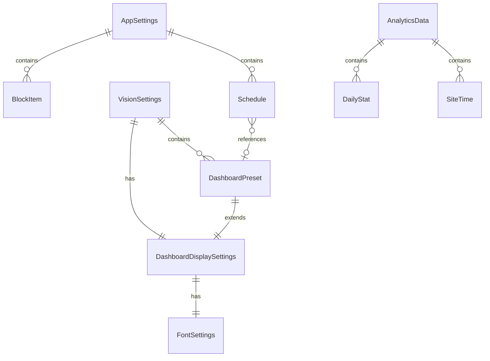

# データモデル

chrome.storage.local に保存するデータ構造の設計。

## ストレージキー一覧

| キー        | 型             | 説明                                       |
| ----------- | -------------- | ------------------------------------------ |
| `settings`  | AppSettings    | アプリ設定（ブロックリスト、スケジュール） |
| `vision`    | VisionSettings | ダッシュボード設定（プリセット含む）       |
| `analytics` | AnalyticsData  | 分析データ（滞在時間、統計）               |

## エンティティ関連図

## エンティティ詳細

### AppSettings（アプリ設定）

| フィールド   | 型          | 説明                   |
| ------------ | ----------- | ---------------------- |
| blockList    | BlockItem[] | ブロックリスト         |
| schedules    | Schedule[]  | スケジュール一覧       |
| language     | string?     | 言語設定（auto/en/ja） |
| lockdownMode | boolean     | ロックダウンモード     |

### BlockItem（ブロック項目）

| フィールド | 型      | 説明                |
| ---------- | ------- | ------------------- |
| id         | string  | 一意識別子          |
| domain     | string  | ドメイン名          |
| isWildcard | boolean | ワイルドカードか    |
| createdAt  | string  | 作成日時（ISO8601） |

### Schedule（スケジュール）

| フィールド | 型       | 説明               |
| ---------- | -------- | ------------------ |
| id         | string   | 一意識別子         |
| name       | string   | スケジュール名     |
| startTime  | string   | 開始時刻（HH:mm）  |
| endTime    | string   | 終了時刻（HH:mm）  |
| days       | number[] | 曜日（0=日〜6=土） |
| enabled    | boolean  | 有効/無効          |
| presetId   | string?  | 適用プリセットID   |

### VisionSettings（ダッシュボード設定）

| フィールド      | 型                       | 説明               |
| --------------- | ------------------------ | ------------------ |
| defaultSettings | DashboardDisplaySettings | デフォルト表示設定 |
| presets         | DashboardPreset[]        | プリセット一覧     |
| activePresetId  | string?                  | 有効なプリセットID |

### DashboardDisplaySettings（表示設定）

| フィールド           | 型                 | 説明                           |
| -------------------- | ------------------ | ------------------------------ |
| goalText             | string             | 目標テキスト                   |
| goalSubText          | string             | サブテキスト                   |
| textColor            | string             | テキスト色                     |
| backgroundType       | "image" \| "color" | 背景タイプ                     |
| backgroundImage      | string             | 背景画像ID                     |
| backgroundColor      | string             | 背景色                         |
| customBackgroundData | string?            | カスタム背景（Base64）※Premium |
| fontSettings         | FontSettings       | フォント設定                   |

### DashboardPreset（プリセット）

DashboardDisplaySettings を継承し、以下を追加：

| フィールド | 型     | 説明                |
| ---------- | ------ | ------------------- |
| id         | string | 一意識別子          |
| name       | string | プリセット名        |
| createdAt  | string | 作成日時（ISO8601） |

### FontSettings（フォント設定）

| フィールド | 型                                           | 説明               |
| ---------- | -------------------------------------------- | ------------------ |
| family     | string                                       | フォントファミリー |
| size       | "sm" \| "md" \| "lg" \| "xl"                 | サイズ             |
| weight     | "normal" \| "medium" \| "semibold" \| "bold" | ウェイト           |

### AnalyticsData（分析データ）

| フィールド      | 型                        | 説明                         |
| --------------- | ------------------------- | ---------------------------- |
| dailyStats      | Record<string, DailyStat> | 日別統計（キー: YYYY-MM-DD） |
| siteTime        | Record<string, SiteTime>  | サイト別滞在時間             |
| siteBlockCounts | Record<string, number>    | サイト別ブロック回数         |
| siteCategories  | Record<string, Category>  | サイトカテゴリ               |

### DailyStat（日別統計）

| フィールド | 型     | 説明               |
| ---------- | ------ | ------------------ |
| date       | string | 日付（YYYY-MM-DD） |
| totalTime  | number | 合計時間（秒）     |
| wasteTime  | number | 浪費時間（秒）     |
| investTime | number | 投資時間（秒）     |
| blockCount | number | ブロック回数       |

### SiteTime（サイト滞在時間）

| フィールド | 型     | 説明           |
| ---------- | ------ | -------------- |
| domain     | string | ドメイン名     |
| totalTime  | number | 合計時間（秒） |
| lastVisit  | string | 最終訪問日時   |

## 機能制限

無料版/有料版の制限値。詳細は [PRD.md](./PRD.md) のマネタイズセクションを参照。

| 項目           | 無料版 | 有料版 |
| -------------- | ------ | ------ |
| ブロックリスト | 無制限 | 無制限 |
| 分析履歴       | 7日間  | 全期間 |
| プリセット数   | 1件    | 5件    |
| カスタム背景   | ×      | ○      |
