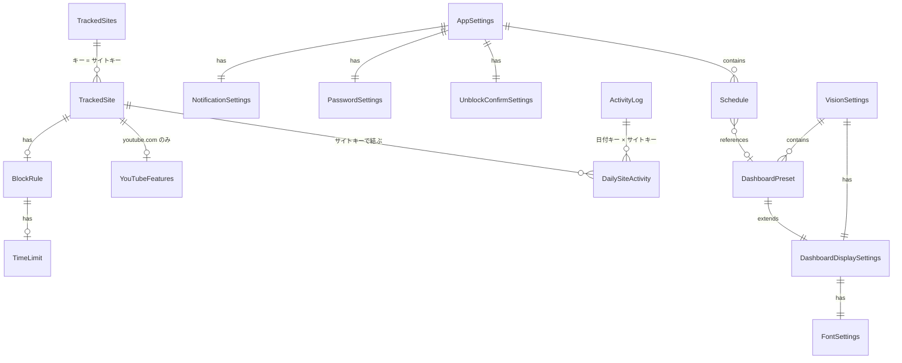

# データモデル

chrome.storage に保存するデータ構造の設計。

## 考え方

- **設定と事実を分ける。** 何を追跡し、どうブロックするかは `sites`（サイトごと）と `settings`（全体）に置く。いつ・どのサイトで・何が起きたかは `activity` にだけ置く
- **画面に出す数値はすべて導出する。** 浪費時間・ランキング・グラフ・レポート・時間制限の今日の使用量は `src/lib/activityStats.ts` が `activity` と `sites` から求める。画面やハンドラで集計しない
- **`sites` と `activity` を書くのは background だけ。** 画面はメッセージで依頼する（書き込みの直列化を 1 箇所で保つため）

## ストレージキー一覧

読み書きは `@wxt-dev/storage` の項目定義（`src/lib/storage.ts`）を通す。値は生のオブジェクトのまま保存される（JSON 文字列ではない）。`local:` は保存領域を選ぶ接頭辞で、chrome.storage.local 上の実キーには含まれない。

| 項目定義のキー        | 実キー          | 型                 | 書き手                                     | 説明                             |
| --------------------- | --------------- | ------------------ | ------------------------------------------ | -------------------------------- |
| `local:settings`      | `settings`      | AppSettings        | 画面・background                           | 全サイトに共通の設定             |
| `local:sites`         | `sites`         | TrackedSites       | background（`src/lib/siteService.ts`）     | 追跡中のサイトとサイトごとの設定 |
| `local:activity`      | `activity`      | ActivityLog        | background（`src/lib/activityService.ts`） | 日 × サイトの事実                |
| `local:vision`        | `vision`        | VisionSettings     | 画面                                       | ダッシュボードの表示設定         |
| `local:supportPrompt` | `supportPrompt` | SupportPromptState | 画面                                       | 支援誘導の表示状態               |

項目定義を通さないもの:

| 領域    | キー                                                  | 持ち主                                                               |
| ------- | ----------------------------------------------------- | -------------------------------------------------------------------- |
| local   | `ga_client_id` / `ga_session_id` / `ga_session_start` | `src/lib/analytics.ts`（GA4。詳細は [ANALYTICS.md](./ANALYTICS.md)） |
| session | `lastBlockedDomain`                                   | `src/lib/storage.ts`。ブロック画面の帯に出すホスト名                 |

## エンティティ関連図

```mermaid
erDiagram
    AppSettings ||--o{ Schedule : contains
    AppSettings ||--|| NotificationSettings : has
    AppSettings ||--|| PasswordSettings : has
    AppSettings ||--|| UnblockConfirmSettings : has

    TrackedSites ||--o{ TrackedSite : "キー = サイトキー"
    TrackedSite ||--o| BlockRule : has
    TrackedSite ||--o| YouTubeFeatures : "youtube.com のみ"
    BlockRule ||--o| TimeLimit : has

    ActivityLog ||--o{ DailySiteActivity : "日付キー × サイトキー"
    TrackedSite ||--o{ DailySiteActivity : "サイトキーで結ぶ"

    VisionSettings ||--|| DashboardDisplaySettings : has
    VisionSettings ||--o{ DashboardPreset : contains
    DashboardPreset ||--|| DashboardDisplaySettings : extends
    DashboardDisplaySettings ||--|| FontSettings : has
    Schedule }o--o| DashboardPreset : references
```

## サイトキー

追跡中のサイトは正規化したドメイン（サイトキー）で識別する。

- 正規化: 小文字にし、先頭の `*.` と `www.` を除く（`*.example.com` と `example.com` は照合結果が同じなので区別しない）
- 照合: ホスト名がキーと一致するか `.キー` で終わるとき、そのサイトに属する（declarativeNetRequest の `||キー` と同じ範囲）
- 追跡中のサイト同士は祖先・子孫の関係にならない（追加時に拒否する）。1 つのホスト名は高々 1 つのサイトに属する

実装: `src/lib/siteKey.ts`

## 日付キー

`activity` の日付はローカル時刻の `YYYY-MM-DD`。スケジュールと同じくローカルの 0 時で日が変わる（時間制限の「1 日」もこの境界）。

実装: `src/lib/time.ts` の `toDateKey`

## エンティティ詳細

### AppSettings（全サイトに共通の設定）

| フィールド     | 型                             | 説明                                                       |
| -------------- | ------------------------------ | ---------------------------------------------------------- |
| paused         | boolean                        | 全体の一時停止                                             |
| schedules      | Schedule[]                     | スケジュール。1 件以上あればスケジュール内だけブロックする |
| notifications  | NotificationSettings           | 時間制限の通知                                             |
| password       | PasswordSettings               | 解除操作のパスワード保護                                   |
| unblockConfirm | UnblockConfirmSettings         | パスワード未設定時の長押し確認                             |
| analyticsOptIn | AnalyticsOptIn \| null（任意） | GA4 の同意。未決定なら無いか null                          |

### Schedule（スケジュール）

| フィールド | 型       | 説明                                       |
| ---------- | -------- | ------------------------------------------ |
| id         | string   | 一意識別子                                 |
| name       | string   | スケジュール名                             |
| startTime  | string   | 開始時刻（HH:mm、ローカル）                |
| endTime    | string   | 終了時刻（HH:mm。`00:00` は `24:00` 扱い） |
| days       | number[] | 曜日（0=日〜6=土）                         |
| enabled    | boolean  | 有効/無効                                  |
| presetId   | string?  | 適用するダッシュボードのスタイル           |

### NotificationSettings（通知）

| フィールド       | 型                | 説明                           |
| ---------------- | ----------------- | ------------------------------ |
| timeLimitEnabled | boolean           | 時間制限の残り時間通知を出すか |
| timeLimitMinutes | 1 \| 3 \| 5 \| 10 | 残り何分で通知するか           |

### PasswordSettings（パスワード保護）

| フィールド   | 型             | 説明                                           |
| ------------ | -------------- | ---------------------------------------------- |
| enabled      | boolean        | 解除操作にパスワードを求めるか                 |
| passwordHash | string \| null | パスワードの SHA-256 ハッシュ。未設定なら null |

### UnblockConfirmSettings（ブロック解除の長押し確認）

| フィールド  | 型                  | 説明                                                   |
| ----------- | ------------------- | ------------------------------------------------------ |
| holdSeconds | 5 \| 10 \| 30 \| 60 | 確定までに長押しする秒数。パスワード保護中は使われない |

### AnalyticsOptIn（GA4 の同意）

| フィールド | 型      | 説明                   |
| ---------- | ------- | ---------------------- |
| enabled    | boolean | 匿名の使用統計を送るか |
| decidedAt  | string  | 決めた時刻（ISO8601）  |

### TrackedSite（追跡中のサイト）

分析の母集団であり、サイトごとの設定の置き場。`sites` はサイトキーをキーにした `Record<SiteKey, TrackedSite>`。

| フィールド | 型                      | 説明                                                                   |
| ---------- | ----------------------- | ---------------------------------------------------------------------- |
| domain     | SiteKey                 | サイトキー                                                             |
| trackedAt  | string                  | 追跡を始めた時刻（ISO8601）                                            |
| block      | BlockRule \| null       | ブロックの設定。null ならブロック対象ではない（追跡だけ）              |
| youtube    | YouTubeFeatures \| null | YouTube 固有の非表示機能。domain が `youtube.com` のときだけ値を持てる |

生成契機は 2 つ: ブロックリストへの追加（`block` を持つ）と、分析タブからの追跡サイトの追加（`block` が null）。youtube.com は YouTube 機能を有効にしたときにも作られる。

| 操作                   | 変わるもの                                       |
| ---------------------- | ------------------------------------------------ |
| ブロックリストに追加   | `block` を作る（サイトが無ければサイトごと作る） |
| ブロックのトグル       | `block.enabled`                                  |
| ブロックリストから削除 | `block` を null にする（追跡は続く）             |
| 追跡の停止             | サイトと、その `activity` の行を消す             |

### BlockRule（ブロックの設定）

| フィールド | 型                | 説明                                                      |
| ---------- | ----------------- | --------------------------------------------------------- |
| enabled    | boolean           | false なら一時的に無効                                    |
| addedAt    | string            | ブロックリストに入れた時刻（ISO8601）。ブロック日数の起点 |
| timeLimit  | TimeLimit \| null | null なら常時ブロック                                     |

判定の流れは [BLOCK_STATE_MACHINE.md](./BLOCK_STATE_MACHINE.md)。

### TimeLimit（時間制限）

| フィールド   | 型      | 説明                 |
| ------------ | ------- | -------------------- |
| type         | 'daily' | 1 日あたりの制限のみ |
| limitSeconds | number  | 1 日に使える秒数     |

今日の使用量は保存しない。`activity` の今日の行の `seconds` を使う。

### YouTubeFeatures（YouTube 固有の非表示機能）

| フィールド          | 型      | 説明                   |
| ------------------- | ------- | ---------------------- |
| hideShorts          | boolean | ショートを隠す         |
| hideRecommendations | boolean | おすすめを隠す         |
| hideComments        | boolean | コメントを隠す         |
| hideHomeFeed        | boolean | ホームのフィードを隠す |

アクセスのブロックと時間制限は youtube.com の `block` が持つ（他のサイトと同じ）。

### ActivityLog（事実）

`Record<DateKey, Record<SiteKey, DailySiteActivity>>`。追跡中のサイトについてだけ記録する。

### DailySiteActivity（1 日・1 サイトぶんの事実）

| フィールド | 型     | 説明                                                                                                               |
| ---------- | ------ | ------------------------------------------------------------------------------------------------------------------ |
| seconds    | number | ページが表示されていた秒数                                                                                         |
| blocks     | number | ブロックが成立した回数（ブロック画面へ飛ばした回数）                                                               |
| unblocks   | number | 利用者の操作でブロックが効かなくなった回数（トグル OFF・ブロックリストからの削除・YouTube のアクセスブロック OFF） |

書き手は `src/lib/activityService.ts` の `appendActivity` だけ（削除系も同じモジュールの同じ待ち行列を通る）。

### VisionSettings（ダッシュボード設定）

| フィールド      | 型                       | 説明                  |
| --------------- | ------------------------ | --------------------- |
| defaultSettings | DashboardDisplaySettings | 既定の表示設定        |
| presets         | DashboardPreset[]        | スタイル一覧          |
| activePresetId  | string \| null           | 選択中のスタイルの ID |

### DashboardDisplaySettings（表示設定）

| フィールド           | 型                 | 説明                     |
| -------------------- | ------------------ | ------------------------ |
| goalText             | string             | 目標テキスト             |
| goalSubText          | string             | サブテキスト             |
| textColor            | string             | テキスト色               |
| backgroundType       | "image" \| "color" | 背景の種類               |
| backgroundImage      | string             | 既定の背景画像の ID      |
| backgroundColor      | string             | 背景色                   |
| customBackgroundData | string \| null     | 取り込んだ背景（Base64） |
| fontSettings         | FontSettings       | フォント設定             |

### DashboardPreset（スタイル）

DashboardDisplaySettings に次を足したもの。

| フィールド | 型     | 説明                |
| ---------- | ------ | ------------------- |
| id         | string | 一意識別子          |
| name       | string | スタイル名          |
| createdAt  | string | 作成日時（ISO8601） |

### FontSettings（フォント設定）

| フィールド | 型                                           | 説明                                      |
| ---------- | -------------------------------------------- | ----------------------------------------- |
| family     | FontFamily                                   | フォントファミリー（`src/types/font.ts`） |
| size       | "sm" \| "md" \| "lg" \| "xl"                 | サイズ                                    |
| weight     | "normal" \| "medium" \| "semibold" \| "bold" | ウェイト                                  |

### SupportPromptState（支援誘導の表示状態）

| フィールド  | 型             | 説明                                            |
| ----------- | -------------- | ----------------------------------------------- |
| dismissedAt | number \| null | 最後に閉じた時刻（epoch ms）。未操作なら null   |
| opened      | boolean        | 支援ページを開いたことがあるか。true なら非表示 |

## 導出する値

「浪費時間」は、追跡中のサイトが表示されていた時間の合計（分類は持たない）。

| 画面・処理                                           | 導出（`src/lib/activityStats.ts`）               | 期間                         |
| ---------------------------------------------------- | ------------------------------------------------ | ---------------------------- |
| ポップアップの今日のサマリー・新しいタブの MiniStats | `todaySummary`                                   | 今日                         |
| ブロック画面の回数と時間                             | `siteTotals`                                     | 保持期間全体                 |
| 時間制限の判定・残り時間・通知・バッジ               | `secondsOnDay`                                   | 今日                         |
| 利用時間の推移（日別・サイト別・累積）               | `dailySeries` / `rankSites` / `cumulativeSeries` | グラフの期間（全系列で同じ） |
| 週次・月次レポート                                   | `sumRange` / `dailySeries` / `rankSites`         | その週・その月               |
| 追跡中のサイト一覧（解除日・解除後の時間）           | `lastUnblockedOn` / `secondsSinceUnblock`        | 最後に解除した日から今日     |
| CSV                                                  | `dailySeries` / `rankSites` / `lastActiveOn`     | 保持期間全体                 |

## 機能上限

課金による機能制限は行わない（詳細は [PRD.md](./PRD.md) のマネタイズセクションを参照）。

UI の都合による上限のみ存在する。

| 項目           | 上限   | 理由                                                             |
| -------------- | ------ | ---------------------------------------------------------------- |
| 追跡中のサイト | 無制限 | -                                                                |
| 事実の保持     | 365日  | ストレージ肥大の防止。`daily-cleanup` アラームが古い日の行を消す |
| スタイル       | 10件   | 選択ボタンを横並びで表示する UI の都合                           |
| カスタム背景   | 無制限 | -                                                                |

定義箇所: `src/constants/limits.ts`（`MAX_PRESETS`）、`src/constants/intervals.ts`（`MAX_HISTORY_DAYS_FALLBACK`）
