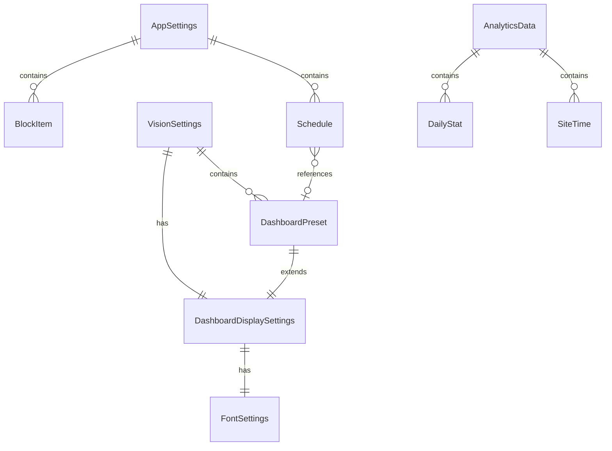

# データモデル

chrome.storage.local に保存するデータ構造の設計。

## ストレージキー一覧

読み書きは `@wxt-dev/storage` の項目定義（`src/lib/storage.ts`）を通す。値は**生のオブジェクトのまま**保存される（JSON 文字列ではない）。

| 項目定義のキー         | chrome.storage.local のキー | 型                 | 説明                                                   |
| ---------------------- | --------------------------- | ------------------ | ------------------------------------------------------ |
| `local:settings`       | `settings`                  | AppSettings        | アプリ設定（ブロックリスト、スケジュール）             |
| `local:vision`         | `vision`                    | VisionSettings     | ダッシュボード設定（プリセット含む）                   |
| `local:analytics`      | `analytics`                 | AnalyticsData      | 分析データ（滞在時間、統計）                           |
| `local:unblockHistory` | `unblockHistory`            | UnblockHistory     | 一時解除の履歴                                         |
| `local:supportPrompt`  | `supportPrompt`             | SupportPromptState | 支援誘導の表示状態（閉じた時刻・支援ページを開いたか） |

`local:` は保存領域（local / session / sync / managed）を選ぶための接頭辞で、chrome.storage.local 上の実キーには含まれない。

読み出しは公開関数（`getSettings` / `getVision` / `getAnalytics` / `getUnblockHistory`）を通す。項目定義の `fallback` は保存値が null / undefined のときしか効かず、旧実装が書いた JSON 文字列が同じ実キーに残っていると素通りするため、公開関数側でオブジェクトかどうかを検査して既定値に倒している。書き込みは項目定義の `setValue()` を使う。未保存と既定値を区別したい場合だけ `hasStoredVision()` のような専用の関数を通す。

セッション限りの値（`lastBlockedDomain`）は項目定義を通さず `chrome.storage.session` を直接使う。

## エンティティ関連図

```mermaid
erDiagram
    AppSettings ||--o{ BlockItem : contains
    AppSettings ||--o{ Schedule : contains

    VisionSettings ||--|| DashboardDisplaySettings : has
    VisionSettings ||--o{ DashboardPreset : contains

    DashboardPreset ||--|| DashboardDisplaySettings : extends
    DashboardDisplaySettings ||--|| FontSettings : has

    Schedule }o--o| DashboardPreset : references

    AnalyticsData ||--o{ DailyStat : contains
    AnalyticsData ||--o{ SiteTime : contains
```

## エンティティ詳細

### AppSettings（アプリ設定）

| フィールド   | 型          | 説明                   |
| ------------ | ----------- | ---------------------- |
| blockList    | BlockItem[] | ブロックリスト         |
| schedules    | Schedule[]  | スケジュール一覧       |
| language     | string?     | 言語設定（auto/en/ja） |
| lockdownMode | boolean     | ロックダウンモード     |

### BlockItem（ブロック項目）

| フィールド | 型      | 説明                |
| ---------- | ------- | ------------------- |
| id         | string  | 一意識別子          |
| domain     | string  | ドメイン名          |
| isWildcard | boolean | ワイルドカードか    |
| createdAt  | string  | 作成日時（ISO8601） |

### Schedule（スケジュール）

| フィールド | 型       | 説明               |
| ---------- | -------- | ------------------ |
| id         | string   | 一意識別子         |
| name       | string   | スケジュール名     |
| startTime  | string   | 開始時刻（HH:mm）  |
| endTime    | string   | 終了時刻（HH:mm）  |
| days       | number[] | 曜日（0=日〜6=土） |
| enabled    | boolean  | 有効/無効          |
| presetId   | string?  | 適用プリセットID   |

### VisionSettings（ダッシュボード設定）

| フィールド      | 型                       | 説明               |
| --------------- | ------------------------ | ------------------ |
| defaultSettings | DashboardDisplaySettings | デフォルト表示設定 |
| presets         | DashboardPreset[]        | プリセット一覧     |
| activePresetId  | string?                  | 有効なプリセットID |

### DashboardDisplaySettings（表示設定）

| フィールド           | 型                 | 説明                   |
| -------------------- | ------------------ | ---------------------- |
| goalText             | string             | 目標テキスト           |
| goalSubText          | string             | サブテキスト           |
| textColor            | string             | テキスト色             |
| backgroundType       | "image" \| "color" | 背景タイプ             |
| backgroundImage      | string             | 背景画像ID             |
| backgroundColor      | string             | 背景色                 |
| customBackgroundData | string?            | カスタム背景（Base64） |
| fontSettings         | FontSettings       | フォント設定           |

### DashboardPreset（プリセット）

DashboardDisplaySettings を継承し、以下を追加：

| フィールド | 型     | 説明                |
| ---------- | ------ | ------------------- |
| id         | string | 一意識別子          |
| name       | string | プリセット名        |
| createdAt  | string | 作成日時（ISO8601） |

### FontSettings（フォント設定）

| フィールド | 型                                           | 説明               |
| ---------- | -------------------------------------------- | ------------------ |
| family     | string                                       | フォントファミリー |
| size       | "sm" \| "md" \| "lg" \| "xl"                 | サイズ             |
| weight     | "normal" \| "medium" \| "semibold" \| "bold" | ウェイト           |

### AnalyticsData（分析データ）

| フィールド      | 型                        | 説明                         |
| --------------- | ------------------------- | ---------------------------- |
| dailyStats      | Record<string, DailyStat> | 日別統計（キー: YYYY-MM-DD） |
| siteTime        | Record<string, SiteTime>  | サイト別滞在時間             |
| siteBlockCounts | Record<string, number>    | サイト別ブロック回数         |
| siteCategories  | Record<string, Category>  | サイトカテゴリ               |

### DailyStat（日別統計）

| フィールド | 型     | 説明               |
| ---------- | ------ | ------------------ |
| date       | string | 日付（YYYY-MM-DD） |
| totalTime  | number | 合計時間（秒）     |
| wasteTime  | number | 浪費時間（秒）     |
| investTime | number | 投資時間（秒）     |
| blockCount | number | ブロック回数       |

### SiteTime（サイト滞在時間）

| フィールド | 型     | 説明           |
| ---------- | ------ | -------------- |
| domain     | string | ドメイン名     |
| totalTime  | number | 合計時間（秒） |
| lastVisit  | string | 最終訪問日時   |

### SupportPromptState（支援誘導の表示状態）

| フィールド  | 型             | 説明                                            |
| ----------- | -------------- | ----------------------------------------------- |
| dismissedAt | number \| null | 最後に閉じた時刻（epoch ms）。未操作なら null   |
| opened      | boolean        | 支援ページを開いたことがあるか。true なら非表示 |

## 機能上限

課金による機能制限は行わない（詳細は [PRD.md](./PRD.md) のマネタイズセクションを参照）。

UI の都合による上限のみ存在する。

| 項目           | 上限   | 理由                                   |
| -------------- | ------ | -------------------------------------- |
| ブロックリスト | 無制限 | -                                      |
| 分析履歴       | 365日  | ストレージ肥大の防止                   |
| スタイル       | 10件   | 選択ボタンを横並びで表示する UI の都合 |
| カスタム背景   | 無制限 | -                                      |

定義箇所: `src/constants/limits.ts`（`MAX_PRESETS`）、`src/constants/intervals.ts`（`MAX_HISTORY_DAYS_FALLBACK`）
