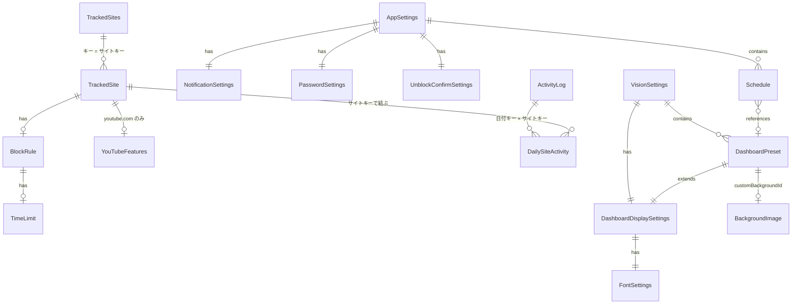

# データモデル

chrome.storage に保存するデータ構造の設計。

## 考え方

- **設定と事実を分ける。** 何を追跡し、どうブロックするかは `sites`（サイトごと）と `settings`（全体）に置く。いつ・どのサイトで・何が起きたかは `activity` にだけ置く
- **画面に出す数値はすべて導出する。** 浪費時間・ランキング・グラフ・レポート・時間制限の今日の使用量は `src/lib/activityStats.ts` が `activity` と `sites` から求める。画面やハンドラで集計しない
- **保存項目を書くのは background だけ。** `settings` / `sites` / `activity` / `vision` / スタイルの画像は、background のサービス（`src/lib/settingsService.ts` / `siteService.ts` / `activityService.ts`）が各自の待ち行列で書く。画面はメッセージで依頼し、保存値は購読（`useStorageItem`）で読む。例外は画面が書く `supportPrompt` と、`src/lib/analytics.ts` が持つ GA4 のキーだけ（書き込みの直列化を 1 箇所で保つため）
- **この規則は lint が守る。** `eslint.config.mjs` の `no-restricted-syntax` / `no-restricted-imports` が、サービス以外からの保存項目・`@wxt-dev/storage`・`chrome.storage.local` への書き込みを禁じる（例外のファイルと対象は同ファイルの定数）

## ストレージキー一覧

読み書きは `@wxt-dev/storage` の項目定義（`src/lib/storage.ts`）を通す。値は生のオブジェクトのまま保存される（JSON 文字列ではない）。`local:` は保存領域を選ぶ接頭辞で、chrome.storage.local 上の実キーには含まれない。

| 項目定義のキー        | 実キー          | 型                 | 書き手                                     | 説明                             |
| --------------------- | --------------- | ------------------ | ------------------------------------------ | -------------------------------- |
| `local:settings`      | `settings`      | AppSettings        | background（`src/lib/settingsService.ts`） | 全サイトに共通の設定             |
| `local:sites`         | `sites`         | TrackedSites       | background（`src/lib/siteService.ts`）     | 追跡中のサイトとサイトごとの設定 |
| `local:activity`      | `activity`      | ActivityLog        | background（`src/lib/activityService.ts`） | 日 × サイトの事実                |
| `local:vision`        | `vision`        | VisionSettings     | background（`src/lib/settingsService.ts`） | ダッシュボードの表示設定         |
| `local:supportPrompt` | `supportPrompt` | SupportPromptState | 画面                                       | 支援誘導の表示状態               |

項目定義を通さないもの:

| 領域    | キー                                                  | 持ち主                                                                                                                                                          |
| ------- | ----------------------------------------------------- | --------------------------------------------------------------------------------------------------------------------------------------------------------------- |
| local   | `backgroundImage:<imageId>`                           | 書き手は background（`src/lib/settingsService.ts`）、キーを作るのは `src/lib/storage.ts` の `backgroundImageKey`。スタイルの背景画像 1 枚（「スタイルの画像」） |
| local   | `ga_client_id` / `ga_session_id` / `ga_session_start` | `src/lib/analytics.ts`（GA4。詳細は [ANALYTICS.md](./ANALYTICS.md)）                                                                                            |
| session | `lastBlocked`                                         | `src/lib/storage.ts`。ブロック画面の帯に出すホスト名とブロックの理由                                                                                            |

## エンティティ関連図

```mermaid
erDiagram
    AppSettings ||--o{ Schedule : contains
    AppSettings ||--|| NotificationSettings : has
    AppSettings ||--|| PasswordSettings : has
    AppSettings ||--|| UnblockConfirmSettings : has

    TrackedSites ||--o{ TrackedSite : "キー = サイトキー"
    TrackedSite ||--o| BlockRule : has
    TrackedSite ||--o| YouTubeFeatures : "youtube.com のみ"
    BlockRule ||--o| TimeLimit : has

    ActivityLog ||--o{ DailySiteActivity : "日付キー × サイトキー"
    TrackedSite ||--o{ DailySiteActivity : "サイトキーで結ぶ"

    VisionSettings ||--|| DashboardDisplaySettings : has
    VisionSettings ||--o{ DashboardPreset : contains
    DashboardPreset ||--|| DashboardDisplaySettings : extends
    DashboardPreset ||--o| BackgroundImage : "customBackgroundId"
    DashboardDisplaySettings ||--|| FontSettings : has
    Schedule }o--o| DashboardPreset : references
```

## サイトキー

追跡中のサイトは正規化したドメイン（サイトキー）で識別する。

- 正規化: 小文字にし、先頭の `*.` と `www.` を除く（`*.example.com` と `example.com` は照合結果が同じなので区別しない）
- 照合: ホスト名がキーと一致するか `.キー` で終わるとき、そのサイトに属する（declarativeNetRequest の `||キー` と同じ範囲）
- 追跡中のサイト同士は祖先・子孫の関係にならない（追加時に拒否する）。1 つのホスト名は高々 1 つのサイトに属する

実装: `src/lib/siteKey.ts`

## 日付キー

`activity` の日付はローカル時刻の `YYYY-MM-DD`。スケジュールと同じくローカルの 0 時で日が変わる（時間制限の「1 日」もこの境界）。

実装: `src/lib/time.ts` の `toDateKey`

## エンティティ詳細

### AppSettings（全サイトに共通の設定）

| フィールド     | 型                             | 説明                                                                                                            |
| -------------- | ------------------------------ | --------------------------------------------------------------------------------------------------------------- |
| paused         | boolean                        | 全体の一時停止                                                                                                  |
| schedules      | Schedule[]                     | スケジュール。有効なものが 1 件以上あればスケジュール内だけブロックする（すべて無効ならスケジュール無しと同じ） |
| notifications  | NotificationSettings           | 時間制限の通知                                                                                                  |
| password       | PasswordSettings               | 解除操作のパスワード保護                                                                                        |
| unblockConfirm | UnblockConfirmSettings         | パスワード未設定時の長押し確認                                                                                  |
| analyticsOptIn | AnalyticsOptIn \| null（任意） | GA4 の同意。未決定なら無いか null                                                                               |

### Schedule（スケジュール）

| フィールド | 型       | 説明                                                  |
| ---------- | -------- | ----------------------------------------------------- |
| id         | string   | 一意識別子                                            |
| name       | string   | スケジュール名                                        |
| startTime  | string   | 開始時刻（HH:mm、ローカル）                           |
| endTime    | string   | 終了時刻（HH:mm か `24:00`。`00:00` は `24:00` 扱い） |
| days       | number[] | 曜日（0=日〜6=土）                                    |
| enabled    | boolean  | 有効/無効                                             |
| presetId   | string?  | 適用するダッシュボードのスタイル                      |

検証: `src/types/messageSchemas.ts` の `ScheduleSchema`。名前は空白以外を 1 文字以上含む、曜日は 0〜6 の整数を重複なく 1 つ以上、時刻の書式は `src/lib/time.ts` の `TIME_OF_DAY_PATTERN`。設定の取り込みと background のスケジュールの追加・更新（`add-schedule` / `update-schedule`）が同じスキーマを使い、合わない値は保存しない

### NotificationSettings（通知）

| フィールド       | 型                | 説明                           |
| ---------------- | ----------------- | ------------------------------ |
| timeLimitEnabled | boolean           | 時間制限の残り時間通知を出すか |
| timeLimitMinutes | 1 \| 3 \| 5 \| 10 | 残り何分で通知するか           |

### PasswordSettings（パスワード保護）

| フィールド   | 型             | 説明                                           |
| ------------ | -------------- | ---------------------------------------------- |
| enabled      | boolean        | 解除操作にパスワードを求めるか                 |
| passwordHash | string \| null | パスワードの SHA-256 ハッシュ。未設定なら null |

書き手は background だけ（`set-password` / `change-password` / `remove-password` のハンドラと `src/lib/settingsService.ts`）。画面は平文のパスワードを送り、長さの検査（4〜100 文字。`src/lib/password.ts` の `validatePasswordStrength`）・照合・ハッシュ化は background が行う。保護中かどうかは `src/lib/password.ts` の `isProtectedByPassword`（`enabled` が true で、ハッシュがある）で決め、background の照合と画面の表示（パスワード入力を求めるか）の両方がこれに従う。画面はハッシュの値を照合に使わない。照合を求める操作は [SCREEN.md の「解除の流れ」](./SCREEN.md#解除の流れ)

### UnblockConfirmSettings（ブロック解除の長押し確認）

| フィールド  | 型                  | 説明                                                   |
| ----------- | ------------------- | ------------------------------------------------------ |
| holdSeconds | 5 \| 10 \| 30 \| 60 | 確定までに長押しする秒数。パスワード保護中は使われない |

### AnalyticsOptIn（GA4 の同意）

| フィールド | 型      | 説明                   |
| ---------- | ------- | ---------------------- |
| enabled    | boolean | 匿名の使用統計を送るか |
| decidedAt  | string  | 決めた時刻（ISO8601）  |

### TrackedSite（追跡中のサイト）

分析の母集団であり、サイトごとの設定の置き場。`sites` はサイトキーをキーにした `Record<SiteKey, TrackedSite>`。

| フィールド | 型                      | 説明                                                                   |
| ---------- | ----------------------- | ---------------------------------------------------------------------- |
| domain     | SiteKey                 | サイトキー                                                             |
| trackedAt  | string                  | 追跡を始めた時刻（ISO8601）                                            |
| block      | BlockRule \| null       | ブロックの設定。null ならブロック対象ではない（追跡だけ）              |
| youtube    | YouTubeFeatures \| null | YouTube 固有の非表示機能。domain が `youtube.com` のときだけ値を持てる |

生成契機は 2 つ: ブロックリストへの追加（`block` を持つ）と、分析タブからの追跡サイトの追加（`block` が null）。youtube.com は YouTube 機能を有効にしたときにも作られる。

| 操作                   | 変わるもの                                                                          |
| ---------------------- | ----------------------------------------------------------------------------------- |
| ブロックリストに追加   | `block` を作る（サイトが無ければサイトごと作る）                                    |
| ブロックのトグル       | `block.enabled`                                                                     |
| ブロックリストから削除 | `block` を null にする（追跡は続く）                                                |
| 追跡の停止             | サイトと、その `activity` の行を消す（`block` か `youtube` を持つサイトは止めない） |

画面での見え方（どちらも `sites` からの導出で、保存はしない）:

- 「ブロック中のサイト」一覧（ブロックリストタブ・新しいタブ・ブロックリスト CSV）は、`block` を持つサイトから youtube.com を除いたもの（`src/lib/blockList.ts` の `blockListSites`。新しいタブはそのうち `block.enabled` のものだけ）。youtube.com の設定は YouTube の節だけが扱う
- 追跡中サイト一覧（分析タブ）の状態は、`block === null` なら解除済み（追跡だけ）、`block.enabled` でブロック中 / ブロック中（無効）

### BlockRule（ブロックの設定）

| フィールド | 型                | 説明                                                      |
| ---------- | ----------------- | --------------------------------------------------------- |
| enabled    | boolean           | false なら一時的に無効                                    |
| addedAt    | string            | ブロックリストに入れた時刻（ISO8601）。ブロック日数の起点 |
| timeLimit  | TimeLimit \| null | null なら常時ブロック                                     |

判定の流れは [BLOCK_STATE_MACHINE.md](./BLOCK_STATE_MACHINE.md)。

### TimeLimit（時間制限）

| フィールド   | 型      | 説明                 |
| ------------ | ------- | -------------------- |
| type         | 'daily' | 1 日あたりの制限のみ |
| limitSeconds | number  | 1 日に使える秒数     |

今日の使用量は保存しない。`activity` の今日の行の `seconds` を使う。

### YouTubeFeatures（YouTube 固有の非表示機能）

| フィールド          | 型      | 説明                   |
| ------------------- | ------- | ---------------------- |
| hideShorts          | boolean | ショートを隠す         |
| hideRecommendations | boolean | おすすめを隠す         |
| hideComments        | boolean | コメントを隠す         |
| hideHomeFeed        | boolean | ホームのフィードを隠す |

アクセスのブロックと時間制限は youtube.com の `block` が持つ（他のサイトと同じ）。

### ActivityLog（事実）

`Record<DateKey, Record<SiteKey, DailySiteActivity>>`。追跡中のサイトについてだけ記録する。

### DailySiteActivity（1 日・1 サイトぶんの事実）

| フィールド | 型     | 説明                                                                                                               |
| ---------- | ------ | ------------------------------------------------------------------------------------------------------------------ |
| seconds    | number | ページが表示されていた秒数                                                                                         |
| blocks     | number | ブロックが成立した回数（ブロック画面へ飛ばした回数）                                                               |
| unblocks   | number | 利用者の操作でブロックが効かなくなった回数（トグル OFF・ブロックリストからの削除・YouTube のアクセスブロック OFF） |

書き手は `src/lib/activityService.ts` の `appendActivity` だけ（削除系も同じモジュールの同じ待ち行列を通る）。

### VisionSettings（ダッシュボード設定）

| フィールド      | 型                       | 説明                  |
| --------------- | ------------------------ | --------------------- |
| defaultSettings | DashboardDisplaySettings | 既定の表示設定        |
| presets         | DashboardPreset[]        | スタイル一覧          |
| activePresetId  | string \| null           | 選択中のスタイルの ID |

スタイルの件数は `MAX_PRESETS` まで（「機能上限」）。スタイルの作成（`create-preset`）と設定の取り込みで `src/lib/settingsService.ts` が保存済みの最新の値に対して数える。取り込みは既存のスタイルを残し、ID が重ならないスタイルをファイルの並び順に上限まで足し、残りは取り込まずに名前を画面へ返す（取り込まなかったスタイルを指す `activePresetId` とスケジュールの `presetId` は外す）

### DashboardDisplaySettings（表示設定）

| フィールド      | 型                 | 説明                |
| --------------- | ------------------ | ------------------- |
| goalText        | string             | 目標テキスト        |
| goalSubText     | string             | サブテキスト        |
| textColor       | string             | テキスト色          |
| backgroundType  | "image" \| "color" | 背景の種類          |
| backgroundImage | string             | 既定の背景画像の ID |
| backgroundColor | string             | 背景色              |
| fontSettings    | FontSettings       | フォント設定        |

利用者の画像は持たない（持てるのはスタイルだけ）。

### DashboardPreset（スタイル）

DashboardDisplaySettings に次を足したもの。

| フィールド         | 型             | 説明                                                                                      |
| ------------------ | -------------- | ----------------------------------------------------------------------------------------- |
| id                 | string         | 一意識別子                                                                                |
| name               | string         | スタイル名                                                                                |
| createdAt          | string         | 作成日時（ISO8601）                                                                       |
| customBackgroundId | string \| null | 利用者の画像の ID（「スタイルの画像」）。あれば backgroundImage より優先。null = 使わない |

### スタイルの画像

画像 1 枚を 1 つの保存キー `backgroundImage:<imageId>` に置く（値は JPEG の data URL で、文字数は `IMAGE_LIMITS.TARGET_SIZE` 以下）。論理的には画像はスタイルの一部で、書き手の `src/lib/settingsService.ts` が次を守る。

| 規則                         | 守り方                                                                                                                                |
| ---------------------------- | ------------------------------------------------------------------------------------------------------------------------------------- |
| スタイルと一緒に作る         | 作るのは `update-preset` の画像の `set` と設定の取り込みだけ。ID は background が振る                                                 |
| 差し替えるたびに新しい ID    | 同じ ID の中身は書き換えない。読み手は ID ごとに 1 回読めば済み、変更を監視しない                                                     |
| スタイルと一緒に消す         | `update-preset` の `set` / `clear` と `delete-preset` が古い画像を消す                                                                |
| 共有しない                   | 既存の画像 ID を画面から受け取るメッセージは無い。取り込みも毎回新しい ID で作る                                                      |
| 持ち主のいない画像を残さない | 古い画像を消してから、スタイル（と足す画像）を 1 回の書き込みで書く。間で止まっても残るのは「画像の無い ID を指すスタイル」だけになる |

読み手（`src/hooks/useBackgroundImage.ts`）は画像の無い ID を画像なしとして扱う。新しいタブは表示するスタイルの画像 1 枚だけを読む。

### FontSettings（フォント設定）

| フィールド | 型                                           | 説明                                      |
| ---------- | -------------------------------------------- | ----------------------------------------- |
| family     | FontFamily                                   | フォントファミリー（`src/types/font.ts`） |
| size       | "sm" \| "md" \| "lg" \| "xl"                 | サイズ                                    |
| weight     | "normal" \| "medium" \| "semibold" \| "bold" | ウェイト                                  |

### SupportPromptState（支援誘導の表示状態）

| フィールド  | 型             | 説明                                            |
| ----------- | -------------- | ----------------------------------------------- |
| dismissedAt | number \| null | 最後に閉じた時刻（epoch ms）。未操作なら null   |
| opened      | boolean        | 支援ページを開いたことがあるか。true なら非表示 |

## 設定ファイル（書き出し形式）

書き出し・取り込みは `src/lib/settingsExport.ts`。形式の版は `EXPORT_VERSION`（古い版の扱いは [SCREEN.md](./SCREEN.md) の設定タブ「設定のバックアップ」）。

- スタイルの画像は ID ではなく data URL（`customBackgroundData`）でスタイルごとに含め、ファイル 1 つで完結させる。既定の表示設定は画像の欄を持たない
- 取り込みは設定・表示設定・画像を 1 回の書き込みで保存する（画像の ID の振り方は「スタイルの画像」、スタイルの重ね方は「VisionSettings」）
- 取り込むファイルの大きさの上限は `MAX_IMPORT_SIZE`（「機能上限」）。超えたら形式エラーではなく大きすぎる旨で拒む

## 導出する値

「浪費時間」は、追跡中のサイトが表示されていた時間の合計（分類は持たない）。

| 画面・処理                                           | 導出（`src/lib/activityStats.ts`）                                     | 期間                         |
| ---------------------------------------------------- | ---------------------------------------------------------------------- | ---------------------------- |
| ポップアップの今日のサマリー・新しいタブの MiniStats | `todaySummary`                                                         | 今日                         |
| ブロック画面の回数と時間                             | `siteTotals`                                                           | 保持期間全体                 |
| 時間制限の判定・残り時間・通知・バッジ               | `secondsOnDay`                                                         | 今日                         |
| 利用時間の推移（日別・サイト別・累積）               | `dailySeries` / `rankSites` / `cumulativeSeries`                       | グラフの期間（全系列で同じ） |
| 週次・月次レポート                                   | `sumRange` / `dailySeries` / `rankSites`                               | その週・その月               |
| 追跡中のサイト一覧（解除日・解除後の時間・合計）     | `lastUnblockedOn` / `secondsSinceUnblock` / `totalSecondsSinceUnblock` | 最後に解除した日から今日     |
| CSV（ブロック回数・日別統計）                        | `rankSites` / `lastBlockedOn` / `dailySeries`                          | 保持期間全体                 |
| CSV（解除したサイト）                                | `lastUnblockedOn` / `secondsSinceUnblock` / `lastActiveOn`             | 最後に解除した日から今日     |

## 機能上限

課金による機能制限は行わない（詳細は [PRD.md](./PRD.md) のマネタイズセクションを参照）。

| 項目                   | 上限                | 理由                                                                     |
| ---------------------- | ------------------- | ------------------------------------------------------------------------ |
| 追跡中のサイト         | 無制限              | -                                                                        |
| 事実の保持             | 365日               | ストレージ肥大の防止。`daily-cleanup` アラームが古い日の行を消す         |
| スタイル               | 10件                | [PRD.md](./PRD.md)「機能上限について」                                   |
| 利用者の画像           | スタイルごとに 1 枚 | 画像はスタイルの一部（「スタイルの画像」）                               |
| 設定ファイルの取り込み | 15 MB               | 画像を含む書き出し（スタイルの上限 × 画像 1 枚の上限）を取り込めるように |

定義箇所: `src/constants/limits.ts`（`MAX_PRESETS` / `IMAGE_LIMITS` / `MAX_IMPORT_SIZE`）、`src/constants/intervals.ts`（`MAX_HISTORY_DAYS_FALLBACK`）
