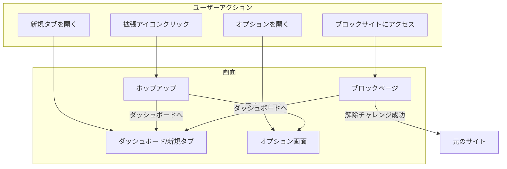

# 画面設計

## 1. 画面一覧

| 画面名         | コンテキスト | パス               | 説明                                |
| -------------- | ------------ | ------------------ | ----------------------------------- |
| ポップアップ   | popup        | popup/index.html   | 拡張アイコンクリック時に表示        |
| ダッシュボード | newtab       | newtab/index.html  | 新規タブ / ブロックページとして表示 |
| オプション     | options      | options/index.html | 詳細設定画面                        |
| ブロックページ | blocked      | blocked/index.html | ブロック時に表示（目標リマインド）  |

## 2. 画面遷移図



## 3. 各画面詳細

---

### ポップアップ（popup）

拡張アイコンをクリックした時に表示される小窓。クイックアクセス用。

#### サイズ

- 幅: 360px（固定）
- 高さ: 480px（最大）

#### レイアウト

```
┌─────────────────────────────────┐
│  [Logo] VisionFocus    [⚙️]    │  ← ヘッダー
├─────────────────────────────────┤
│                                 │
│  ┌───────────────────────────┐  │
│  │     今日の目標           │  │  ← 目標カード（タップでNewtab）
│  │  「ライバルを超える」    │  │
│  └───────────────────────────┘  │
│                                 │
│  ── 今日のサマリー ──────────  │
│                                 │
│  浪費時間: 1h 23m               │
│  投資時間: 3h 45m               │
│  ブロック回数: 12回             │
│                                 │
├─────────────────────────────────┤
│  ┌─────────────────────────┐    │
│  │ 🔒 ロックダウンモード   │    │  ← ワンタップ有効化
│  └─────────────────────────┘    │
│                                 │
│  [クイックブロック追加]         │  ← 現在のサイトを追加
│                                 │
└─────────────────────────────────┘
```

#### 要素一覧

| 要素               | 種類           | 説明                               |
| ------------------ | -------------- | ---------------------------------- |
| ヘッダー           | コンポーネント | ロゴ + 設定アイコン                |
| 目標カード         | コンポーネント | 目標テキスト表示、クリックでNewtab |
| 今日のサマリー     | セクション     | 浪費/投資時間、ブロック回数        |
| ロックダウンボタン | ボタン         | 即時ロックダウンモード有効化       |
| クイックブロック   | ボタン         | 現在のサイトをブロックリストに追加 |

#### 挙動

- 設定アイコン → オプション画面を新規タブで開く
- 目標カードクリック → ダッシュボード（新規タブ）を開く
- ロックダウンボタン → 確認モーダル後に有効化
- クイックブロック → 現在のタブのドメインを追加

---

### ダッシュボード / 新規タブ（newtab）

新規タブを開いた時に表示。目標を常に意識させるビジョンボード。

#### サイズ

- フルスクリーン（ブラウザウィンドウサイズ）

#### レイアウト

```
┌──────────────────────────────────────────────────────────────────┐
│                                                                  │
│                    [背景画像（フルスクリーン）]                  │
│                                                                  │
│    ┌────────────────────────────────────────────────────────┐    │
│    │                                                        │    │
│    │                                                        │    │
│    │              「ライバルを追い抜き、                     │    │
│    │                圧倒的な成果を出す」                     │    │  ← 目標テキスト
│    │                                                        │    │
│    │                                                        │    │
│    └────────────────────────────────────────────────────────┘    │
│                                                                  │
│    ┌──────────────┐  ┌──────────────┐  ┌──────────────┐         │
│    │  浪費時間    │  │  投資時間    │  │  ブロック    │         │  ← ミニ統計
│    │   1h 23m    │  │   3h 45m    │  │    12回      │         │
│    └──────────────┘  └──────────────┘  └──────────────┘         │
│                                                                  │
│                                    [詳細分析] [設定]  [⚙️]       │  ← フッター
└──────────────────────────────────────────────────────────────────┘
```

#### 要素一覧

| 要素           | 種類           | 説明                              |
| -------------- | -------------- | --------------------------------- |
| 背景画像       | 画像           | デフォルト or ユーザー設定        |
| 目標テキスト   | テキスト       | ユーザーが設定した目標            |
| ミニ統計カード | コンポーネント | 今日の浪費/投資時間、ブロック回数 |
| 詳細分析リンク | リンク         | オプション画面の分析タブへ        |
| 設定アイコン   | アイコン       | オプション画面へ                  |

#### 挙動

- 背景画像はオプションで変更可能（有料版はアップロード可能）
- 目標テキストは編集アイコンクリックで編集モードへ（プリセット選択中は編集不可）
- 統計カードクリックでオプション画面の詳細分析へ
- プリセットは以下の優先順位で適用:
  1. アクティブなスケジュールのプリセット
  2. ユーザー選択中のプリセット（activePresetId）
  3. デフォルト設定

#### Premium機能

| 機能           | 説明                                           |
| -------------- | ---------------------------------------------- |
| 壁紙ダウンロード | 現在の画面を壁紙として保存（複数解像度対応）   |
| カスタム背景   | アップロードした画像を背景として使用           |
| フォント拡張   | 20種類以上のGoogleフォントから選択可能         |

---

### ブロックページ（blocked）

ブロックリストのサイトにアクセスした時に表示されるページ。

#### サイズ

- フルスクリーン（ブラウザウィンドウサイズ）

#### レイアウト

```
┌──────────────────────────────────────────────────────────────────┐
│                                                                  │
│                    [背景画像（ダッシュボードと同じ）]            │
│                                                                  │
│                         ⚠️ BLOCKED                               │
│                                                                  │
│    ┌────────────────────────────────────────────────────────┐    │
│    │                                                        │    │
│    │              「ライバルを追い抜き、                     │    │
│    │                圧倒的な成果を出す」                     │    │  ← 目標リマインド
│    │                                                        │    │
│    │              今、これをしていて良いのか？              │    │
│    │                                                        │    │
│    └────────────────────────────────────────────────────────┘    │
│                                                                  │
│                  [ダッシュボードへ]  [解除チャレンジ]            │
│                                                                  │
│                     twitter.com をブロック中                     │
│                                                                  │
└──────────────────────────────────────────────────────────────────┘
```

#### 要素一覧

| 要素                 | 種類     | 説明                         |
| -------------------- | -------- | ---------------------------- |
| BLOCKEDアイコン      | アイコン | ブロック状態を示す           |
| 目標リマインド       | テキスト | ユーザーの目標 + 問いかけ    |
| ダッシュボードボタン | ボタン   | ダッシュボードへ遷移         |
| 解除チャレンジボタン | ボタン   | チャレンジモーダルを表示     |
| ブロック中ドメイン   | テキスト | 現在ブロックしているドメイン |

#### 解除チャレンジモーダル

```
┌─────────────────────────────────────┐
│   🎯 解除チャレンジ                │
├─────────────────────────────────────┤
│                                     │
│   以下のテキストを入力してください  │
│                                     │
│   "I choose to focus on my goals"   │
│                                     │
│   ┌───────────────────────────┐     │
│   │                           │     │
│   └───────────────────────────┘     │
│                                     │
│   [キャンセル]     [解除する]       │
│                                     │
└─────────────────────────────────────┘
```

#### 挙動

- 解除チャレンジ成功 → 一定時間（5分）のみアクセス許可
- ハードモード（有料版）→ 解除チャレンジ自体を無効化可能
- ロックダウンモード中 → 解除不可

---

### オプション画面（options）

詳細設定と分析を行う画面。タブ形式で複数のセクションを管理。

#### サイズ

- 最大幅: 1200px（中央寄せ）
- 高さ: フルスクリーン

#### タブ構成

1. ダッシュボード設定
2. ブロックリスト
3. スケジュール
4. 分析
5. 有料版（アップグレード）

#### レイアウト（ブロックリストタブ）

```
┌──────────────────────────────────────────────────────────────────┐
│  [Logo] VisionFocus                                              │
├──────────────────────────────────────────────────────────────────┤
│  [ダッシュボード] [ブロックリスト] [スケジュール] [分析] [有料版] │
├──────────────────────────────────────────────────────────────────┤
│                                                                  │
│  ブロックリスト                              [+ サイトを追加]    │
│                                                                  │
│  ┌────────────────────────────────────────────────────────────┐  │
│  │ twitter.com                      [編集] [削除]             │  │
│  ├────────────────────────────────────────────────────────────┤  │
│  │ *.youtube.com                    [編集] [削除]             │  │
│  ├────────────────────────────────────────────────────────────┤  │
│  │ reddit.com                       [編集] [削除]             │  │
│  └────────────────────────────────────────────────────────────┘  │
│                                                                  │
│  無料版: 5サイトまで (残り2枠)                                   │
│  [有料版にアップグレードして無制限に]                            │
│                                                                  │
└──────────────────────────────────────────────────────────────────┘
```

#### レイアウト（分析タブ）

```
┌──────────────────────────────────────────────────────────────────┐
│  [Logo] VisionFocus                                              │
├──────────────────────────────────────────────────────────────────┤
│  [ダッシュボード] [ブロックリスト] [スケジュール] [分析] [有料版] │
├──────────────────────────────────────────────────────────────────┤
│                                                                  │
│  📊 利用状況分析                    [今日] [7日間] [30日間]      │
│                                                                  │
│  ┌─────────────────────────────────────────────────────────┐     │
│  │                                                         │     │
│  │              [棒グラフ: 日別利用時間]                   │     │
│  │                                                         │     │
│  └─────────────────────────────────────────────────────────┘     │
│                                                                  │
│  サイト別ランキング                                              │
│  ┌────────────────────────────────────────────────────────────┐  │
│  │ 1. twitter.com         2h 30m    ████████████  浪費       │  │
│  │ 2. github.com          1h 45m    ████████      投資       │  │
│  │ 3. youtube.com         1h 20m    ██████        浪費       │  │
│  │ 4. docs.google.com     1h 00m    █████         投資       │  │
│  └────────────────────────────────────────────────────────────┘  │
│                                                                  │
│  無料版: 直近7日間のみ表示                                       │
│  [有料版で全期間の履歴を確認]                                    │
│                                                                  │
└──────────────────────────────────────────────────────────────────┘
```

#### タブ別要素

**1. ダッシュボード設定（一般タブ）**

| 要素             | 説明                                       |
| ---------------- | ------------------------------------------ |
| プリセット一覧   | プリセットの選択・適用・削除               |
| プリセット作成   | 現在の設定を新規プリセットとして保存       |
| 目標テキスト入力 | 目標を設定                                 |
| サブテキスト入力 | 補足メッセージ                             |
| テキスト色選択   | 表示テキストの色                           |
| 背景タイプ選択   | 画像 / 単色                                |
| 背景画像選択     | デフォルト6種類 / アップロード（有料版）   |
| 背景色選択       | 単色背景の色                               |
| フォント設定     | ファミリー・サイズ・ウェイト（有料版拡張） |
| プレビュー       | 現在の設定をリアルタイムプレビュー         |

※ 無料版: プリセット1件まで / 有料版: プリセット5件まで
※ Freeダウングレード時: 2件目以降のプリセットはロック表示（🔒）

**2. ブロックリスト**

| 要素               | 説明                    |
| ------------------ | ----------------------- |
| サイト一覧         | 追加・編集・削除        |
| ワイルドカード説明 | \*.example.com の使い方 |
| 無料版制限表示     | 残り枠数                |

**3. スケジュール**

| 要素             | 説明                                         |
| ---------------- | -------------------------------------------- |
| スケジュール一覧 | 既存スケジュールの表示・編集・削除           |
| スケジュール名   | 識別用の名前                                 |
| 時間帯設定       | 開始・終了時刻                               |
| 曜日選択         | 適用する曜日（複数選択可）                   |
| プリセット連携   | このスケジュール中に適用するプリセットを選択 |
| 有効/無効切替    | スケジュールのオン/オフ                      |

※ Freeダウングレード時: ロックされたプリセットはスケジュールで適用されない

**4. 分析**

| 要素               | 説明                            |
| ------------------ | ------------------------------- |
| 期間選択           | 今日 / 7日間 / 30日間（有料版） |
| 利用時間グラフ     | 日別の棒グラフ                  |
| サイト別ランキング | 滞在時間順                      |
| 浪費/投資分類      | サイト分類設定                  |

**5. 有料版（プレミアムタブ）**

| 要素                   | 説明                           |
| ---------------------- | ------------------------------ |
| ライセンスキー入力     | Gumroadで購入したキーを入力    |
| アクティベート/解除    | ライセンスの有効化/無効化      |
| 開発者モード           | 24時間限定のプレミアム体験     |
| 機能比較表             | 無料版 vs 有料版               |
| アップグレードボタン   | Gumroad決済ページへ            |
| サブスクリプション管理 | 有料ユーザー用の管理リンク     |

---

## 4. モーダル一覧

### 新規プリセット作成モーダル（NewPresetModal）

```
┌─────────────────────────────────────┐
│   新規プリセット作成               │
├─────────────────────────────────────┤
│                                     │
│   プリセット名                      │
│   ┌───────────────────────────┐     │
│   │ 仕事モード                │     │
│   └───────────────────────────┘     │
│                                     │
│   [キャンセル]     [作成]           │
│                                     │
└─────────────────────────────────────┘
```

### スケジュール編集モーダル（ScheduleModal）

```
┌─────────────────────────────────────┐
│   スケジュール編集                 │
├─────────────────────────────────────┤
│                                     │
│   スケジュール名                    │
│   ┌───────────────────────────┐     │
│   │ 平日集中タイム            │     │
│   └───────────────────────────┘     │
│                                     │
│   開始時刻        終了時刻          │
│   [09:00]         [18:00]           │
│                                     │
│   適用曜日                          │
│   [日] [月●] [火●] [水●] [木●] [金●] [土] │
│                                     │
│   プリセット連携                    │
│   ┌───────────────────────────┐     │
│   │ 仕事モード            ▼  │     │
│   └───────────────────────────┘     │
│   ⚠️ 選択中のプリセットは          │
│      Freeプランでは適用されません   │
│                                     │
│   [キャンセル]     [保存]           │
│                                     │
└─────────────────────────────────────┘
```

※ ロックされたプリセット（🔒）はドロップダウンで disabled 表示
