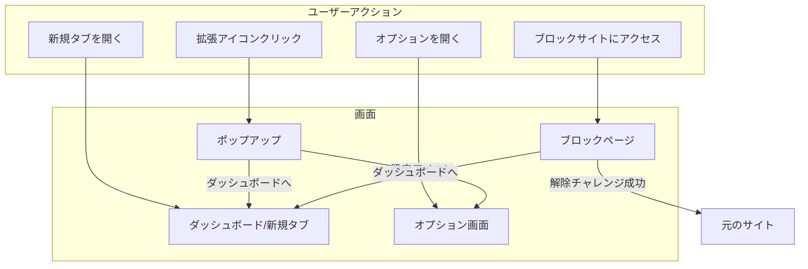

# 画面設計

## 1. 画面一覧

| 画面名         | コンテキスト | パス               | 説明                                |
| -------------- | ------------ | ------------------ | ----------------------------------- |
| ポップアップ   | popup        | popup/index.html   | 拡張アイコンクリック時に表示        |
| ダッシュボード | newtab       | newtab/index.html  | 新規タブ / ブロックページとして表示 |
| オプション     | options      | options/index.html | 詳細設定画面                        |
| ブロックページ | blocked      | blocked/index.html | ブロック時に表示（目標リマインド）  |

## 2. 画面遷移図


```mermaid
flowchart TB
    subgraph ユーザーアクション
        A[拡張アイコンクリック]
        B[新規タブを開く]
        C[ブロックサイトにアクセス]
        D[オプションを開く]
    end

    subgraph 画面
        P[ポップアップ]
        N[ダッシュボード/新規タブ]
        BL[ブロックページ]
        O[オプション画面]
    end

    A --> P
    B --> N
    C --> BL
    D --> O

    P -->|設定アイコン| O
    P -->|ダッシュボードへ| N
    BL -->|解除チャレンジ成功| 元のサイト
    BL -->|ダッシュボードへ| N
```

## 3. 各画面詳細

---

### ポップアップ（popup）

拡張アイコンをクリックした時に表示される小窓。クイックアクセス用。

#### サイズ

- 幅: 360px（固定）
- 高さ: 480px（最大）

#### レイアウト

```
┌─────────────────────────────────┐
│  [Logo] VisionFocus    [⚙️]    │  ← ヘッダー
├─────────────────────────────────┤
│                                 │
│  ┌───────────────────────────┐  │
│  │     今日の目標           │  │  ← 目標カード（タップでNewtab）
│  │  「ライバルを超える」    │  │
│  └───────────────────────────┘  │
│                                 │
│  ── 今日のサマリー ──────────  │
│                                 │
│  ブロック: 12   最もブロック: x │
│  浪費時間: 1h 23m  解除: 1      │
│                                 │
├─────────────────────────────────┤
│  ┌─────────────────────────┐    │
│  │ 🔒 ロックダウンモード   │    │  ← ワンタップ有効化
│  └─────────────────────────┘    │
│                                 │
│  [クイックブロック追加]         │  ← 現在のサイトを追加
│                                 │
└─────────────────────────────────┘
```

#### 要素一覧

| 要素               | 種類           | 説明                                                                                                                                                                                         |
| ------------------ | -------------- | -------------------------------------------------------------------------------------------------------------------------------------------------------------------------------------------- |
| ヘッダー           | コンポーネント | ロゴ + 設定アイコン                                                                                                                                                                          |
| 目標カード         | コンポーネント | 目標テキスト表示、クリックでNewtab                                                                                                                                                           |
| 今日のサマリー     | セクション     | 今日のブロック数・最もブロックしたサイトとその回数・浪費時間・解除数。`activity` から `todaySummary` で導出する（母集団は追跡中のサイト、期間は今日。今日のブロックが 0 件なら「まだなし」） |
| ロックダウンボタン | ボタン         | 即時ロックダウンモード有効化                                                                                                                                                                 |
| クイックブロック   | ボタン         | 現在のサイトをブロックリストに追加                                                                                                                                                           |

#### 挙動

- 設定アイコン → オプション画面を新規タブで開く
- 目標カードクリック → ダッシュボード（新規タブ）を開く
- ロックダウンボタン → 確認モーダル後に有効化
- クイックブロック → 現在のタブのドメインを追加

---

### ダッシュボード / 新規タブ（newtab）

新規タブを開いた時に表示。目標を常に意識させるビジョンボード。

#### サイズ

- フルスクリーン（ブラウザウィンドウサイズ）

#### レイアウト

```
┌──────────────────────────────────────────────────────────────────┐
│                                                                  │
│                    [背景画像（フルスクリーン）]                  │
│                                                                  │
│    ┌────────────────────────────────────────────────────────┐    │
│    │                                                        │    │
│    │                                                        │    │
│    │              「ライバルを追い抜き、                     │    │
│    │                圧倒的な成果を出す」                     │    │  ← 目標テキスト
│    │                                                        │    │
│    │                                                        │    │
│    └────────────────────────────────────────────────────────┘    │
│                                                                  │
│         ┌──────────────┐  ┌──────────────┐                     │
│         │今日のブロック│  │ ブロック日数 │                     │  ← ミニ統計
│         │     12       │  │    7 日      │                     │
│         └──────────────┘  └──────────────┘                     │
│                                                                  │
│                                    [詳細分析] [設定]  [⚙️]       │  ← フッター
└──────────────────────────────────────────────────────────────────┘
```

#### 要素一覧

| 要素                   | 種類           | 説明                                                                                                                                                                                          |
| ---------------------- | -------------- | --------------------------------------------------------------------------------------------------------------------------------------------------------------------------------------------- |
| 背景画像               | 画像           | デフォルト or ユーザー設定                                                                                                                                                                    |
| 目標テキスト           | テキスト       | ユーザーが設定した目標                                                                                                                                                                        |
| ブロック情報           | バナー         | ブロックされて来たときだけ出す。サイトのブロック回数と浪費時間は `activity` から `siteTotals` で導出する（期間は保持期間全体。ホスト名は追跡中のサイトに引き直す）。浪費時間は 0 なら出さない |
| ミニ統計カード         | コンポーネント | 今日のブロック数（`todaySummary`。ポップアップと同じ導出）、ブロック日数                                                                                                                      |
| ブロック中のサイト一覧 | コンポーネント | 有効なブロック項目と、各サイトのブロック回数（`siteTotals`。期間は保持期間全体）                                                                                                              |
| 詳細分析リンク         | リンク         | オプション画面の分析タブへ                                                                                                                                                                    |
| 設定アイコン           | アイコン       | オプション画面へ                                                                                                                                                                              |

#### 挙動

- 背景画像はオプションで変更可能（アップロードも可能）
- 目標テキストは編集アイコンクリックで編集モードへ（スタイル選択中は編集不可）
- 統計カードクリックでオプション画面の詳細分析へ
- スタイルは以下の優先順位で適用:
  1. アクティブなスケジュールのスタイル
  2. ユーザー選択中のスタイル（activePresetId）
  3. デフォルト設定
- スタイルが 1 件も無くてもこの画面を表示する（デフォルト設定で描画する）。
  そのときだけスタイル作成を促す案内とボタンを追加で表示する

#### 追加機能（全ユーザー利用可能）

| 機能             | 説明                                         |
| ---------------- | -------------------------------------------- |
| 壁紙ダウンロード | 現在の画面を壁紙として保存（複数解像度対応） |
| カスタム背景     | アップロードした画像を背景として使用         |
| フォント選択     | 20種類以上のGoogleフォントから選択可能       |

---

### ブロックページ（blocked）

ブロックリストのサイトにアクセスした時に表示されるページ。

#### サイズ

- フルスクリーン（ブラウザウィンドウサイズ）

#### レイアウト

```
┌──────────────────────────────────────────────────────────────────┐
│                                                                  │
│                    [背景画像（ダッシュボードと同じ）]            │
│                                                                  │
│                         ⚠️ BLOCKED                               │
│                                                                  │
│    ┌────────────────────────────────────────────────────────┐    │
│    │                                                        │    │
│    │              「ライバルを追い抜き、                     │    │
│    │                圧倒的な成果を出す」                     │    │  ← 目標リマインド
│    │                                                        │    │
│    │              今、これをしていて良いのか？              │    │
│    │                                                        │    │
│    └────────────────────────────────────────────────────────┘    │
│                                                                  │
│                  [ダッシュボードへ]  [解除チャレンジ]            │
│                                                                  │
│                     twitter.com をブロック中                     │
│                                                                  │
└──────────────────────────────────────────────────────────────────┘
```

#### 要素一覧

| 要素                 | 種類     | 説明                         |
| -------------------- | -------- | ---------------------------- |
| BLOCKEDアイコン      | アイコン | ブロック状態を示す           |
| 目標リマインド       | テキスト | ユーザーの目標 + 問いかけ    |
| ダッシュボードボタン | ボタン   | ダッシュボードへ遷移         |
| 解除チャレンジボタン | ボタン   | チャレンジモーダルを表示     |
| ブロック中ドメイン   | テキスト | 現在ブロックしているドメイン |

#### 解除チャレンジモーダル

```
┌─────────────────────────────────────┐
│   🎯 解除チャレンジ                │
├─────────────────────────────────────┤
│                                     │
│   以下のテキストを入力してください  │
│                                     │
│   "I choose to focus on my goals"   │
│                                     │
│   ┌───────────────────────────┐     │
│   │                           │     │
│   └───────────────────────────┘     │
│                                     │
│   [キャンセル]     [解除する]       │
│                                     │
└─────────────────────────────────────┘
```

#### 挙動

- 解除チャレンジ成功 → 一定時間（5分）のみアクセス許可
- ハードモード → 解除チャレンジ自体を無効化可能
- ロックダウンモード中 → 解除不可

---

### オプション画面（options）

詳細設定と分析を行う画面。タブ形式で複数のセクションを管理。

#### サイズ

- 最大幅: 1200px（中央寄せ）
- 高さ: フルスクリーン

#### タブ構成

1. ブロックリスト
2. スタイル設定
3. スケジュール
4. 分析
5. 設定
6. ヘルプ

URL ハッシュ（`#blocklist` / `#styles` / `#schedules` / `#analytics` / `#settings` / `#help`）で開くタブを指定できる。値を変える項目は設定タブに集め、ヘルプタブには読むものだけを置く。

#### レイアウト（ブロックリストタブ）

```
┌──────────────────────────────────────────────────────────────────┐
│  [Logo] ダッシュボード                                           │
├──────────────────────────────────────────────────────────────────┤
│  [ブロックリスト] [スタイル] [スケジュール] [分析] [設定] [ヘルプ]   │
├──────────────────────────────────────────────────────────────────┤
│                                                                  │
│  ブロックリスト                              [+ サイトを追加]    │
│                                                                  │
│  ┌────────────────────────────────────────────────────────────┐  │
│  │ twitter.com                      [編集] [削除]             │  │
│  ├────────────────────────────────────────────────────────────┤  │
│  │ *.youtube.com                    [編集] [削除]             │  │
│  ├────────────────────────────────────────────────────────────┤  │
│  │ reddit.com                       [編集] [削除]             │  │
│  └────────────────────────────────────────────────────────────┘  │
│                                                                  │
│  ブロックサイト数: 無制限                                        │
│  [分析履歴は全期間を表示]                                        │
│                                                                  │
└──────────────────────────────────────────────────────────────────┘
```

#### レイアウト（分析タブ）

```
┌──────────────────────────────────────────────────────────────────┐
│  [Logo] ダッシュボード                                           │
├──────────────────────────────────────────────────────────────────┤
│  [ブロックリスト] [スタイル] [スケジュール] [分析] [設定] [ヘルプ]   │
├──────────────────────────────────────────────────────────────────┤
│  サイト追跡                           [エクスポート ▾] [↻]       │
│                                                                  │
│  利用時間の推移          [Xでシェア] [画像を保存] [リセット]     │
│  追跡サイト全体の合計利用時間  3h 20m（3サイトの合計）           │
│  [日別] [サイト別] [累積]                                        │
│  ┌─────────────────────────────────────────────────────────┐     │
│  │              [グラフ: 直近 14 日]                       │     │
│  └─────────────────────────────────────────────────────────┘     │
│                                                                  │
│  よくブロックしたサイト                                          │
│  1. twitter.com   [🛡 42回] [🔓 3]                               │
│  2. youtube.com   [🛡 18回]                                      │
│                                                                  │
│  追跡サイトを追加  [example.com        ] [追加]                  │
│                                                                  │
│  追跡中のサイト (3)                                              │
│  ● reddit.com  ブロック中  ブロック開始: 3日前                   │
│  ● twitter.com 解除  解除: 昨日  ⏱ 1h 1m  [再ブロック] [停止]    │
│                                                                  │
│  レポート  [週次] [月次]                                         │
│  ◀ Jun 10 - 16 ▶   合計・日別グラフ・浪費サイトトップ・よくブロック │
└──────────────────────────────────────────────────────────────────┘
```

#### タブ別要素

**1. スタイル設定タブ**

| 要素             | 説明                               |
| ---------------- | ---------------------------------- |
| スタイル一覧     | スタイルの選択・適用・削除         |
| スタイル作成     | 現在の設定を新規スタイルとして保存 |
| 目標テキスト入力 | 目標を設定                         |
| サブテキスト入力 | 補足メッセージ                     |
| テキスト色選択   | 表示テキストの色                   |
| 背景タイプ選択   | 画像 / 単色                        |
| 背景画像選択     | デフォルト12種類 / アップロード    |
| 背景色選択       | 単色背景の色                       |
| フォント設定     | ファミリー・サイズ・ウェイト       |
| プレビュー       | 現在の設定をリアルタイムプレビュー |

※ スタイルは最大10件まで（UI の都合による上限）

**2. ブロックリスト**

| 要素               | 説明                    |
| ------------------ | ----------------------- |
| サイト一覧         | 追加・編集・削除        |
| ワイルドカード説明 | \*.example.com の使い方 |
| 上限表示           | スタイル数の上限表示    |

**3. スケジュール**

| 要素             | 説明                                       |
| ---------------- | ------------------------------------------ |
| 週間カレンダー   | スケジュールをタイムライン形式で視覚化     |
| スケジュール一覧 | 既存スケジュールの表示・編集・削除         |
| スケジュール名   | 識別用の名前                               |
| 時間帯設定       | 開始・終了時刻                             |
| 曜日選択         | 適用する曜日（複数選択可）                 |
| スタイル連携     | このスケジュール中に適用するスタイルを選択 |
| 有効/無効切替    | スケジュールのオン/オフ                    |

**週間カレンダー（WeeklyCalendar）**

```
┌──────────────────────────────────────────────────────────────────┐
│  📅 週間カレンダー                                               │
│  ┌─────┬─────────────────────────────────────────────────────┐   │
│  │     │  日  │  月  │  火  │  水  │  木  │  金  │  土  │      │
│  ├─────┼─────────────────────────────────────────────────────┤   │
│  │06:00│      │      │      │      │      │      │      │      │
│  │09:00│      │■■■■■│■■■■■│■■■■■│■■■■■│■■■■■│      │      │
│  │     │      │仕事  │仕事  │仕事  │仕事  │仕事  │      │      │
│  │12:00│      │■■■■■│■■■■■│■■■■■│■■■■■│■■■■■│      │      │
│  │18:00│      │      │      │      │      │      │      │      │
│  │21:00│■■■■■│■■■■■│■■■■■│■■■■■│■■■■■│■■■■■│■■■■■│      │
│  │     │集中  │集中  │集中  │集中  │集中  │集中  │集中  │      │
│  │24:00│      │      │      │      │      │      │      │      │
│  └─────┴─────────────────────────────────────────────────────┘   │
│                                                                  │
│  凡例: ■ 仕事モード  ■ 集中タイム                               │
└──────────────────────────────────────────────────────────────────┘
```

| 機能                 | 説明                                           |
| -------------------- | ---------------------------------------------- |
| タイムライン表示     | 縦軸=時間（0〜24時）、横軸=曜日（日〜土）      |
| スケジュールブロック | 色付きブロックで時間帯を表示                   |
| スタイル名表示       | ブロック内にスタイル名を表示                   |
| 無効表示             | 無効なスケジュールは半透明・取り消し線で表示   |
| クリック操作         | ブロッククリックで編集モーダルを開く           |
| 凡例                 | カレンダー下部にスケジュール名と色の対応を表示 |

※ Freeダウングレード時: ロックされたスタイルはスケジュールで適用されない

**4. 分析**

分析タブの数値はすべて事実の表（`activity`）から導出し、母集団は追跡中のサイトに限る（導出は `src/lib/activityStats.ts`、事実の表の形は [DATA_MODEL.md](./DATA_MODEL.md) の ActivityLog）。「浪費時間」は追跡中のサイトが表示されていた時間。日付は端末のローカル日付で区切る。

| 要素                   | 説明                                                                                                                   | 期間                                 |
| ---------------------- | ---------------------------------------------------------------------------------------------------------------------- | ------------------------------------ |
| 利用時間の推移         | 日別・サイト別（上位 8 件）・累積の 3 系列と、見出しの合計・サイト数                                                   | 直近 14 日（3 系列と合計で同じ期間） |
| よくブロックしたサイト | ブロック回数の多い順（上位 10 件）。解除回数が 1 以上ならバッジを添える                                                | 保持期間全体                         |
| 追跡サイトを追加       | 追跡中のサイトにドメインを足す                                                                                         | -                                    |
| 追跡中のサイト         | 追跡中のサイトごとにブロック中 / 解除済み、ブロック開始日、最後に解除した日、解除後の時間。解除済みが 2 件以上なら合計 | 最後に解除した日から今日まで         |
| 週次/月次レポート      | タブで切り替え、選んだ方を全幅で表示。合計・日別（週別）・前期比・傾向・浪費サイトトップ・よくブロックしたサイト       | その週（月曜〜日曜）・その月         |
| X シェア               | ブロック回数の合計・浪費時間の合計・いちばんブロックされたサイトを文面に入れる                                         | 保持期間全体                         |
| CSVエクスポート        | 下表                                                                                                                   | 下表                                 |

- 週次・月次レポートの合計・日別・トップは同じ期間・同じ母集団から出す（トップはその週・その月の中で順位を付ける）

**CSVエクスポート機能**

| 項目                       | 列                                                                                                 | 期間                         |
| -------------------------- | -------------------------------------------------------------------------------------------------- | ---------------------------- |
| ブロックリスト             | Domain / Wildcard / Added Date                                                                     | -                            |
| サイト別ブロック回数       | Domain / Block Count / Last Blocked                                                                | 保持期間全体                 |
| 日別統計データ             | Date / Waste Time / Block Count（何も無い日は出さない）                                            | 保持期間全体                 |
| ブロック解除サイト滞在時間 | Domain / Unblocked Date / Time Since Unblock / Last Activity（解除したことが無いサイトは出さない） | 最後に解除した日から今日まで |

**5. 設定**

| 要素                 | 説明                                                                                                                                    |
| -------------------- | --------------------------------------------------------------------------------------------------------------------------------------- |
| ブロック解除の保護   | ブロック解除の長押し確認の秒数（5 / 10 / 30 / 60 秒）とパスワード保護。パスワード保護中は秒数を選べない                                 |
| 通知設定             | 時間制限つきサイト（YouTube の時間制限を含む）の残り時間通知の有効/無効と、何分前に通知するか。時間制限つきサイトの有無によらず常に表示 |
| データとプライバシー | 匿名の使用統計の共有（Analytics Opt-In）の切り替え                                                                                      |
| 設定のバックアップ   | 設定のエクスポート（JSON ファイル）とインポート                                                                                         |

**6. ヘルプ**

| 要素                   | 説明                             |
| ---------------------- | -------------------------------- |
| はじめに               | 基本的な使い方の説明             |
| よくある質問           | FAQ形式でよくある質問と回答      |
| トラブルシューティング | うまく動かないときの確認事項     |
| 開発を支援             | 支援リンク                       |
| サポート               | フィードバック・問い合わせ先情報 |
| バージョン表示         | 拡張機能の版数                   |

---

## 4. モーダル一覧

### 新規スタイル作成モーダル（NewPresetModal）

```
┌─────────────────────────────────────┐
│   新規スタイル作成                 │
├─────────────────────────────────────┤
│                                     │
│   スタイル名                        │
│   ┌───────────────────────────┐     │
│   │ 仕事モード                │     │
│   └───────────────────────────┘     │
│                                     │
│   [キャンセル]     [作成]           │
│                                     │
└─────────────────────────────────────┘
```

### スタイル削除確認モーダル（DeletePresetModal）

参照しているスケジュールが 1 件以上あるときだけ開く。

```
┌─────────────────────────────────────┐
│   このスタイルを削除しますか？     │
├─────────────────────────────────────┤
│                                     │
│   ⚠ このスタイルは N 件のスケジュー │
│     ルで使用されています。削除する  │
│     とスケジュールのスタイル連携が  │
│     解除されます。                  │
│     スケジュール自体は残り、有効・  │
│     無効の状態も変わりません。      │
│                                     │
│   [キャンセル]     [削除]           │
│                                     │
└─────────────────────────────────────┘
```

### スケジュール編集モーダル（ScheduleModal）

```
┌─────────────────────────────────────┐
│   スケジュール編集                 │
├─────────────────────────────────────┤
│                                     │
│   スケジュール名                    │
│   ┌───────────────────────────┐     │
│   │ 平日集中タイム            │     │
│   └───────────────────────────┘     │
│                                     │
│   開始時刻        終了時刻          │
│   [09:00]         [18:00]           │
│                                     │
│   適用曜日                          │
│   [日] [月●] [火●] [水●] [木●] [金●] [土] │
│                                     │
│   スタイル連携                      │
│   ┌───────────────────────────┐     │
│   │ 仕事モード            ▼  │     │
│   └───────────────────────────┘     │
│   ⚠️ 選択中のスタイルは            │
│      Freeプランでは適用されません   │
│                                     │
│   [キャンセル]     [保存]           │
│                                     │
└─────────────────────────────────────┘
```

※ ロックされたスタイル（🔒）はドロップダウンで disabled 表示
