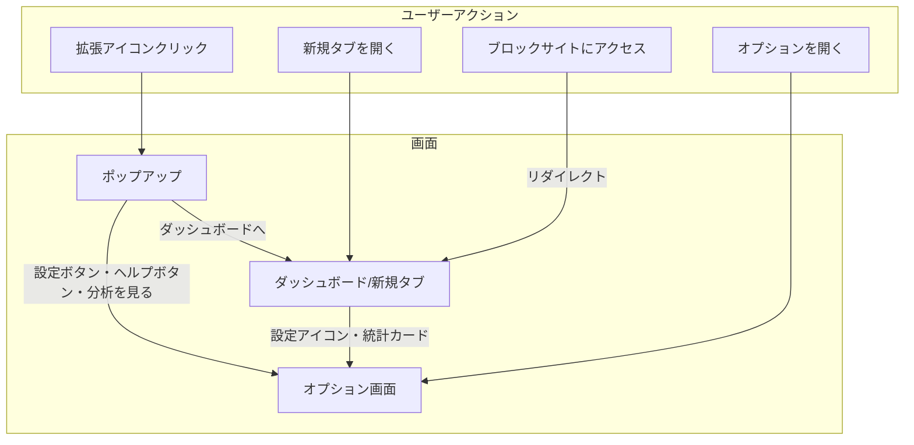

# 画面設計

## 1. 画面一覧

| 画面名         | コンテキスト | パス               | 説明                                                     |
| -------------- | ------------ | ------------------ | -------------------------------------------------------- |
| ポップアップ   | popup        | popup/index.html   | 拡張アイコンクリック時に表示                             |
| ダッシュボード | newtab       | newtab/index.html  | 新規タブ。ブロックしたときのリダイレクト先も兼ねる       |
| オプション     | options      | options/index.html | 詳細設定画面。ブロックの解除（無効化・削除）もここで行う |

ブロック専用の画面は無い。ブロックの画面と解除の流れは下記「[ブロックしたときの画面と解除の流れ](#ブロックしたときの画面と解除の流れ)」。

## 2. 画面遷移図


```mermaid
flowchart TB
    subgraph ユーザーアクション
        A[拡張アイコンクリック]
        B[新規タブを開く]
        C[ブロックサイトにアクセス]
        D[オプションを開く]
    end

    subgraph 画面
        P[ポップアップ]
        N[ダッシュボード/新規タブ]
        O[オプション画面]
    end

    A --> P
    B --> N
    C -->|リダイレクト| N
    D --> O

    P -->|設定ボタン・ヘルプボタン・分析を見る| O
    P -->|ダッシュボードへ| N
    N -->|設定アイコン・統計カード| O
```

## 3. 各画面詳細

---

### ポップアップ（popup）

拡張アイコンをクリックした時に表示される小窓。クイックアクセス用。

#### サイズ

- 幅: 480px（固定）
- 高さ: 最小 500px・最大 600px（最大を超える分は縦にスクロール）
- 定義: `src/styles/globals.css` の `.popup-container`

#### レイアウト

```
┌─────────────────────────────────────┐
│ [Logo] VisionFocus  有効 [ON] [⚙][?] │  ← ヘッダー
│        v1.0.0                       │
├─────────────────────────────────────┤
│ ┌─────────────────────────────────┐ │
│ │ ⏱ example.com  残り時間         │ │  ← 時間制限情報（時間制限つきサイトのときだけ）
│ └─────────────────────────────────┘ │
│                                     │
│ サイトをブロック                    │  ← クイックブロック
│ [example.com          ] [ブロック]  │
│                                     │
│ ┌─────────────────────────────────┐ │
│ │ 🎯 只今の目標                   │ │  ← 目標カード（クリックでダッシュボード）
│ │    「ライバルを超える」         │ │
│ └─────────────────────────────────┘ │
│                                     │
│ 今日のサマリー                      │
│ ┌───────────────┐ ┌───────────────┐ │
│ │ 今日のブロック│ │ 最もブロック  │ │
│ │ 12            │ │ x.com  5回    │ │
│ └───────────────┘ └───────────────┘ │
│ ┌───────────────┐ ┌───────────────┐ │
│ │ 浪費時間      │ │ ブロック解除  │ │
│ │ 1h 23m        │ │ 1             │ │
│ └───────────────┘ └───────────────┘ │
│           [↗ 分析を見る]            │
└─────────────────────────────────────┘
```

#### 要素一覧

| 要素                     | 種類           | 説明                                                                                                                                                                                          |
| ------------------------ | -------------- | --------------------------------------------------------------------------------------------------------------------------------------------------------------------------------------------- |
| ヘッダー                 | コンポーネント | ロゴ・バージョン、すべてのブロックの一時停止のトグル（ON が有効）、設定ボタン、ヘルプボタン                                                                                                   |
| 時間制限情報             | セクション     | 開いているタブのドメインに時間制限があるときだけ、ドメインと残り時間を表示する                                                                                                                |
| クイックブロック         | コンポーネント | 見出し・ドメインの入力欄・ブロックボタン。入力欄には開いているタブのドメインが入る                                                                                                            |
| 目標カード               | コンポーネント | 目標テキスト表示（未設定なら設定を促す案内）、クリックでダッシュボード                                                                                                                        |
| 今日のサマリー           | セクション     | 今日のブロック数・最もブロックしたサイトとその回数・浪費時間・解除数。`activity` から `todaySummary` で導出する（母集団は許可サイトを除く、期間は今日。今日のブロックが無ければ「まだなし」） |
| 分析を見るボタン         | ボタン         | オプション画面の分析タブを開く                                                                                                                                                                |
| 利用統計の確認ダイアログ | モーダル       | 利用統計を共有するかを尋ねる。出す条件は [COMPONENT.md の AnalyticsOptInModal](./COMPONENT.md#analyticsoptinmodal)                                                                            |
| パスワードダイアログ     | モーダル       | 一時停止の前にパスワードを求める。出す条件は下記「[解除の流れ](#解除の流れ)」の一時停止の行                                                                                                   |

#### 挙動

- 設定ボタン → オプション画面を新規タブで開く
- ヘルプボタン → オプション画面のヘルプタブを新規タブで開く
- 一時停止のトグル → 確認は下記「[解除の流れ](#解除の流れ)」
- クイックブロック → 入力欄のドメインをブロックリストに追加する（ブロックボタンか Enter）
- 目標カードクリック → ダッシュボード（新規タブ）を開く
- 分析を見るボタン → オプション画面の分析タブを新規タブで開く

---

### ダッシュボード / 新規タブ（newtab）

新規タブを開いた時に表示。目標を常に意識させるビジョンボード。

#### サイズ

- フルスクリーン（ブラウザウィンドウサイズ）

#### レイアウト

```
┌──────────────────────────────────────────────────────────────────┐
│                                                                  │
│                    [背景画像（フルスクリーン）]                  │
│                                                                  │
│    ┌────────────────────────────────────────────────────────┐    │
│    │                                                        │    │
│    │                                                        │    │
│    │              「ライバルを追い抜き、                     │    │
│    │                圧倒的な成果を出す」                     │    │  ← 目標テキスト
│    │                                                        │    │
│    │                                                        │    │
│    └────────────────────────────────────────────────────────┘    │
│                                                                  │
│         ┌──────────────┐  ┌──────────────┐                     │
│         │今日のブロック│  │ ブロック日数 │                     │  ← ミニ統計
│         │     12       │  │    7 日      │                     │
│         └──────────────┘  └──────────────┘                     │
│                                                                  │
│                                    [詳細分析] [設定]  [⚙️]       │  ← フッター
└──────────────────────────────────────────────────────────────────┘
```

#### 要素一覧

| 要素                   | 種類           | 説明                                                                                                                                                                                                                             |
| ---------------------- | -------------- | -------------------------------------------------------------------------------------------------------------------------------------------------------------------------------------------------------------------------------- |
| 背景画像               | 画像           | デフォルト or ユーザー設定                                                                                                                                                                                                       |
| 目標テキスト           | テキスト       | ユーザーが設定した目標                                                                                                                                                                                                           |
| ブロック情報           | バナー         | 出す条件と文言は下記「[ダッシュボードの帯](#ダッシュボードの帯)」。サイトのブロック回数と浪費時間は `activity` から `siteTotals` で導出する（期間は保持期間全体。ホスト名は追跡中のサイトに引き直す）。浪費時間は 0 なら出さない |
| ミニ統計カード         | コンポーネント | 今日のブロック数（`todaySummary`。ポップアップと同じ導出）、ブロック日数（ブロックされたサイトの `block.addedAt` から）                                                                                                          |
| ブロック中のサイト一覧 | コンポーネント | 追跡中のサイトのうち有効なブロック設定を持つもの（youtube.com は含めない）と、各サイトのブロック回数（`siteTotals`。期間は保持期間全体）                                                                                         |
| 詳細分析リンク         | リンク         | オプション画面の分析タブへ                                                                                                                                                                                                       |
| 設定アイコン           | アイコン       | オプション画面へ                                                                                                                                                                                                                 |

#### 挙動

- 背景画像はオプションで変更可能（アップロードも可能）
- 目標テキストは編集アイコンクリックで編集モードへ（スタイル選択中は編集不可）
- 統計カードクリックでオプション画面の詳細分析へ
- スタイルは以下の優先順位で適用:
  1. アクティブなスケジュールのスタイル
  2. ユーザー選択中のスタイル（activePresetId）
  3. デフォルト設定
- スタイルが 1 件も無くてもこの画面を表示する（デフォルト設定で描画する）。
  そのときだけスタイル作成を促す案内とボタンを追加で表示する

#### 追加機能（全ユーザー利用可能）

| 機能             | 説明                                         |
| ---------------- | -------------------------------------------- |
| 壁紙ダウンロード | 現在の画面を壁紙として保存（複数解像度対応） |
| カスタム背景     | アップロードした画像を背景として使用         |
| フォント選択     | 20種類以上のGoogleフォントから選択可能       |

---

### ブロックしたときの画面と解除の流れ

ブロックしたページはダッシュボード（`newtab.html`）へリダイレクトし、ダッシュボードの「ブロック情報」の帯でブロックしたことを知らせる。
リダイレクトの経路と記録は [BLOCK_STATE_MACHINE.md の「ブロックの記録とブロック画面」](./BLOCK_STATE_MACHINE.md#ブロックの記録とブロック画面) を正とする。

#### ダッシュボードの帯

- 帯を出すのは、ブロックが記録した「最後にブロックしたドメインと理由」が残っているときだけ。読んだら消すので、再読み込みや次に開いた新規タブには出ない
- 記録の理由が `time_limit_exceeded` なら「時間制限に達しました」と「（ドメイン） の許可された時間を使い切りました」を、`always_blocked` なら「（ドメイン） はブロックリストに登録されています」とそのサイトのブロック回数・浪費時間を出す（数値の導出は上記「要素一覧」の「ブロック情報」）
- 理由はドメインと同じ記録から読み、URL では受け渡さない。リダイレクトの 2 経路（新しい遷移を止めるリダイレクトと、開いているタブの差し替え）のどちらでも同じ文言になる
- 帯には、記録されたホスト名を正規化したキーが、覆うブロックの登録の真のサブドメインのときだけ「（ホスト名） は許可する」ボタンを出す（`allowCandidate`。理由が常時ブロックでも時間制限でも出す。`www.youtube.com` のように正規化するとブロックの登録そのものになるホストには出さない）。押すと確認なしで（パスワード保護中も同じ）そのホストを許可サイトにし（「時間を記録する」は OFF で始まる）、「（ホスト名） を許可しました」と `https://（ホスト名）/` を開く「開く」リンクに替わる。拒まれたら理由の文言をボタンの下に出す
- ブロックの登録そのものを解除する操作はダッシュボードに置かない。解除は次の画面で行う

#### 解除の流れ

| 操作                                    | 画面                                               | 確認                                                                             | ブロックへの戻し方                                                                       |
| --------------------------------------- | -------------------------------------------------- | -------------------------------------------------------------------------------- | ---------------------------------------------------------------------------------------- |
| サイトのブロックの無効化                | オプション画面のブロックリストタブ                 | パスワード保護中はパスワード入力、それ以外は長押し確認                           | ブロックリストのトグルを ON にするか、分析タブの再ブロック                               |
| サイトのブロックの削除                  | オプション画面のブロックリストタブ                 | 同上                                                                             | ブロックリストに追加し直すか、分析タブの再ブロック                                       |
| 「YouTubeへのアクセスをブロック」の OFF | オプション画面のブロックリストタブ（YouTube の節） | 同上                                                                             | 同じトグルを ON にする                                                                   |
| 「YouTubeブロックを有効にする」の OFF   | オプション画面のブロックリストタブ（YouTube の節） | 同上                                                                             | 同じトグルを ON にしたうえで「YouTubeへのアクセスをブロック」も ON にする                |
| すべてのブロックの一時停止              | ポップアップのヘッダーのトグル                     | パスワード保護中だけパスワード入力（長押し確認は無い）                           | ポップアップのヘッダーのトグルを ON にするか、スケジュールタブでスケジュールを有効にする |
| 設定のインポート                        | オプション画面の設定タブ（設定のバックアップ）     | 上書きの確認。パスワード保護中は同じ確認の中でパスワード入力（長押し確認は無い） | 以前に書き出したファイルをインポートし直す                                               |

- 長押しの秒数とパスワード保護は設定タブの「ブロック解除の保護」で決める（下記「5. 設定」）
- パスワードの照合は画面ではなく background が行う。パスワード入力で確定すると、画面は入力を添えて操作を送り、background が照合してから書く。違えば何も変えず、ダイアログに「パスワードが正しくありません」を出して閉じない。保護中に上表の操作（一時停止・無効化・削除・YouTube のアクセスブロックを外す操作・設定のインポート）をパスワードなしで送っても background が拒む。ブロックへ戻す操作（有効化・一時停止の解除）にはパスワードを求めない
- 確認を振り分ける部品は [COMPONENT.md の useUnblockGuard](./COMPONENT.md#useunblockguard) を参照
- 確認が通るとすぐに解除され、解除に期限は無い（自動ではブロックに戻らない）
- 戻したときに時間制限が残るかどうかは、サイトは下記「[4. 分析](#タブ別要素)」の再ブロック、YouTube は [BLOCK_STATE_MACHINE.md の「YouTube の扱い」](./BLOCK_STATE_MACHINE.md#youtube-の扱い) を参照

---

### オプション画面（options）

詳細設定と分析を行う画面。タブ形式で複数のセクションを管理。

#### サイズ

- 最大幅: 1200px（中央寄せ）
- 高さ: フルスクリーン

#### タブ構成

1. ブロックリスト
2. スタイル設定
3. スケジュール
4. 分析
5. 設定
6. ヘルプ

URL ハッシュ（`#blocklist` / `#styles` / `#schedules` / `#analytics` / `#settings` / `#help`）で開くタブを指定できる。値を変える項目は設定タブに集め、ヘルプタブには読むものだけを置く。

#### レイアウト（ブロックリストタブ）

```
┌──────────────────────────────────────────────────────────────────┐
│  [Logo] ダッシュボード                                           │
├──────────────────────────────────────────────────────────────────┤
│  [ブロックリスト] [スタイル] [スケジュール] [分析] [設定] [ヘルプ]   │
├──────────────────────────────────────────────────────────────────┤
│                                                                  │
│  ブロックリスト                              [+ サイトを追加]    │
│                                                                  │
│  ┌────────────────────────────────────────────────────────────┐  │
│  │ twitter.com                      [編集] [削除]             │  │
│  ├────────────────────────────────────────────────────────────┤  │
│  │ instagram.com                    [編集] [削除]             │  │
│  ├────────────────────────────────────────────────────────────┤  │
│  │ reddit.com  許可サイト 1 件      [編集] [削除]             │  │
│  └────────────────────────────────────────────────────────────┘  │
│                                                                  │
│  YouTube（許可サイト N 件）                                      │
│                                                                  │
│  許可サイト                                                      │
│  ブロックしたドメインの中でも、ここに登録したホストは開けます    │
│  [例: music.youtube.com                  ] [+ 追加]              │
│  ┌────────────────────────────────────────────────────────────┐  │
│  │ old.reddit.com                   (●) 時間を記録する  [×]   │  │
│  │ reddit.com の例外                                          │  │
│  └────────────────────────────────────────────────────────────┘  │
│                                                                  │
│  ブロックサイト数: 無制限                                        │
│  [分析履歴は全期間を表示]                                        │
│                                                                  │
└──────────────────────────────────────────────────────────────────┘
```

#### レイアウト（分析タブ）

```
┌──────────────────────────────────────────────────────────────────┐
│  [Logo] ダッシュボード                                           │
├──────────────────────────────────────────────────────────────────┤
│  [ブロックリスト] [スタイル] [スケジュール] [分析] [設定] [ヘルプ]   │
├──────────────────────────────────────────────────────────────────┤
│  サイト追跡                           [エクスポート ▾] [↻]       │
│                                                                  │
│  利用時間の推移          [Xでシェア] [画像を保存] [リセット]     │
│  浪費時間の合計（直近 14 日）           3h 20m（3サイトの合計）  │
│  [日別] [サイト別] [累積]                                        │
│  ┌─────────────────────────────────────────────────────────┐     │
│  │              [グラフ: 直近 14 日]                       │     │
│  └─────────────────────────────────────────────────────────┘     │
│                                                                  │
│  許可サイトの時間（許可サイトが 1 件以上あるときだけ）           │
│  許可サイトの合計利用時間（直近 14 日） 1h 0m（1サイトの合計）   │
│  [日別] [サイト別] [累積]  [グラフ: 直近 14 日]                  │
│                                                                  │
│  よくブロックしたサイト                                          │
│  1. twitter.com   [🛡 42回] [🔓 3]                               │
│  2. youtube.com   [🛡 18回]                                      │
│                                                                  │
│  追跡サイトを追加  [example.com        ] [追加]                  │
│                                                                  │
│  追跡中のサイト (5)                                              │
│  ● reddit.com  ブロック中  ブロック開始: 3日前                   │
│  ● facebook.com ブロック中（無効）  ⏱ 10m  [再ブロック]          │
│  ● twitter.com 解除  解除: 昨日  ⏱ 1h 1m  [再ブロック] [停止]    │
│  ● music.youtube.com 許可  ⏱ 1h 0m                               │
│  ● studio.youtube.com 許可  記録していません                     │
│                                                                  │
│  レポート  [週次] [月次]                                         │
│  ◀ Jun 10 - 16 ▶   合計・日別グラフ・浪費サイトトップ・よくブロック │
└──────────────────────────────────────────────────────────────────┘
```

#### タブ別要素

**1. スタイル設定タブ**

| 要素             | 説明                               |
| ---------------- | ---------------------------------- |
| スタイル一覧     | スタイルの選択・適用・削除         |
| スタイル作成     | 現在の設定を新規スタイルとして保存 |
| 目標テキスト入力 | 目標を設定                         |
| サブテキスト入力 | 補足メッセージ                     |
| テキスト色選択   | 表示テキストの色                   |
| 背景タイプ選択   | 画像 / 単色                        |
| 背景画像選択     | デフォルト12種類 / アップロード    |
| 背景色選択       | 単色背景の色                       |
| フォント設定     | ファミリー・サイズ・ウェイト       |
| プレビュー       | 現在の設定をリアルタイムプレビュー |

※ スタイルは最大10件まで（理由は [PRD.md](./PRD.md)「機能上限について」）

**2. ブロックリスト**

| 要素               | 説明                       |
| ------------------ | -------------------------- |
| サイト一覧         | 追加・編集・削除           |
| ワイルドカード説明 | \*.example.com の使い方    |
| 許可サイト         | 追加・記録の切り替え・削除 |

- 一覧の行は追跡中のサイト（`sites`）のうちブロックの規則（`rule` の `kind` が `block`）を持つもの。youtube.com は出さない（YouTube の節が担当する）。どのサイトを並べるかは `src/lib/blockList.ts` の `blockListSites` だけが決め、新しいタブの一覧とブロックリスト CSV も同じ関数を通す
- 入力は `*.` と `www.` を除いたサイトキーで登録する（`*.example.com` も `example.com` として登録され、サブドメインも止める）
- 追跡中のサイトの祖先・子孫になるドメイン（例: `youtube.com` があるときの `m.youtube.com`）は追加できず、理由を入力欄の下に出す（入れ子を許すのは子孫が許可サイトのときだけ。許可サイトとして登録済みのドメインも追加できない。決まりの SSOT は [DATA_MODEL.md のサイトキー](./DATA_MODEL.md#サイトキー)）
- タブは「ブロック」節（追加欄・ブロック中のサイト一覧・YouTube の節）と「許可サイト」節の 2 つからなる
- ブロックの行と YouTube の節の補足に、その下にある許可サイトの件数（「許可サイト N 件」）を出す。0 件なら出さない。YouTube の節に例外の欄は置かない
- 「許可サイト」節は説明・入力欄と追加ボタン・一覧を持つ。追加は `add-allowed-site` を送り、「時間を記録する」は OFF で始まる。拒否されたら（ブロック中・追跡中のホスト、許可サイトでない子孫を持つホスト）理由を入力欄の下に出し、入力は残す。上にブロックが無いホストも追加できる
- 許可サイトの行は、ホスト名・補足（覆うブロックがあれば「<ブロック> の例外」、無ければ「かかっているブロックはありません」。親のブロックを無効にしているあいだも同じ）・「時間を記録する」のスイッチ（`set-allowed-site-recording`）・削除（×。`stop-tracking` で登録と記録が消え、そのホストを開いているタブはブロック画面に置き換わる）。並びはドメイン順（`allowedSiteRows`）。追加・切り替え・削除に確認は出さない
- YouTube の節の値は `sites['youtube.com']` から出す（機能の有効 = `youtube` があるかブロックの規則が有効、アクセスブロック = ブロックの規則の `enabled`）。保存を拒まれたとき（youtube.com が許可サイト・新しく作ると許可サイトでない子孫と入れ子になる）は、理由を有効化のトグルの下に出す
  | 上限表示 | スタイル数の上限表示 |

**3. スケジュール**

| 要素             | 説明                                       |
| ---------------- | ------------------------------------------ |
| 週間カレンダー   | スケジュールをタイムライン形式で視覚化     |
| スケジュール一覧 | 既存スケジュールの表示・編集・削除         |
| スケジュール名   | 識別用の名前                               |
| 時間帯設定       | 開始・終了時刻                             |
| 曜日選択         | 適用する曜日（複数選択可）                 |
| スタイル連携     | このスケジュール中に適用するスタイルを選択 |
| 有効/無効切替    | スケジュールのオン/オフ                    |

- 注意書き（「設定された時間帯のみブロックが有効」）は有効なスケジュールが 1 件以上あるときだけ出す。すべて無効ならスケジュール無しと同じく常にブロックするため

**週間カレンダー（WeeklyCalendar）**

```
┌──────────────────────────────────────────────────────────────────┐
│  📅 週間カレンダー                                               │
│  ┌─────┬─────────────────────────────────────────────────────┐   │
│  │     │  日  │  月  │  火  │  水  │  木  │  金  │  土  │      │
│  ├─────┼─────────────────────────────────────────────────────┤   │
│  │06:00│      │      │      │      │      │      │      │      │
│  │09:00│      │■■■■■│■■■■■│■■■■■│■■■■■│■■■■■│      │      │
│  │     │      │仕事  │仕事  │仕事  │仕事  │仕事  │      │      │
│  │12:00│      │■■■■■│■■■■■│■■■■■│■■■■■│■■■■■│      │      │
│  │18:00│      │      │      │      │      │      │      │      │
│  │21:00│■■■■■│■■■■■│■■■■■│■■■■■│■■■■■│■■■■■│■■■■■│      │
│  │     │集中  │集中  │集中  │集中  │集中  │集中  │集中  │      │
│  │24:00│      │      │      │      │      │      │      │      │
│  └─────┴─────────────────────────────────────────────────────┘   │
│                                                                  │
│  凡例: ■ 仕事モード  ■ 集中タイム                               │
└──────────────────────────────────────────────────────────────────┘
```

| 機能                 | 説明                                           |
| -------------------- | ---------------------------------------------- |
| タイムライン表示     | 縦軸=時間（0〜24時）、横軸=曜日（日〜土）      |
| スケジュールブロック | 色付きブロックで時間帯を表示                   |
| スタイル名表示       | ブロック内にスタイル名を表示                   |
| 無効表示             | 無効なスケジュールは半透明・取り消し線で表示   |
| クリック操作         | ブロッククリックで編集モーダルを開く           |
| 凡例                 | カレンダー下部にスケジュール名と色の対応を表示 |

※ Freeダウングレード時: ロックされたスタイルはスケジュールで適用されない

**4. 分析**

分析タブの数値はすべて事実の表（`activity`）から導出し、母集団は追跡中のサイトに限る（導出は `src/lib/activityStats.ts`、事実の表の形は [DATA_MODEL.md](./DATA_MODEL.md) の ActivityLog）。「浪費時間」は追跡中のサイトのうち許可サイトを除いたものが表示されていた時間で、許可サイトの時間は別のグラフに出す（母集団の SSOT は [DATA_MODEL.md の導出する値](./DATA_MODEL.md#導出する値)）。日付は端末のローカル日付で区切る。

| 要素                   | 説明                                                                                                                                                                           | 期間                                                         |
| ---------------------- | ------------------------------------------------------------------------------------------------------------------------------------------------------------------------------ | ------------------------------------------------------------ |
| 利用時間の推移         | 浪費時間の日別・サイト別（上位 8 件）・累積の 3 系列と、見出しの合計・サイト数                                                                                                 | 直近 14 日（3 系列と合計で同じ期間）                         |
| 許可サイトの時間       | 許可サイトが 1 件以上あるときだけ、利用時間の推移の下に別のカードで出す。同じ 3 系列と見出しの合計・サイト数（見出しの文言と色だけが違う）                                     | 直近 14 日（3 系列と合計で同じ期間）                         |
| よくブロックしたサイト | ブロック回数の多い順（上位 10 件）。解除回数が 1 以上ならバッジを添える                                                                                                        | 保持期間全体                                                 |
| 追跡サイトを追加       | 追跡中のサイトにドメインを足す                                                                                                                                                 | -                                                            |
| 追跡中のサイト         | 追跡中のサイトごとに状態（ブロック中 / ブロック中（無効） / 解除済み / 許可）、ブロック開始日、最後に解除した日、解除後の時間。ブロックが効いていないサイトが 2 件以上なら合計 | 最後に解除した日から今日まで（許可サイトの行は保持期間全体） |
| 週次/月次レポート      | タブで切り替え、選んだ方を全幅で表示。合計・日別（週別）・前期比・傾向・浪費サイトトップ・よくブロックしたサイト・許可サイトの時間                                             | その週（月曜〜日曜）・その月                                 |
| X シェア               | ブロック回数の合計・浪費時間の合計・いちばんブロックされたサイトを文面に入れる                                                                                                 | 保持期間全体                                                 |
| CSVエクスポート        | 下表                                                                                                                                                                           | 下表                                                         |

- 週次・月次レポートの合計・日別・トップは同じ期間・同じ母集団（浪費時間の母集団）から出す（トップはその週・その月の中で順位を付ける）
- 週次・月次レポートの許可サイトの時間は、集計値の下の補助の 1 行「許可サイトの時間: <時間>」にだけ出し（0 秒なら出さない）、合計・前期比・傾向・トップには入れない。浪費が無く許可サイトの時間だけがある過去の期間は「データなし」にする
- 追跡中のサイトの状態は、許可サイトなら「許可」、規則が無ければ「解除済み」（追跡だけ）、ブロックの規則の `enabled` で「ブロック中」と「ブロック中（無効）」（トグルで無効にしたもの）に分ける。並びはブロック中 → 無効 → 解除済み → 許可。ブロック開始日はブロックの規則の `addedAt` から出す
- 許可サイトの行は「許可」の印と時間（保持期間全体）だけを出し、操作（再ブロック・追跡の停止）は出さない（許可サイトの削除はブロックリストタブの「許可サイト」節が担う）。「時間を記録する」が OFF の行は、時間の代わりに「記録していません」を出す。一覧の合計には入れない
- 解除日・解除後の時間・再ブロックは、ブロックが効いていないサイト（無効・解除済み）にだけ出す。追跡の停止はブロックの規則が無く（解除済み）YouTube 機能も持たないサイトにだけ出す（ブロック設定を消すのはブロックリストタブの確認つきの経路だけにし、YouTube の非表示の設定も画面の操作なしに消さないため）
- 再ブロックは、解除済みならブロックリストに入れ（`add-block`。ブロック設定を新しく作るので時間制限は無く、常時ブロックになる。ブロックリストタブで削除してから追加し直したときも同じ）、無効ならトグルを ON に戻す（`toggle-block`。時間制限は保ったまま）。追跡の停止は `stop-tracking` を依頼し、サイトと、その `activity` の行を消す
- 追跡サイトの追加は `add-tracked-site` で依頼する。形式の誤り・重複・入れ子（許可サイトでない追跡中のサイトの祖先・子孫）で拒否されたときは、ハンドラが返す理由を入力欄の下に出し、入力は残す

**CSVエクスポート機能**

| 項目                       | 列                                                                                                 | 期間                         |
| -------------------------- | -------------------------------------------------------------------------------------------------- | ---------------------------- |
| ブロックリスト             | Domain / Added Date（youtube.com は含めない）                                                      | -                            |
| サイト別ブロック回数       | Domain / Block Count / Last Blocked                                                                | 保持期間全体                 |
| 日別統計データ             | Date / Waste Time / Block Count（何も無い日は出さない）                                            | 保持期間全体                 |
| ブロック解除サイト滞在時間 | Domain / Unblocked Date / Time Since Unblock / Last Activity（解除したことが無いサイトは出さない） | 最後に解除した日から今日まで |

**5. 設定**

| 要素                 | 説明                                                                                                                                                                                                                                                                                                                                                                                                                                                                      |
| -------------------- | ------------------------------------------------------------------------------------------------------------------------------------------------------------------------------------------------------------------------------------------------------------------------------------------------------------------------------------------------------------------------------------------------------------------------------------------------------------------------- |
| ブロック解除の保護   | ブロック解除の長押し確認の秒数（5 / 10 / 30 / 60 秒）とパスワード保護。パスワード保護中は秒数を選べない                                                                                                                                                                                                                                                                                                                                                                   |
| 通知設定             | 時間制限つきサイト（YouTube の時間制限を含む）の残り時間通知の有効/無効と、何分前に通知するか。時間制限つきサイトの有無によらず常に表示                                                                                                                                                                                                                                                                                                                                   |
| データとプライバシー | 匿名の使用統計の共有（Analytics Opt-In）の切り替え                                                                                                                                                                                                                                                                                                                                                                                                                        |
| 設定のバックアップ   | 設定のエクスポート（JSON ファイル）とインポート。追跡中のサイト（ブロック設定・時間制限・YouTube 機能）を含む。インポートはバックアップから戻すのと同じで、サイト・スケジュール・スタイルをファイルの内容で丸ごと置き換える（ファイルに無いサイトは記録ごと消える）。ファイルを選んだあと、取り込む前に必ず上書きの確認（取り込み確認モーダル）を出し、キャンセルなら何も変えない。旧い版のファイルと、ファイルの中に許されない入れ子の組があるファイルは形式エラーで拒む |

**6. ヘルプ**

| 要素                   | 説明                             |
| ---------------------- | -------------------------------- |
| はじめに               | 基本的な使い方の説明             |
| よくある質問           | FAQ形式でよくある質問と回答      |
| トラブルシューティング | うまく動かないときの確認事項     |
| 開発を支援             | 支援リンク                       |
| サポート               | フィードバック・問い合わせ先情報 |
| バージョン表示         | 拡張機能の版数                   |

---

## 4. モーダル一覧

### 新規スタイル作成モーダル（NewPresetModal）

```
┌─────────────────────────────────────┐
│   新規スタイル作成                 │
├─────────────────────────────────────┤
│                                     │
│   スタイル名                        │
│   ┌───────────────────────────┐     │
│   │ 仕事モード                │     │
│   └───────────────────────────┘     │
│                                     │
│   [キャンセル]     [作成]           │
│                                     │
└─────────────────────────────────────┘
```

### 取り込み確認モーダル（ImportConfirmModal）

設定タブ「設定のバックアップ」でファイルを選び、検査を通ったときに開く。パスワード保護中だけパスワード欄を出す。パスワードが違うときは理由を出し、閉じない。

```
┌─────────────────────────────────────┐
│   設定をインポート                  │
├─────────────────────────────────────┤
│                                     │
│   ⚠ すべての設定が上書きされます。  │
│     ファイルに無いサイトは記録ごと  │
│     消えます。インポートしますか？  │
│                                     │
│   パスワードを入力（保護中のみ）    │
│   ┌───────────────────────────┐     │
│   │ ••••••                    │     │
│   └───────────────────────────┘     │
│                                     │
│   [キャンセル]     [インポート]     │
│                                     │
└─────────────────────────────────────┘
```

### スタイル削除確認モーダル（DeletePresetModal）

参照しているスケジュールが 1 件以上あるときだけ開く。

```
┌─────────────────────────────────────┐
│   このスタイルを削除しますか？     │
├─────────────────────────────────────┤
│                                     │
│   ⚠ このスタイルは N 件のスケジュー │
│     ルで使用されています。削除する  │
│     とスケジュールのスタイル連携が  │
│     解除されます。                  │
│     スケジュール自体は残り、有効・  │
│     無効の状態も変わりません。      │
│                                     │
│   [キャンセル]     [削除]           │
│                                     │
└─────────────────────────────────────┘
```

### スケジュール編集モーダル（ScheduleModal）

```
┌─────────────────────────────────────┐
│   スケジュール編集                 │
├─────────────────────────────────────┤
│                                     │
│   スケジュール名                    │
│   ┌───────────────────────────┐     │
│   │ 平日集中タイム            │     │
│   └───────────────────────────┘     │
│                                     │
│   開始時刻        終了時刻          │
│   [09:00]         [18:00]           │
│                                     │
│   適用曜日                          │
│   [日] [月●] [火●] [水●] [木●] [金●] [土] │
│                                     │
│   スタイル連携                      │
│   ┌───────────────────────────┐     │
│   │ 仕事モード            ▼  │     │
│   └───────────────────────────┘     │
│   ⚠️ 選択中のスタイルは            │
│      Freeプランでは適用されません   │
│                                     │
│   [キャンセル]     [保存]           │
│                                     │
└─────────────────────────────────────┘
```

※ ロックされたスタイル（🔒）はドロップダウンで disabled 表示
